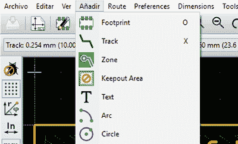

# kicad 翻译成西班牙文

> [https://hacked ay . com/2016/02/11/kiad-翻译成西班牙语/](https://hackaday.com/2016/02/11/kicad-traducido-al-espanol/)

kicad 已经是多氯联苯的原理图捕获和设计的一个很好的工具，但该软件只有在可以使用的情况下才起作用。对于十亿不讲英语的人来说，这意味着语言是使用最佳硬件开发软件时最大的障碍。近几个月来，[quark]一直引领着吉克语的本地化工作，这些工作终于完成了。他还发起了[一个西班牙语 kicad 论坛](http://www.elektroquark.com/forokicad/)，将软件开发推向世界上最广泛使用的语言之一。

虽然还有其他尝试将 kicad 本地化为其他语言，但这些项目大多不完整。在几个月前的 kicad 更新中，西班牙文本地化已经有一些翻译过的频道，但并不多。[electrical quark]的努力使 kicad 更接近数百万西班牙语母语的人，而不仅仅是他们的一些菜单。

西班牙语是世界上第二多讲的语言，而英语是第三语言。仅考虑到这一事实，几乎所有的多氯联苯图解捕获和设计软件工具都只能以中文或英文本地化似乎是荒谬的。[electroquark]将 kicad 本地化为西班牙语的努力，是已经令人印象深刻的软件的一大进步。