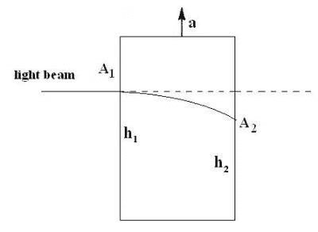

# 关于那些引力波

> 原文：<https://hackaday.com/2016/02/17/about-those-gravitational-waves/>

1687 年，艾萨克·牛顿发表了《原理》，揭示了重力的第一个数学描述。牛顿的运动定律和他对万有引力的描述向世界展示了一个革命性的概念，可以用来描述从天体的运动到落下的苹果的一切。在接下来的几百年里，牛顿无疑将是万有引力之王。但在 20 世纪初，当一个在瑞士专利局工作的年轻人开始问一些深刻的问题时，这一切都改变了。爱因斯坦得出结论，牛顿物理学不足以描述新兴电磁场理论的发现。1905 年，他发表了一篇题为《论运动物体的电动力学》的论文，该论文修正了牛顿定律，使其适用于描述接近光速的物体运动。这种新的描述被称为狭义相对论。

它很“特别”,因为它不涉及重力或加速度。爱因斯坦又花了 10 年时间将这两个概念融入他的相对论。他称之为广义相对论——理解广义相对论对于完全理解引力波的意义是必要的。

## 到底什么是重力？

[Image Source](https://sarahdry.wordpress.com/2014/07/06/did-the-apple-really-fall-on-newtons-head/)

牛顿定律完美地描述了行星的运动，但是他从来没有能够准确地说出引力是什么，它来自哪里，或者它是由什么组成的。爱因斯坦向自己提出了一个简单的问题——如果太阳突然消失，行星的运动会发生什么变化？牛顿力学认为，一旦太阳引力消失，行星将开始直线运动。但这将违反狭义相对论的宇宙速度极限。例如，地球在事后整整八分钟内都不知道太阳消失了。太阳消失后，是什么让行星保持在各自的轨道上？

这个问题的答案将揭示重力的本质，以及它实际上是什么。通过仔细观察引力场和加速度产生的力之间的相似之处，就很容易理解这一点。

## 两部电梯的故事

爱因斯坦意识到所有的物理定律都是正确的，不管它们的参照系是什么。当你在地球表面静止不动时，这些定律同样适用于以恒定的 500 英里/小时速度在 30000 英尺高空飞行的人。在飞机上和在地球上做的实验结果将是一样的。他想知道加速框架和重力场中的框架是否也是如此。

[Image Source](https://wissenschaftblog.wordpress.com/2014/10/21/einsteinsche-feldgleichungen-i-einfuhrung/comment-page-1/)

让我们考虑两部电梯。一部电梯停在地球上。另一个是在深空以 9.8 米/秒 ² 向上加速。居住者有可能分辨出这两种参照系的区别吗？如果地球上电梯里的人掉下一个苹果，重力会以 9.8m/s 的加速度把它拉到地板上 ² 。如果在太空中加速电梯上的人也这样做，苹果将以电梯加速的速度移动到地板上——9.8 米/秒 ² 。请注意，苹果下落的速度与其质量无关。

现在让我们考虑同样的两部电梯在不同情况下的情况。其中一个在深空，一动不动。另一个正朝着地球自由落体。我们现在问同样的问题——居住者有可能知道他们在哪个电梯里吗？当任一方放开苹果时，它都不会受到力的作用。它会浮在那里。爱因斯坦意识到这两个参照系是等价的。他意识到我们在地球上感受到的重力与我们在加速的电梯中感受到的伪力是一样的。失重和自由落体没有什么不同。重力不像其他物理力那样以力的形式存在。但是如果它不是一个力，那么它是什么呢？

[Image Source](http://www.thenakedscientists.com/forum/index.php?topic=14526.0)

为了回答这个问题，让我们再来看看我们的一对电梯。让我们想象一下，每一个都在一边装有激光器，在另一边装有探测器。它们离地面的高度相同。我们的实验将包括从激光器中释放一个光子，并观察它击中探测器的位置。光子没有质量，所以应该不会受到引力的影响。因此，在坐在地球上的电梯里进行实验，应该会发现光子在与它的来源相同的高度撞击探测器。但是，当我们在太空中对加速电梯进行实验时，我们得到了不同的结果。光子释放时电梯是向上加速的，所以一定是在更低的点撞上了探测器！

如果我们承认两个电梯环境是等价的，我们就被迫得出结论:地球上电梯里的光子一定是沿着一条弯曲的路径。爱因斯坦继续证明地球引力场的存在会使光子的路径弯曲。他将证明引力不是一种力，而仅仅是空间和时间的几何学。将大质量物体吸引在一起的“力”是由它们的时空曲率引起的。

## 引力波

现在我们知道如果太阳突然消失会发生什么。由太阳引起的时空弯曲会弹回并向外波动。它会发出一个以光速向行星运动的引力波。每颗行星都将沿着它们的轨道稳定地运行，沿着仍然存在的太阳曲率，幸福地不知道即将到来的厄运。一旦波浪袭来，曲率就消失了。如果没有弯曲的时空跟随，行星将遵循牛顿力学并进入深空。

当然，这都是假设，引力波的概念也是如此。爱因斯坦曾预言过它们，但认为它们太小了，在地球上无法测量。这一切在几天前发生了变化，美国的两个机构成功记录了十亿年前发生的两个黑洞的合并。合并引发了一连串的引力波，而[我们听到了](http://www.cnn.com/2016/02/11/us/gravitational-waves-feat/index.html)。

现在我们知道这种现象存在并且可以测量，更多的资源将致力于探索这个天体物理学的新领域。

感谢[PyroChiliarch]的提示！

**来源**

[标题图像](http://www.extremetech.com/extreme/222852-what-are-gravitational-waves-and-where-does-physics-go-from-here-now-that-weve-found-them)。