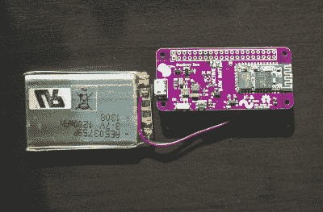
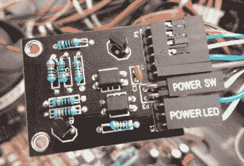
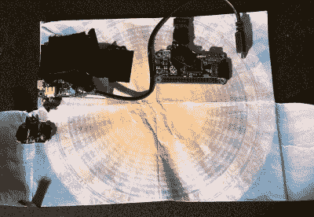
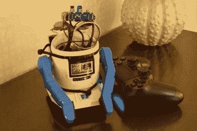

# hack let 95–更多 Pi Zero 竞赛参赛作品

> 原文：<https://hackaday.com/2016/02/13/hacklet-95-more-pi-zero-contest-entries/>

我们已经进入了 Hackaday 和 Adafruit 终极合作的第二周:树莓派零竞赛。参赛作品飞来了！截至周四晚上，我们有 70 个项目竞争 10 个树莓派零中的一个，以及三个 100 美元的 Hackaday 商店礼券中的一个。在本周的 Hacklet 上，我们将会看到更多的参赛作品。

 我们从【肖恩·哈金斯】和[蓝莓零开始——把你的圆周率放在口袋里](https://hackaday.io/project/9548)。[肖恩]不能离开家没有他的树莓派零。然而，携带启动一台小型 Linux 计算机所需的所有电缆、适配器和附件可能是一件苦差事。他创造了一个解决方案，用蓝莓零来简化这一切。这个定制的 PCB 帽包含一个连接到 Pi 控制台端口的 HC-05 型蓝牙模块。串行本身并不能构成一个独立的 Pi，所以[Sean]添加了一个 LiPo 电池和充电器芯片。开关电源将 4.2 V LiPo 输出提升至 Pi 所需的 5 V。现在，当[Sean]必须破解一些 python 代码时，他所需要做的就是打开手机、平板电脑或电脑的蓝牙连接。

【Doihaveto】正在用他的圆周率 0 来管理一台台式 PC。[电脑电源](https://hackaday.io/project/4077)让他不仅可以打开或关闭电脑，还可以完全断开电源。[Doihaveto 的] PC 确实有局域网唤醒功能，但是当系统出现故障时，他就遇到了问题。他的 Pi 提供了一层额外的保护，以防事情没有像预期的那样醒来。该板包含两个到主机 PC 的光隔离连接。一个是电源开关输出，另一个是电源 LED 输入。如果所有这些都失败了，PC Power 还可以控制一个固态继电器，将计算机与主电源完全隔离。PC Power 使用 Python 通过 flask web 框架创建的 web 界面。

 接下来是【tomwsmf】与[皮弗尔德](https://hackaday.io/project/9498-pifold)。就像上面的[Sean]一样，[tomwsmf]不能离开家，除非他的圆周率为零。然而，[tomwsmf]并不是黑客代码，而是提供媒体服务。PiFold 是一个包含 Pi Zero powered 服务器的钱包。Anyfesto 软件包在 Pi 上运行，通过 WiFi 提供歌曲和文件。音频也通过 PiFM 在 88.1 MHz FM 上传输。一个 2500 mAh 的电池组加上一个升压转换器使 PiFold 保持嗡嗡作响。当电池需要充电时，[tomwsmf]可以使用一个小型太阳能电池板来补充电池，同时保持绿色。

 最后，我们有了【弗雷德里克 J】与[改装机器人](https://hackaday.io/project/9546)。20 世纪 80 年代是日本玩具机器人的黄金时代。Tomy、Nikko 和其他几家公司创造了像 Omnibot 这样的设备，这些设备领先于他们的时代。[Fredrick]仍然有他的老式 Nikko 遥控机器人，但它早已停止工作。圆周率零点提供了一个让小家伙重获新生的绝佳机会。[Fredrik]的目标是保持 RC 机器人的原始外观，同时赋予它新的功能。旧的 DC 汽车正被闭环伺服系统所取代。伺服系统将由 Adafruit 16 通道伺服驱动板控制。改造机器人的下一步是一块 6000 毫安的大电池。我们迫不及待地想看看这个结果如何！

如果你想看到更多的参赛者参加 Hackaday 和 Adafruit 的圆周率为零竞赛，[请查看提交列表](https://hackaday.io/submissions/adafruitpizerocontest/list)！如果你在那个列表上没有看到你的项目，你不用联系我，[只要提交给圆周率零点大赛](https://hackaday.io/contest/9326-adafruit-pi-zero-contest)！这就是本周的 Hacklet。一如既往，下周见。同样的黑客时间，同样的黑客频道，带给你最好的 [Hackaday.io](https://hackaday.io/) ！