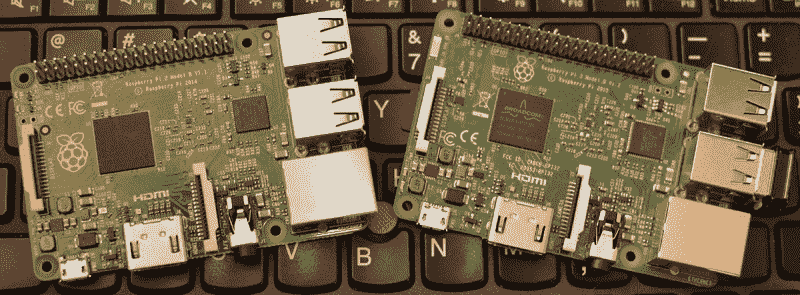
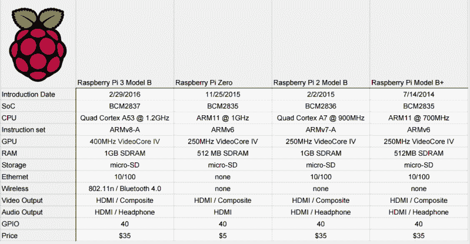
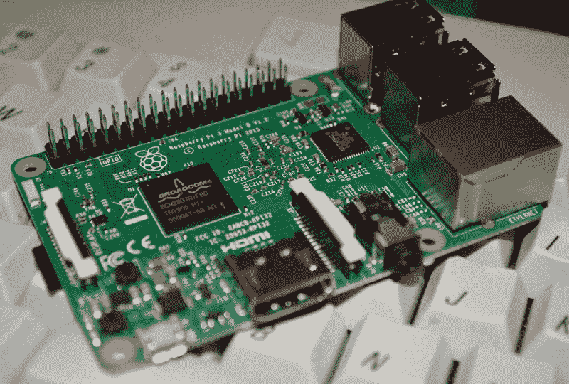
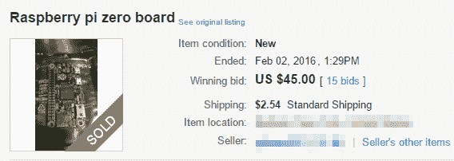
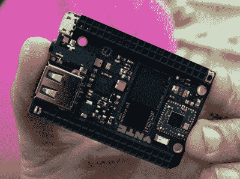

# 介绍树莓 Pi 3

> 原文：<https://hackaday.com/2016/02/28/introducing-the-raspberry-pi-3/>

*TL；大卫:树莓 Pi 3 型现在已经上市了。这款最新型号包括 802.11n WiFi、蓝牙 4.0 和运行频率为 1.2 GHz 的四核 64 位 ARM Cortex A53。这是一台可用的台式电脑。现在在普通的 Pi 零售店可以买到，售价 35 美元。*

上周末，关于最新的树莓 Pi 的消息像野火一样席卷了互联网，这要归功于一份公布的 FCC 文件，其中显示了一款带有车载 WiFi 和蓝牙的 Pi。虽然我们感谢几十位 Hackaday 读者写信告诉我们泄露的 FCC 文件，但我们的嘴一直被封到现在。我们已经对 Pi 3 进行了两周的实际测试，Pi 3 的实际情况比一些泄露的 FCC 文件告诉你的要酷得多。

树莓 Pi 3 Model B 采用四核 64 位 ARM Cortex A53，主频 1.2 GHz。这使得 Pi 3 比 Pi 2 快了大约 50%。与 Pi 2 相比，RAM 保持不变——1GB lpddr 2-900 SDRAM，VideoCore IV GPU 提供的图形功能也保持不变。正如泄露的 FCC 文件将告诉你的那样，Pi 3 现在包括板载 802.11n WiFi 和蓝牙 4.0。WiFi、无线键盘和无线鼠标现在开箱即用。

* * *

对于树莓派基金会来说，这是非常特殊的一年。因为该基金会成立于 2012 年 2 月 29 日，严格来说，今天是他们的第一个生日，或者至少这是他们告诉所有人的厚颜无耻的话。随着这个周年纪念日的到来，庆祝活动正在有序进行，一款新的覆盆子 Pi 已经发布。

The Raspberry Pi 2 (left) and the Raspberry Pi 3 (right). Physically, there are very few differences.

## 规范

Pi 3 的突出特点是内置的 WiFi 和蓝牙，但它并不止于此。以下是 Pi 3 的完整规格:

*   SoC: Broadcom BCM2837(大约比 Pi 2 快 50%)
*   CPU: 1.2 GHZ 四核 ARM Cortex A53 (ARMv8 指令集)
*   GPU: Broadcom VideoCore IV @ 400 MHz
*   内存:1 GB LPDDR2-900 SDRAM
*   USB 端口:4 个
*   网络:10/100 MBPS 以太网、802.11n 无线局域网、蓝牙 4.0

Pi 3 正是你所期待的最新的树莓 Pi。不，它没有 SATA 或 USB C 或 PCIe 连接器。Raspberry Pi 基金会的目标一直是为每个人生产一台廉价的计算机，增加这些端口只会抬高价格。圆周率基金会没有取悦超级用户，而是尽力取悦任何人。与去年年底的树莓 Pi 2 一样，树莓 Pi 3 采用了新的 CPU，即 Broadcom BCM2837 四核 64 位 ARM Cortex A53，运行频率为 1.2 GHz。

虽然围绕 Raspberry Pi 3 最有新闻价值的预发布泄漏是增加的无线功能，但大新闻是升级的 CPU。对于皮质 A53，Pi 3 已经通过了一个阈值。Raspberry Pi 不再只是一个用来在模拟器中玩复古视频游戏的主板，它也不再局限于作为机顶盒的职责。Pi 3 是一台真正的计算机。

### 这是树莓派生态系统的*转轮*和*法戈*

当四年前最初的 Raspberry Pi 推出时，它立即兑现了将基于 Linux 的低成本计算机带给大众的承诺。这个承诺并不是要给大众带来一台高性能的 Linux 电脑；检查你的电子邮件，或者在原始 Pi 上加载一个网页是一件苦差事。尽管如此，该板还是有足够的能力非常受欢迎，这也是理所当然的:使用一个带有几个 GPIO 引脚和一个以太网端口的小型 Linux 板，您可以做很多事情。

去年，Raspberry Pi 基金会推出了 Pi 2，这是一款更强大的主板，具有更快、更强的 CPU。第一印象非常好。这是一台实际上可以用作电脑的电脑。我仍然将我的 Pi 2 连接到我工作台上的一台旧平板电视和键盘上，用于轻松浏览和查看 pdf。

树莓 Pi 3 完全是另一个怪物。Pi 3 现在已经超过了成为一台有用的台式电脑的门槛。

*救命！*和*一个辛苦的白天的夜晚*都是披头士的优秀专辑，但是是*左轮手枪*让披头士更上一层楼。齐柏林飞船 I 和 T8 II 很棒，但是是 T10 IV 让齐柏林飞艇从一个优秀的乐队变成了传奇。将这一比喻延伸到电影中，*抚养亚利桑那*是科恩兄弟的狂热崇拜，但正是*法戈*和*大勒保斯基*让这些电影制作人出名。Pi 3 是 Pi 基金会的*左轮*和*法戈*。Raspberry Pi 已经从一个可以让 GPIO 上的几个 led 闪烁的小巧廉价的 Linux 板变成了一个便宜的 Linux 盒子，它的速度足以成为一台合适的计算机。

Raspberry Pi 基金会的目标是在早期教育中推广计算机科学。虽然圆周率 1、圆周率 2 和圆周率 0 在这方面能力有限，但圆周率 3 更有用。这是一台可以容纳整个小学计算机实验室的计算机。树莓派现在已经超过了有用的门槛。

### 零和游戏

就在几个月前，树莓派基金会[推出了树莓派 Zero](http://hackaday.com/2015/11/25/the-5-raspberry-pi-zero/) ，这是最初树莓派的精简版。它售价 5 美元。互联网疯了，圆周率零被吞噬，没有人有任何股票。这台 5 美元的电脑在易贝卖 45 美元。供求定律就像万有引力定律和热力学定律一样不可动摇，可以理解，有人批评圆周率基金会。

Fools have money

在与[Eben Upton]，这位身兼多职的覆盆子圆周率基金会的创始人交谈时，在讨论圆周率 3 时，房间里有一头大象。圆周率的零在哪里，圆周率 3 的库存会超过几个小时吗？

最初的 B 型车发布会被等候名单所困扰，人们等了几个月才拿到一辆。Pi 型号 B+更好，Pi 2 首发异常顺利，两周出货 50 万。由于意外的需求和较低的制造量，推出 Pi Zero 是一个异常。圆周率零点的第一轮只生产了 10 万台，此后不久又生产了 10 万台。现在，有 30 万台 Pi 3s 在仓库里，准备运往世界各地。

虽然圆周率 3 将被证明是非常受欢迎的，但你可能不会在易贝看到黄牛出售数百元的圆周率 3。只要我们没有太多的囤积者，你也可以很快得到一个。至于圆周率的 0，他们来了，这并不像他们有一个截止日期。

### 树莓派的竞争对手

四年前，[当树莓派开始看起来确实不是一个软件的时候，运行 Linux 的廉价单板计算机并没有太多的产品。任何人能做的最好的是 Gumstix，这些花费在 150 美元左右。](https://hackaday.com/2011/08/26/raspberry-pi-might-not-be-vaporware/)

自从 Raspberry Pi 发布以来，每个人都意识到运行 Linux 的廉价小型设备将非常有用。说句实话，[Eben]和 Raspberry Pi 基金会的其他成员对小型嵌入式开发板的庞大生态系统负有巨大责任。每个人都在行动:英特尔有爱迪生和夸克，BeagleBone 几乎与 Pi 同时发布，甚至有传言说苹果有一个 SBC 正在工作中。随后出现了克隆人、仿冒者和其他想要分一杯羹的人。

第一批受圆周率影响很大的主板之一是[香蕉圆周率](http://www.bananapi.org/p/product.html)，这是一台单板计算机，其布局与最初的圆周率惊人地相似。接下来是[机器人](http://www.hardkernel.com/main/products/prdt_info.php?g_code=G143703355573)，接着是[橙皮](http://www.orangepi.org/)，还有[乌杜](http://shop.udoo.org/other/home/udoo-dual-basic.html)，还有[立体棋盘](http://cubieboard.org/2015/03/10/cubieboard4cc-a80-released/)。

The C.H.I.P., a $9 or $8 computer, announced in May of last year. It’s only beginning to ship to Kickstarter backers.

廉价的消费单板计算机的技术水平开始显示出一种模式。首先，Raspberry Pi 基金会发布了一个板，每个人都争先恐后地在这个板上提出改进。接下来，Pi 基金会发布新的硬件，至少相当于当前的非品牌 SBC，但也建立在庞大的 Pi 生态系统和社区之上。其他品牌再次尝试超越圆周率，循环往复。还记得惠普吗，没人会相信这台电脑实际上只花了 9 美元？现在有了树莓派 Zero，一台售价 5 美元的电脑(如果你能找到的话)。你还是买不到一个 C.H.I.P。他们仍在处理去年 5 月的预购，如果你为 C.H.I.P .活动捐款，你可能还要再等三个月。相比之下，仅仅几周时间，10 万台 Raspberry Pi Zeros 就已经发货。

被誉为树莓派杀手的最新主板是 [Pine64](https://www.kickstarter.com/projects/pine64/pine-a64-first-15-64-bit-single-board-super-comput/description) 和[Odroid XU4](http://www.hardkernel.com/main/products/prdt_info.php)XU4 售价 70 美元，在此基础上，可以立即拒绝作为一个可行的 Pi 竞争对手。Pine64 最初是作为 Kickstarter 的一项活动开始的，承诺一个运行在 1.2GHz 的四核 ARM Cortex A53 处理器，1gb 的 RAM，以太网，HDMI 和几个 GPIO 引脚来闪烁几个 led。通过阅读规格表，它与基金会的最新产品非常相似，除了 Pi 3 上的 WiFi 和蓝牙。Pine64 将很快向支持者发布，但它在到达时就已经死了。我是 Pine64 Kickstarter 活动的支持者，我应该对这种廉价的 64 位计算机有一些承诺偏见。甚至我必须承认树莓派 3 是优越的董事会。毕竟，它是无线的，加上巨大的社区支持、例子和已经编写的库，选择是明确的:Pi 基金会又打了一个全垒打。

你可能会认为 Raspberry Pi 基金会正在他们的竞争对手周围迭代。这不是真的；Pi Zero 的开发时间约为 9 个月，远在惠普的 Kickstarter 推出之前。Pi 3 的开发时间接近 18 个月，包括 Broadcom 开发新芯片的时间。

树莓基金会在宣布他们的产品时，敏锐地意识到了奥斯本效应。毫无疑问，现在有升级到 Pi 3 的计划正在进行中，但是向全世界宣布这些计划只会让人们等待下一个伟大的宣布。与无数 Kickstarter 为基于 Linux 的 ARM 开发平台发起的活动相比，他们宣布一款产品，预计将在一年内上市，Pi 基金会的做法要明智得多。在这一点上，发射前一两天 FCC 数据库的一些泄漏并不重要。

## 软件

Raspberry Pi 总是打算运行各种操作系统，在过去的四年里，我们已经看到了几乎所有的东西。从股票 Debian 发行版到更深奥的选项，从 Windows 10 IOT 到第 9 号计划。其中一些操作系统的有用性值得怀疑，但更多的操作系统选择并不是坏事，对吗？

在树莓 Pi 上没有得到足够喜爱的两个操作系统也是 ARM 系统最常见的两个操作系统:Android 和 Chrome OS。是的，有项目将这些操作系统引入 Pi 2，但是它们还不是很成熟，当然也没有准备好用于主流。

Pi 3 将改变这一点。是的，它更快了，但是旗舰 Pi 的更新是在一个实验性的 OpenGL 驱动程序发布几周之后。到目前为止，图形一直是阻碍 Pi 使用合适的 Android 系统的一个因素，[Eben]告诉我 Chrome OS 将在短期内进入 Pi 3。

### 树莓派的未来

Pi Zero 是一个全垒打，除了制造和分销，一台运行 Linux 并提供几个 GPIO 引脚的 5 美元计算机足以刺穿世界上 Arduinos 的心脏。Pi 3 完全是另一种野兽。Pi 1、Pi 2 和 Pi Zero 是恰好运行 Linux 和超级任天堂模拟器的开发系统。Pi 3 是一台合适的计算机，碰巧也有 GPIO 引脚，一个巨大的开发场景，数以千计的你可以想象的任何硬件黑客的例子，以及一个拥有数百万成员的社区。

Pi 3 也是第一块实现让学生对计算机科学感兴趣的承诺的主板。这是一台既便宜又好的电脑，足够送给小学生的教室。他们将能够做他们的功课，最聪明的一群将开始闪烁的 led 和开关引脚头的 H 桥。Raspberry Pi 3 终于是一台好到足以成为真正主流设备的电脑，而不仅仅是技术爱好者奉承的玩具。

我们将在接下来的几天内发布 Pi 3 的基准，但在此之前，请前往 Element 14、RS 或任何其他 Pi 供应商，并挑选其中一个电路板。可能会有足够的钱。

* * *

如果你在寻找“披露”这个词，它就在那里。树莓派基金会给我发了一个树莓派 3 的 B 型和 SD 卡。