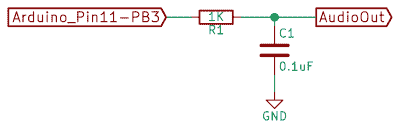
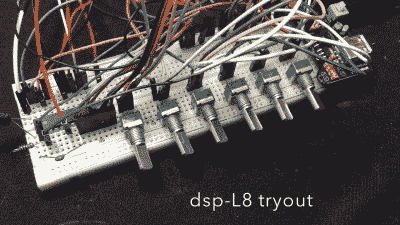
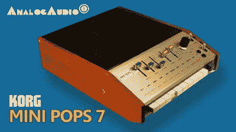
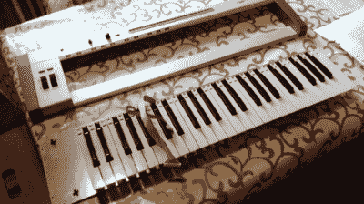

# 一系列开源合成器

> 原文：<https://hackaday.com/2016/02/23/a-slew-of-open-source-synthesizers/>

Hackaday reader [Jan Ostman]一直在制作基于微控制器的 DIY 合成器。最近，他开放了很多源代码，这样你就可以在家一起玩了。所有这些虚拟模拟合成器和发声器都可以在 Arduino 或 AVR ATmega328 上实现，如果你身边正好有一台的话。

额外的部件，比如键盘，一些按钮，或者一些电位计旋钮不会伤害到旋转，如果你想做一些更永久或者更明显的可玩性的东西，就像[Jan]做的那样。另一方面，如果你只是想尝试一下，我已经调整了他的代码，使其更加即插即用。代码足够简单，是一个很好的学习平台。因此，让我们快速浏览一下三台架子鼓和一个弦乐合成器，每一台都可以在几分钟内在试验板上完成。

要在 Arduino UNO 上安装，从[这个 GitHub 库](https://github.com/hexagon5un/jan_ostmans_synths)获取 zip 文件，并将每个子文件夹移动到你的 Arduino sketch 目录。你已经准备好合作了。

 [https://www.youtube.com/embed/WtemWPOVMjo?version=3&rel=1&showsearch=0&showinfo=1&iv_load_policy=1&fs=1&hl=en-US&autohide=2&wmode=transparent](https://www.youtube.com/embed/WtemWPOVMjo?version=3&rel=1&showsearch=0&showinfo=1&iv_load_policy=1&fs=1&hl=en-US&autohide=2&wmode=transparent)

## 简单的鼓机

[Jan]有两个基于样本回放的鼓机，他已经公布了代码:带有直进鼓样本的 [dsp-D8](https://janostman.wordpress.com/the-dsp-d8-drum-chip-source-code/) 和装载拉丁打击乐的 [dsp-L8](https://janostman.wordpress.com/dsp-l8-source-code/) 。它们本质上是相同的代码库，但是样本不同，所以我们将它们放在一起处理。

研究[Jan]的代码启发我写了一篇关于 DDS 回放的更长的文章[，所以如果你想重温一下基本原理，你可以去那里。简而言之，你可以通过使用一个比你要播放的数据点数大得多的计数器来改变样本回放的音高。](http://hackaday.com/2016/02/12/embed-with-elliot-audio-playback-with-direct-digital-synthesis/)

【Jan】的架子鼓都使用 AVR 的硬件[脉宽调制](https://en.wikipedia.org/wiki/Pulse-width_modulation) (PWM)外设来回放样本。您可以使用更高级的器件，但这只需在输出端使用一个可选的电阻和电容滤波器即可完成工作，使器件总数达到三个:Arduino、1 千欧电阻和一个相当大的(0.1 uF？)电容。中断服务程序(ISR)定期将新的样本值载入 PWM 寄存器，剩下的工作由 AVR 的外设硬件完成。

一个巧妙的地方是使用了一个[循环缓冲区](http://hackaday.com/2015/10/29/embed-with-elliot-going-round-with-circular-buffers/)，它保存回放样本值，直到 ISR 准备好接收它们。在鼓机的情况下，CPU 没有太多的数学工作要做——它只是将所有不同的同步声音的样本组合起来——但在他更复杂的模块中，这个缓冲区允许 CPU 偶尔花更多的时间来计算样本值，而不是在更新之间。它为[Jan]的代码赢得了一些喘息的空间，并且仍然允许它在没有故障的情况下制作样本回放时间表。

【Jan】为每个样本添加了单独的音高控制，这对于现场演奏或调整来说非常棒，你可以在他的两个视频中观看他使用它们:一个用于 [dsp-D8](https://www.youtube.com/watch?v=rRwwSJVY8IQ) ，另一个用于 [dsp-L8](https://www.youtube.com/watch?v=-ghc43s8bYU) 。不过，连接这么多旋钮简直是小菜一碟，所以我用细齿电锯帮你检查了代码，砍掉了[Jan]的按钮和旋钮接口，代之以 Arduino 的内置串行 I/O。

为了演奏我的[Jan]鼓机版本，每个样本都被映射到 home 行中的一个键:“asdfjkl。如果你有一个合适的串行终端程序，可以实时传输每次击键，你马上就能打出 9600 波特的节奏。请注意，Arduino IDE 的内置终端只在你按下“enter”键后才发送按键——这使得按速度演奏非常困难。(我自己用的是 *screen /dev/ttyACM0 9600* 或者内置了 Python 的 *pyserial* 库的终端。Windows 用户用什么做实时终端？)

如果您还没有，[下载这个 zip 文件](https://github.com/hexagon5un/jan_ostmans_synths/archive/master.zip)，将每个子文件夹移动到您的 Arduino 草图目录，并将一个扩音扬声器直接连接到您的 Arduino 的第 11 针和地，或者包括一个 RC 滤波器。只需要一秒钟你就可以开始玩了。当你想要所有旋钮的完整版本，前往[简]的网站。

## O2 Minipops

[简]的[O2 mini pops](https://janostman.wordpress.com/2016/01/30/the-o2-minipops-rhythm-box/)机器模仿了一个老派的节奏盒:[Korg mini pops 7](https://www.youtube.com/watch?v=6qXW_eyeJFM)。这种原始的鼓机是可怕的俗气还是神圣的俗气，这是旁观者的耳朵，但它是一种经典，已经被到处使用。[Jan]以让·米歇尔·雅尔的史诗专辑*oxygen*命名他的专辑。你会在剪辑中听到他们在 1:40 左右开始。众所周知，Jarre 过去常常按下迷你 pops 上的多个按钮，通过一次演奏多个来制作更复杂的鼓模式。

在  固件中拥有自己的迷你弹出窗口的好处是，你可以添加你想要的功能。你不必像可怜的贾尔先生那样在舞台上现场捣烂多个塑料按钮，你只需调整固件就可以了。需要更长的图案？你拿到了公羊。重点？荡秋千？拍子速度？这只是几行代码的问题。

声音回放代码就像上面简单的鼓机一样，所以我们不必再讨论它了。唯一真正增加的是序列器，但这才是真正的魔力所在。毕竟，没有一些节拍的鼓机算什么？因为有八种可能的鼓声，每一拍是一个字节，所以 4/4 拍的四个小节正好是存储在内存中的十六个字节。我将数据分解到它自己的头文件`O2_data.h`中，所以看看那里的预编程节奏，并随意修改它们以适应你自己的需要。

为了使 O2 迷你弹出立即播放，我再次剥离了电位计代码(对不起[1 月]！)并通过串行端口传递控制。“用户界面”有五个控件。按下 *j* 和 *k* 在模式间切换，按下 *f* 和 *d* 加速或减速。(它们在你第一排的两个手指下面。)空格键启动和停止鼓机。

试着用`j`和`k`在模式之间自由切换——这是一种令人惊讶的有趣方式来创造你自己的、稍微不那么俗气的模式。您需要下载这段代码并尝试一下。相信我。

## 索林娜

[Jan]还在 Arduino Nano 的基础上构建了一个成熟的弦乐合成器键盘。它模仿了[著名的索林娜弦乐合奏](http://www.dse.nl/~rbos/solina/index.html)，我们不得不说它得到了声音点。

Solina — the Original

[Jan]的 *Solina* 是一种“虚拟模拟”，它在微控制器的 RAM 中建立锯齿波形，然后通过 PWM 输出相应的电压。对于弦乐合成器来说，这是一个良好的开端，因为经过过滤的锯齿波形是小提琴发出的声音的良好开端。

 [https://www.youtube.com/embed/Wc9ZbRWO4SU?version=3&rel=1&showsearch=0&showinfo=1&iv_load_policy=1&fs=1&hl=en-US&autohide=2&wmode=transparent](https://www.youtube.com/embed/Wc9ZbRWO4SU?version=3&rel=1&showsearch=0&showinfo=1&iv_load_policy=1&fs=1&hl=en-US&autohide=2&wmode=transparent)

Solina — the clone

管弦乐队的弦乐部分(以及模仿它的弦乐合成器)的声音的秘密在于，它是许多不同的拉弓乐器同时演奏的组合。无论演奏者多么精确，他们的调音都略有不同，没有一根琴弦的共鸣相位完全一致。 *Solina* 通过自然地去谐每个振荡器，并使它们彼此同相和异相移动来模拟这一点。如果你想深入了解[Jan]的 Solina 到底是如何工作的，他[在这篇博文](https://janostman.wordpress.com/how-to-build-your-very-own-string-synth/)中解释得很好。

同样，我已经将其转换为直接串行控制，您可以通过串行端口控制`envelope`、`detune`、`LFO speed`和`modulation depth`。按一次空格键模拟按键，再按一次松开。试一下失谐和音高调制在二十左右的 *Solina* ，用 *LFO 速率*等参数弹奏。对于一些锯齿波来说，这是很多有用的噪声。

## 键盘和未来

当然，【Jan】的建造比我们在这里展示的要多得多。他的博客开始(2009 年！)这个项目本质上是把一台个人电脑塞进一个键盘外壳，索丽娜和其他人也能拿到自己的钥匙。我们刚刚介绍了任何此类项目的核心——为键盘矩阵进行检测所需的所有二极管布线，还有很多工作要做，更不用说构建外壳、布线电位计和制作好看的前面板了。但是如果你想开始走这条路，你至少已经有了一个好的开始。

[Jan]目前的项目是 [Minimo 微型单声道合成器](https://janostman.wordpress.com/build-the-minimo-synth/)，它将 Solina 更进了一步，并为其添加了具有(数字)共振的低通滤波器。[产生的声音很棒](https://www.youtube.com/watch?v=U2PDLRRNJlk)，所以我们很期待看到【简】未来会把它带向何方。

再次感谢[Jan]开放代码。如果你们中的任何人用这个做了什么，一定要在评论中发表，让我们都知道。自从我开始尝试这些，我就渴望将代码模块化一点，使之更容易适应和修改。也许我们将不得不启动一个 Hackaday.io 项目——这些简单的小合成器实在是太有趣了！