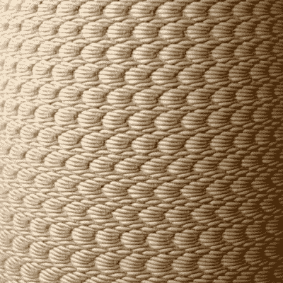

# 3D 打印粘土的良好振动

> 原文：<https://hackaday.com/2016/02/20/good-vibrations-in-3d-printed-clay/>

一个拥有 3D 打印机的工程师希望一切都是严格和精确的。例如，z 轴进给螺杆中的弯曲引起的摆动会在表面上形成与螺距完全匹配的波状图案。没人喜欢这些，对吧？肯定不是工程师！

 但一个人表面的不规则是另一个人的纹饰。我们掌握的细节很少，但从视频来看(也在中断处下方内嵌)足够清楚:[Olivier van Herpt]和[Ricky van Broekhoven] [在他们的陶瓷打印机的打印床下面放了一个振动低音扬声器，并用它来故意破坏他们光滑的表面](https://vimeo.com/142682057)。他们这样做有很大的艺术效果！

我们并不是建议你[完全放弃你的校准](http://hackaday.com/2015/02/20/how-i-learned-to-stop-worrying-and-love-my-3d-printer/)，但是我们确实喜欢不时地有一点创新思维。但是我们的内部工程师抬起头，我们想知道他们是否将低音扬声器的音调与打印头的馈送速率联系起来。评论里有你的想法吗？

[https://player.vimeo.com/video/142682057](https://player.vimeo.com/video/142682057)