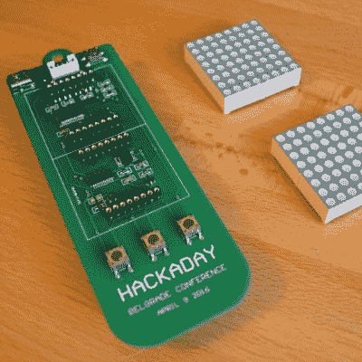
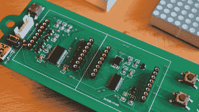
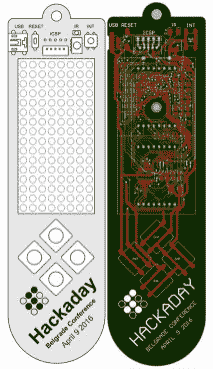
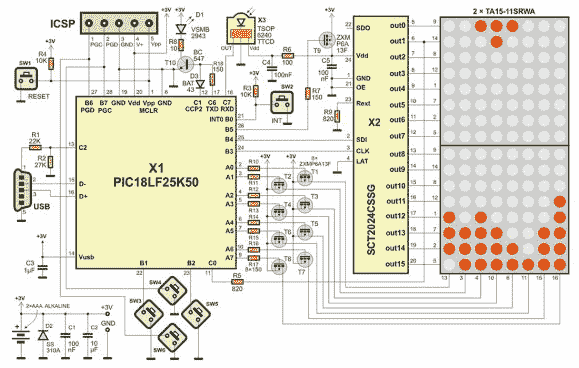

# 它还活着！——贝尔格莱德 Hackaday 徽章

> 原文：<https://hackaday.com/2016/02/17/its-alive-badge-for-hackaday-belgrade/>

我们在欧洲举办的首次会议——贝尔格莱德黑客日即将到来。对我来说，真正令人兴奋的事情之一是[Voja Antonic]为大会设计的硬件徽章。他在硬件选择方面做得很好，我认为我们已经找到了徽章黑客的最佳时机。休息之后，让我们进入硬件和固件的细节。

[现在就买票](https://www.eventbrite.com/e/hackaday-belgrade-tickets-21409115240)参加十个小时的讲座、研讨会、晚间音乐会，当然还有全程的徽章黑客活动。早期鸟类销售于周一结束。我们仍在审核演讲提案，但我们将在下周发布公告，宣布所有的演讲者。

 [https://www.youtube.com/embed/-NOicUTIh-k?version=3&rel=1&showsearch=0&showinfo=1&iv_load_policy=1&fs=1&hl=en-US&autohide=2&wmode=transparent](https://www.youtube.com/embed/-NOicUTIh-k?version=3&rel=1&showsearch=0&showinfo=1&iv_load_policy=1&fs=1&hl=en-US&autohide=2&wmode=transparent)

### 演示场景

 我们把徽章设计得非常容易破解，目的只有一个:挑战你，让你想出一些很酷的东西在上面运行。我们所想的是一个基于[黑客徽章](https://hackaday.io/project/9509-badge-for-hackaday-belgrade-conference)的 demoparty。这是一个相当简单的设计，具有 8×16 LED 矩阵、四个按钮和红外发射器/接收器组件，所以你必须发挥创造力。在晚会结束时，你会有一个在阳光下的时刻——或者至少是在大屏幕上。

为了激励你，我们目前有两套独立的固件正在开发中。Voja 是编码组装方面的大师，正在为徽章组装主要固件。如前所述，他已经为徽章实现了俄罗斯方块游戏。他还具有暂停和睡眠支持(通过连接到 INT0 的第五个按钮管理)以及使用红外接收器和作为发射器的红外 LED 的工作代码。

如果汇编不是你的事，第二个固件是我一直在做的一个准系统 C 实现。它是一个基本的 API，负责扫描硬件定时器中断中的显示和按钮，并公开函数调用，让您在更高的级别为徽章编写应用程序。固件的 C 实现包括一个使用 SDL2 编写的仿真器，因此您可以在没有徽章的情况下测试您的代码。

这两个固件都需要一点改进，然后才能让你深入研究。但是我们的目标是让任何人都能提交演示，即使你不能参加会议。如果你迫不及待想得到一个，你可以随时建立自己的徽章副本，因为它是开放的硬件。

### 硬件设计

 沃佳对他的设计进行了几次修改。你会注意到我们用于测试的原型有三个按钮。最终的设计将有四个十字形的按钮(上/下/左/右)，这些按钮将是更大的 12 毫米种类——自然更容易玩俄罗斯方块。

显示器是两个 Kingbrite 8×8 红色 LED 模块。这些是常见的阴极显示器，使用 16 位吸电流驱动器和 8 个高端 P 沟道 MOSFETS 来切换列。Starchips 吸电流驱动器是恒定电流，因此一个电阻设置所有 led 的电流。

PIC 微控制器驱动整个节目，特别是 PIC18LF25K50，包括 USB 支持。Voja 为这个项目采用了一个 USB 引导加载器，所以你不需要程序员将代码刷新到电路板上。相反，您只需编译代码，并使用 USB 电缆和简单的软件来刷新十六进制文件。

最后，所有徽章都有红外发送和接收连接到 PIC 微控制器的 RX/TX 引脚，因此徽章将能够相互通话。我们特别感兴趣的是看看你会用这个功能做什么。

    

### 散布消息

请帮我们把关于贝尔格莱德黑客日的消息传出去。告诉所有你认识的人，并在你的社交媒体上分享 http://hackaday.io/belgrade。谢谢！