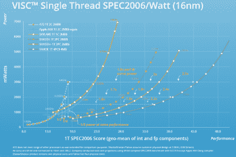
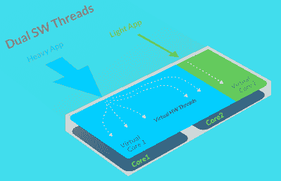

# 可变指令计算:旧的又是新的

> 原文：<https://hackaday.com/2016/02/19/variable-instruction-computing-what-is-old-is-new-again/>

每隔 20 到 25 年，趋势和时尚开始重现。2016 年正在成为 1992 年的重演；《X 档案》又开始播出了，三方总统选举也是可能的。《星际迷航》又回来了。将这些观察数据再往前推 25 年，你就会看到*的外部界限*、*、*以及芝加哥民主党全国代表大会上的骚乱。

历史重演不是政治和流行文化的专属领域。科技也是如此:云只是瘦客户机的延伸，瘦客户机是分时的延伸。旧的都是新的。

在过去的几年里，Soft Machines，一家以隐形模式运行的无晶圆厂半导体公司，发布了第一个全新处理器架构的预览。这种新的架构，VISC，提供了比市场上任何产品更高的性能功耗比。如果你在过去十年左右一直在关注，计算的未来不是 200 瓦的空间加热器，也是强大的 CPU 的两倍。未来是低功耗的机器，足以运行脸书或运行一些 JavaScript。对于服务器，性能功耗比可能是最重要的指标。软机器将如何用新处理器和新架构颠覆半导体市场？如果你了解你的历史，这不应该是一个惊喜。

所有 CPU 都有某种指令集架构(ISA)，无论是 x86、ARM、SPARC、Power 还是 Alpha。不同的 ISAs 在某些任务上可能更快，而在其他任务上可能更慢。例如，6502 是一台漂亮的堆垛机，比 Z80 好得多。这就是为什么你会发现大多数老的 Forth 实现运行在基于 6502 的机器上。这并不是说 6502 是为运行而设计的，这只是一个特殊的历史巧合，使得 6502 成为比其他架构更好的堆栈机器。这反过来又使围绕堆栈设计的语言在 6502 上运行得更快。

Soft Machine’s VISC CPU performance, compared to other ISAs. Click to embiggen

不同的 isa 意味着不同的性能，这也意味着在不同处理器上运行的某些应用的不同功率要求。ARM 芯片进军服务器市场仅仅是因为一个关键指标:性能功耗比。这是 Soft Machine 研究背后的关键因素:生产每瓦特性能最高的 CPU。他们的 ISA 称为 VISC。从技术上来说，这不是可变指令集计算的缩写，但它足够描述性地告诉你它是什么。VISC 是一个全新的 is a，它将 x86 和 ARM 指令转换成其他东西，从而提供更高的性能功耗比。

把它想象成一个视频游戏模拟器。当你在电脑上玩吃豆人游戏时，模拟器将你的键盘按键转换成游戏杆的运动，并将 CRT 输出转换成可以在你的桌面窗口中运行的东西。Soft Machine 的芯片做同样的事情，只是直接在硅中。

### 是的，这听起来很熟悉

早在早期，只有低功率设备的承诺。虽然 16 年前的芯片与今天 100 多瓦的巨型 CPU 相比是低功耗的，但制造超极本、平板电脑或任何其他需要低功耗处理器的设备是很困难的。业界在 Transmeta 找到了这个问题的答案，Transmeta 是一家无晶圆厂的半导体公司，开发了低功耗的 x86 兼容芯片，这些芯片将进入当时的笔记本电脑和平板电脑。

Transmeta 的 Crusoe 和 Efficeon CPUs 都不是 x86 芯片。相反，x86 指令将通过“代码变形软件”转换成本机指令。这些本机指令在低功耗设备中运行效率更高，但这是有代价的:x86 指令需要一个解释器、一个运行时和一个翻译器。这需要安装在每一个有 Transmeta CPU 的设备上。

公平地说，可升级 CPU 的想法很有趣。总是可以添加新的指令，硬件错误可以在软件中修复，CPU 可以模拟除 x86 之外的其他架构。上世纪 90 年代末，甚至有传言说 Transmeta 将推出 PowerPC 和 x86 的混合处理器，苹果对此非常感兴趣。不幸的是，Transmeta 是网络泡沫的受害者，最终在 2007 年关闭了工程部门。

### 历史不会重演，但会押韵

 软机和 Transmeta 有显著区别。软机器在芯片上做所有的事情，而不依赖软件翻译把 x86 变成 VISC 实际代表的任何东西。软机器的袖子上还有另一个窍门:多个虚拟核心。这很像英特尔 CPU 上的超线程如何使四核 CPU 看起来像八核 CPU。

再次，软机借鉴历史的同时更进一步。通过在几个物理内核上实现多个虚拟内核，软机器 CPU 将胜过英特尔。这些内核将能够随意扩展，将更多资源用于要求更高的进程。

总而言之,《软机器》从计算的近期历史中随机借鉴。它在技术上也不存在。知识产权和设计是有的，但迄今为止生产的唯一硅只是单核的测试芯片。

[根据公司路线图](http://softmachines.com/products/#anchorTop)，这些芯片可能即将问世。围绕 16 纳米工艺设计的 SoC 将于今年年中流片。当然，这些芯片投入生产并被塞入设备中还需要更长的时间。然而，当这种情况发生时，Soft Machine 承诺更低功耗的设备可以像今天的四核处理器一样运行。这意味着更强大的智能手机，更长的电池寿命，以及当这款设备真正发布时非常有趣的拆解。