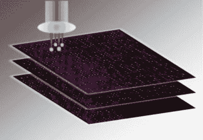

# 5D 玻璃光盘可以存储 360TB！

> 原文：<https://hackaday.com/2016/02/18/5d-glass-disc-can-store-360tb/>

有一小部分黑客担心世界末日。如果我们的整个存在消失了呢？一个外星种族如何学会不去做我们做过的事情，是什么导致了我们的灭亡？我们都听说过用激光在金属盘上蚀刻圣经、历史记载，甚至只是名字——很确定我们已经把相当多的东西送上了太空。但是南安普顿大学光学研究中心的研究人员想出了一种更好的存储方法。他们称之为 [5D 圆盘。](http://www.engadget.com/2016/02/16/5d-discs-can-store-data-until-well-after-the-sun-burns-out/)

根据研究人员的说法，每个磁盘理论上可以容纳 360TB。它们可以承受高达 1000 摄氏度的温度，据信它们可以在室温下持续 138 亿年而不会降解——如果这是真的，那么在光盘降解之前，我们的太阳早就死了！

数据是用纳米级的点存储的，分三层存储。方位和侧位总共构成了五个维度。显微镜和偏振器被用来读取数据，因为当光通过时，这些点会改变光的偏振。

该团队在 2013 年首次展示了[这项技术，但在当时，这项技术只能在一张光盘上存储大约 300kb。三年来，他们取得了长足的进步。](http://inhabitat.com/revolutionary-superman-memory-crystals-can-store-data-virtually-forever/)

到目前为止，他们已经录制了《世界人权宣言》,牛顿的《光学》,以及《大宪章》和詹姆斯国王的《圣经》。维基百科存档的时间到了！

但是我们不得不怀疑。如果这些点是用激光蚀刻的，记录一串 360tb 的数据需要多长时间？！