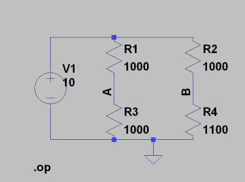
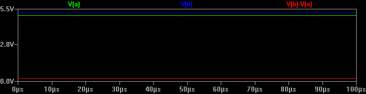
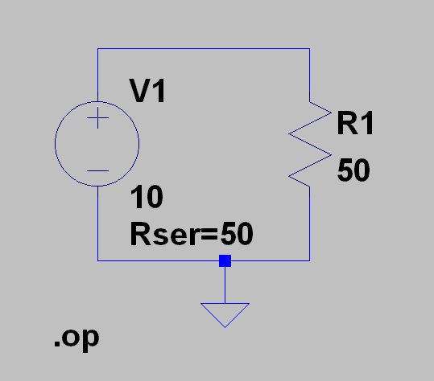

# 为您的工作台增添情趣

> 原文：<https://hackaday.com/2016/02/26/adding-spice-to-your-workbench/>

我们大多数人没有参加过二战，没有开过赛车，也没有驾驶过航天飞机。但是通过模拟，你至少可以体验一下做这些事情会是什么样子。当然，玩《使命召唤》并不等同于去打仗。无论你在模拟什么，都只能到此为止。然而，您可以从模拟中获得很多价值。我敢打赌，玩过《使命召唤》的普通孩子比我的高中历史老师更了解二战的地点和武器。

就电子学而言，仿真是深入了解电路运行的绝佳方式。毕竟，大多数电路都是抽象操作的——没有示波器这样的工具，你无法观察音频放大器并了解它的工作原理。所以模拟，如果做得好，会非常令人满意。你只需要小心记住，它并不总是像真的一样好。

## 那是辣的

最著名的电子模拟器之一是 Spice，它是伯克利在 1973 年创建的。在最初的形式中，你必须在描述你的电路和你想要进行的分析的卡片上打孔。现代的个人电脑版本有时会用一个文本文件代替一副牌。然而，最好的现代版本，给你一个图形用户界面，允许你画一个原理图，然后探测它看结果。

Spice(和其他模拟器)有几个付费和免费版本，都包含 GUI。对于临时用户来说，最好的方法之一是来自 Linear Technology 的名为 LTSpice 的免费产品。

Linear 使 LTSpice 可用，并在其中填充他们设备的模型，希望你能从他们那里购买组件。然而，该软件完全可以用于任何事情，它有一套强大的功能。Linear 为 Windows 生产软件，但我可以证明它在 Wine 下在 Linux 上运行得很好。网站会邀请您注册，但如果您不想注册，也可以不注册。

## 香料四重奏

使用 Spice 有四个部分:原理图捕获(即获取数字形式的原理图)、仿真引擎、模型和输出。LTSpice 非常容易用于原理图捕获，尽管其中一些有点不标准。例如，F9 是撤消键。没有粘贴命令。相反，你选择复制工具(或点击 F6)，然后选择你想要复制的项目，并拖动它们。如果您使用 Eagle 进行 PCB 布局，它会提醒您这一点。

在 Linear 网站上有一个入门指南(这是一堆 PowerPoint 幻灯片),你应该读一下。你也可以看下面我的快速演示。一旦您习惯了复制和粘贴或者如何拖放现有组件，基本操作就非常简单了(提示:张开的手不会移动电线；闭合的手有)。

## DC 电路

[](https://hackaday.com/wp-content/uploads/2016/02/schem1.png) 下面的视频展示了如何构建和分析一个非常简单的 DC 电路(见右图)。您将会看到，一旦您习惯了 LTSpice 执行命令的方式，就很容易画出这样的电路。需要注意的是，我在视频中没有提到:当我输入 1000 和 1100 作为电阻值时，我也可以说 1k 或 1.1k。Spice 足够聪明，可以知道大多数前缀，如 k(千)、u(微)等。唯一混淆的是 m，这是 milli，不是 mega。如果你想放一个 5 兆欧的电阻，试试 5000k 或者 5 兆欧。然而，使用 5m，将得到 0.005 欧姆，这将大大影响您的仿真。字母不区分大小写，所以 M 和 M 都是毫。

另一个提示:在视频中，所有的组件都指向它们默认的方向。但是，当您拖动轮廓时(因为您正在添加新组件或拖动现有组件)，您可以按 Control+R 将其旋转 90 度。

为了便于比较，这个简单电路的实际 Spice“卡片组”如下所示:

```
R1 N001 A 1000
R2 N001 B 1000
R3 A 0 1000
R4 B 0 1100
V1 N001 0 10
.op
.backanno
.end
```

不难理解，但这是因为这是一个非常简单的电路。想象一下有几十或几百个元件的东西，你会喜欢 LTSpice 原理图捕捉。原理图中的 R1 和 V1 部分是电阻和电源的仿真模型。这些简单的模型总是存在于 Spice 中，但是对于一些更复杂的组件，您可能需要选择一个特定的模型。此外，LTSpice 和 read 模型可以从其他供应商或互联网上获得。

模拟引擎读取以句点开头的行。的。原理图上(和卡片组中)的 op 命令告诉 Spice 只输出电路的 DC 工作点。对于这个简单的电路，这就是你所需要的。以下是运行模拟的输出:

```
--- Operating Point ---
V(n001): 10 voltage
V(a): 5 voltage
V(b): 5.2381 voltage
I(R4): 0.0047619 device_current
I(R3): 0.005 device_current
I(R2): 0.0047619 device_current
I(R1): 0.005 device_current
I(V1): -0.0097619 device_current
```

您可以看到使用 label 命令的价值(正如我在视频中所做的)。如果没有它，你就不知道哪个电压是 V(n238)。

然而，真正有趣的是瞬态模拟。反式)。它(或多或少)创建了一个虚拟示波器，可以显示电路中任意点的电压或电流随时间的变化。唯一的问题是，对于 DC 电路，轨迹并不有趣，因为它不会改变。这是 V(a)、V(b)和 V(b)-V(a)的瞬态图:

[](https://hackaday.com/wp-content/uploads/2016/02/trans11.png)

注意红色轨迹是一个数学表达式。你可以用数学找到很多关于你的电路的信息。例如，R3 的功率为 V(a)*I(R3)，通过 R1 的功率为(V(n001)-V(a))*I(R1)。

这里有一个小窍门。如果不想建立表达式 V(b)-V(a)，还有一种方法。通常，要测量 V(b ),你需要点击导线。但是，如果您单击导线并拖动，您将看到探头出现，并且您将拖动一个黑色探头。将黑色探针移至所需的接地参考点(本例中为 V(a )),然后松开。现在，该图将显示 V(b，a ),无需数学运算。

当然，当您有一个交流电路，或者至少是一个由于某种原因而随时间改变状态的电路时，这种类似示波器的输出会更加令人印象深刻。在下一篇文章中，我将展示一个例子。

[](https://hackaday.com/wp-content/uploads/2016/02/schem2.png) 然而，这让你对 LTSpice 的四个部分有了一个基本的感觉:原理图捕获、模型、仿真引擎和输出。还有很多东西要学，但是你可以用我们讨论过的工具做一些非常有趣的 DC 分析。如果你想实验，你可以试着模拟一个 LED 和不同压降电阻值的效果。Spice 的另一个经典“实验”表明，当源电阻等于负载电阻时，功率传输达到最大值(见左图)。下次，[我也会给你展示更多关于原理图和交流电路](http://hackaday.com/2016/02/29/spice-power)。

 [https://www.youtube.com/embed/6QzTZDm0guM?version=3&rel=1&showsearch=0&showinfo=1&iv_load_policy=1&fs=1&hl=en-US&autohide=2&wmode=transparent](https://www.youtube.com/embed/6QzTZDm0guM?version=3&rel=1&showsearch=0&showinfo=1&iv_load_policy=1&fs=1&hl=en-US&autohide=2&wmode=transparent)

