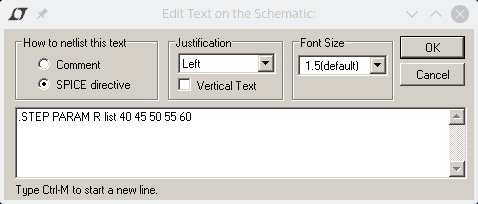
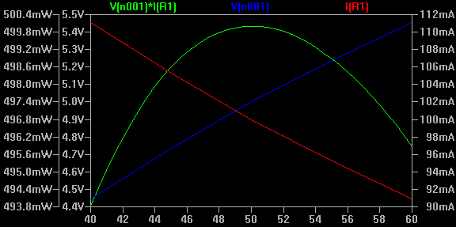
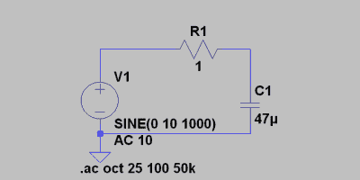
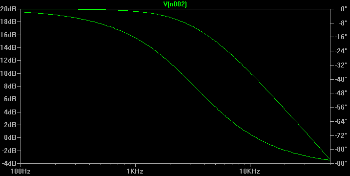

# 香料力量

> 原文：<https://hackaday.com/2016/02/29/spice-power/>

Spice 是一个电路模拟器，您的工具箱中应该有它。虽然模拟器不能告诉你所有的事情，但它通常会在你构建电路之前，就让你对电路的工作方式有一个有价值的了解。在这个由三部分组成的系列的第一部分中，[我查看了 LTSpice，并做了一个 DC 赛道的快速视频演示](http://hackaday.com/2016/02/26/adding-spice-to-your-workbench/)。这一次，我想检查 Spice 的另外两个部分:参数扫描和交流电路。所以让我们开始吧。

[](https://hackaday.com/wp-content/uploads/2016/02/schem2.png) 在第一部中，我给你留下了一个悬念。即使用这个简单电路的最大功率传输问题。如果您运行`.op`模拟，您将得到以下结果:

```
--- Operating Point ---
V(n001): 5 voltage
I(R1): 0.1 device_current
I(V1): -0.1 device_current
```

`R1`(电压乘以电流)中的功率是. 5 W 或 500 mW，如果你喜欢的话。您可能知道，当负载电阻与源电阻相同时，负载中的功率最大。`Rser`参数设置电压源的内阻。你也可以创建一个与`V1`串联的新电阻，并明确地设置它。

如果你认为这个例子太简单而没有价值，请记住，一个电源和一个串联电阻构成一个 Thévenin 源，你可以将任何线性电路转换成它的 thévenin 等效电路，并像这样建模。现在，只要说具有 50 欧姆串联电阻的`V1`可以代替无线电发射机或其他一些已知输出阻抗的复杂设备就足够了。

匹配电阻导致最大功率流过的原因是源电阻与负载电阻一起形成分压器。这里有一些激励结果的手势。如果`R1`完全断开，则`R1`顶部的电压将为 10V，但绝对没有电流流动。那是零瓦特的能量。如果`R1`是一个短的无限大的电流将会流动，但是`R1`只不过是一根电线，你将会有 0V 电压通过它，同样，没有电力。

当`R1`等于源电阻时，你得到一个 50%的分压器。也就是说`R1`会看到 5V，电流会是 10/100 = 0.1。这与 Spice 的结果相符。但是它并没有给你一个好的感觉，为什么那是最好的。显然，降低`R1`会增加电流，对吗？为什么通过的电流越少，产生的功率越大？

## 一步一步来

为了用一张千言万语的图片来回答这个问题，我们需要向原理图添加一个`.STEP`命令。在 LTSpice 工具栏上，有一个图标，上面写着`.op`。您也可以按 S 或从“编辑”菜单中选择“Spice 指令”。使用它输入以下内容:

[](https://hackaday.com/wp-content/uploads/2016/02/step.png)

然后将`R1`的值从 50 改为`{R}`。这看起来很奇怪，但是括号告诉 Spice 这是一个参数，并且`R`与指令中的`R`匹配。由于关键字`list`，Spice 现在将以`R` =40、45、50、55 和 60 欧姆运行仿真。这里是通过`R1`的电压、电流和功率图:

[](https://hackaday.com/wp-content/uploads/2016/02/trace.png)

绿色曲线表示功率，蓝色曲线表示电压，红色曲线表示电流。虽然电流随着电阻的下降而上升，但电压会下降，从而导致功耗降低。相反，电压越高，电流越小。50 欧姆的点正好。

如果不想遍历列表，可以省略`list`关键字，使用如下命令:

```
.STEP PARAM R 40 60 5
```

这给出了相同的结果，因为它以 5 为步长从 40°扫描到 60°。你可以通过使用`.DC`分析而不是`.OP`得到同样的结果，尽管这不是很明显。如果右击原理图上的`.OP`文本，可从弹出的对话框中选择 DC 扫描。帮助文本暗示它扫描电压源(这是真的)。然而，对于源代码，你可以输入`PARAM R`，然后你根本不需要`.STEP`指令。

结果行应如下所示:

```
.DC LIN PARAM R 40 60 5
```

该命令的`LIN`部分告诉 Spice 以线性方式步进该值(即 40、45、50)。这是默认的。然而，`.DC`和`.STEP`命令让你指定`OCT`为八度音阶或`DEC`为十进制扫描。

使用`.OP`或`.DC`命令，输出填充空白(换句话说，您可以读取 42 和 44 欧姆的值)。但是，对于其他模拟类型，您将获得每个步骤的离散输出。例如，尝试将`.OP`命令改为`.TRANS`命令。输出将是正确的，但在这种情况下，很难确定哪组图与`R`的哪个值对应。

## 真正的窗格

解决该问题的一种方法是使用“绘图设置”菜单创建多个绘图窗格。这可以让你在不同的图表上绘制多个事物。在同一个菜单上，有一个选项允许您选择要为特定窗格显示的步骤。请务必取消选中“应用于所有窗格”按钮。

使用窗格和绘图可以做很多事情。例如，您可以将标签从一个窗格拖到另一个窗格，以将波形移动到新窗格。单击标签时使用 Control 或 Alt 键通常很有趣(尽管在 Wine 下，Alt 键可能不会像预期的那样工作)。

另一个技巧是用鼠标在图上拖动一个方框。在您放手之前，您可以在 LTSpice 窗口的左下方阅读有关选择的统计信息。当然，当你放开时，图会缩放，但你可以随时撤消(F9)回到原来的看法。

即使没有窗格，步骤选择器也允许您一次查看一个步骤，而不是合并所有步骤。然而，对于`.DC`或`.OP`分析，无需额外的步骤，绘图就能很好地工作。

## 交流电路

[](https://hackaday.com/wp-content/uploads/2016/02/lowpasss.png) 考虑右边的电路。它有一些新的东西。首先，电压源的交流幅度为 10 V(用于`.AC`分析),同时也是 1000 Hz 的 10 V 正弦波(用于`.TRANS`分析)。还有一个电容器。尽管示意图显示了微的希腊文 mu 字符(如 47 微法)，但您可以将其作为“u”输入。您不需要在键盘上找到输入 mu 的代码。

`.AC`分析扫描源的频率，在本例中从 100 Hz 到 50 kHz。每八度的点数是 25。下面是分析的输出(在`R1`和`C1`的交界处测量):

[](https://hackaday.com/wp-content/uploads/2016/02/lowpass.png)

您可能已经猜到，这是一个粗糙的低通滤波器。低于 1 千赫的频率可以很好地通过，但高于 1 千赫的信号会减少，因为`C1`会将它们分流到地。底线是虚线(在屏幕截图上很难看到)，代表信号的相位(注意右边的垂直刻度)。如果您不想绘制相位，单击右边的刻度，您将看到一个不绘制相位角的选项。

另一种表示方法是使用`.TRANS`分析和一个`.STEP`命令。要看到这一点，将`V1`改为频率为{F},然后添加以下指令:

```
 .STEP PARAM F LIST 1K 10k 100k

```

最后，用`.TRANS .005`替换`.AC`模拟指令。如果绘制输出(即`R1`和`C1`之间的电压):

[](https://hackaday.com/wp-content/uploads/2016/02/filterout.png)

这里很容易看出，绿色走线是 1 kHz 信号，蓝色是 10 kHz 信号，红色是 100 kHz 信号。注意振幅的差异。

## 理论与实践

上述模拟的唯一问题是它是错误的。真正的组件并不像我们使用的完美零件那样工作。电压源有一些内阻。电容器有一定的电阻。电阻器有一些电抗。甚至电线也不是完美的导体。

根据你想要完成的目标，有些可能并不重要。下一次，我将讨论当现实世界中的元件发挥作用时，我们的滤波器电路会发生什么。同时，这里有一个问题:如果你改变滤波器原理图，使`C1`在`R1`所在的位置，而`R1`在`C1`的位置，会发生什么？为什么不试试看呢？请记住，在拖动组件时使用 Control+R 将会旋转它。当你尝试这样做的时候，你可能想要使用张开的手拖动。