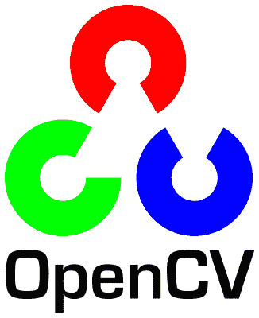

# 洗衣折叠机器人的挑战

> 原文：<https://hackaday.com/2016/02/24/the-challenges-of-a-laundry-folding-robot/>

“今年是通用家用机器人年！”“2016 年将是机器人的时代，就像 1976 年是家用电脑的时代一样！”这种说法的问题在于，自 20 世纪 70 年代以来，我们就一直听到这种说法。通用家用机器人还有很长的路要走。当然，我们有 Roomba，我们甚至有无人驾驶汽车。但是我们没有杰森一家的罗西。虽然我不认为我们会在一段时间内达到 Rosie，但有一些简单的挑战可以刺激这个方向的发展。人们只需看看自己的洗衣房就行了。

使用洗衣机洗涤和烘干衣物并不是一个新概念。洗衣机和烘干机已经变得足够普遍，以至于我们不认为它们是机器人。汉密尔顿·史密斯在 1858 年获得了旋转式洗衣机的专利。美泰克拥有家用机器已有近 100 年的历史。许多早期的机器是由汽油发动机驱动的，因为电力在农村农舍并不常见。从那以后，情况有了很大的改善！我们把要洗的衣物从烘干机转移到篮子里，然后在篮子里折叠起来。正是这最后一步，迫切需要一个家政机器人从每个人手中接过这份苦差事。

可以想象，叠衣服对人类来说很容易，但对机器人来说很难。不过，也不是不可能。这篇文章的想法是展示已经做了什么，并让人们谈论。像这样的项目需要一个人或一组人掌握机械、电子、机器视觉和软件方面的技能。它也肯定会在 2016 年 Hackaday 奖中名列前茅。

商业折叠机是存在的。酒店、医院和其他工业环境都有处理大量床单、毛巾和其他衣物的机器。这些巨大的机器折叠时会熨烫。即使有了现代过程控制技术，他们仍然需要人工操作人员手工装载每一个项目。在黑客方面， [Foldimate 5000](http://www.foldimate.com/) 是一种新颖的机械折叠方法，尽管它不能折叠一切。

来自日本的七个梦想家实验室已经在包括 CES 在内的商展上为他们的洗衣机器人做广告。然而，到目前为止，我看到的每一个演示都是将一件展开的衣物放入洗衣机中。门关上了，几分钟后，这件衣服神奇地折叠起来。在我看到没有人在叠衣服的证据之前，我会说这是恶作剧。

最有前途的洗衣折叠机器人来自伯克利的【彼得·阿贝耳和杰瑞米·梅廷-谢泼德】。早在 2010 年，这对夫妇和他们的团队使用了价值 40 万美元的 Willow Garage 公司的 PR2 机器人。虽然结果很有希望，但他们是在有限的一组衣物上操作的——毛巾，而且只有毛巾。他们的最终研究论文详述了他们的成果。(PDF 警告)

一篮干净的衣物是一个无组织的环境。白色、颜色和印花都堆在一起。模式识别已经过时了。服装也不一定是纯色的。机器人能做什么？

一种方法是从篮子里抓东西——任何东西，抖出来，然后离开。这是伯克利系统如何工作的简化视图。抓住、再抓住并尝试确定衣物的边角。当然，伯克利机器人只需要处理毛巾。它也有一个绿色屏幕的帮助来查看它正在做什么。现实世界中的洗衣不仅仅是毛巾。有些衣服，比如 t 恤，在每个角落都没有清晰的 90 度角。t 恤也可能会翻过来，这是洗衣折叠机器人的一个主要问题。

伯克利有一个非常昂贵的 PR2 机器人在做折叠工作。由于 Hackaday 上的大多数读者没有这样的预算，我们必须找到一种更便宜的方式。谢天谢地[在](https://hackaday.io/project/3800-3d-printable-robot-arm) [Hackaday.io 上有几个机器人手臂项目](https://hackaday.io/project/945-5-axis-robot-arm)可以胜任任务。

更小、更弱的机器人也没有被淘汰。人类有各种各样的形状和大小，他们的衣物也是如此。有一个小机械臂？从婴儿服开始。你认识的任何新父母都会非常乐意帮忙洗衣服——尽管你可能不得不承诺重新折叠你的机器人没有完成的任何事情。

 一个会叠衣服的机器人需要很多软件。谢天谢地，有一些开源库可以构建。输入将来自摄像机。这意味着我们需要一个严肃的机器视觉包来处理图像。这已经存在于 [OpenCV](http://opencv.org/) 中。OpenCV 是一个开放源代码(BSD 许可)的计算机视觉包，它从 1999 年就已经存在了。此后不断完善。Mac、Windows、Linux 以及 Android 和 iOS 都有端口。它也可以在树莓派上运行。

输出将以手臂运动的形式出现。用机器人学的术语来说，决定你想要机械臂移动到哪里就是运动规划。实际计算每个关节移动多少，以及何时移动它们才能到达那里是[逆运动学](https://en.wikipedia.org/wiki/Inverse_kinematics)。阅读关于运动规划和反向运动学的书籍是浪费一个下午或者研究生院七年时间的好方法。外面有很多研究。不过，其中很大一部分是在付费墙后面，所以如果你不在一所重点大学，你就没那么幸运了。尽管如此，一切还没有结束。你可以很容易地找到免费软件来帮助运动规划和逆运动学方程。一个很好的例子就是 [openRave](http://openrave.org/) 。另一个选择是浏览 [ROS(机器人操作系统)](http://wiki.ros.org/)文档页面，ROS 是基于 Linux 的系统，它构成了 PR2 机器人的大脑。

没有了输入和输出，剩下的就是控制了。这个软件将处理来自 OpenCV 的数据，并决定将手臂移动到哪里。折叠衣物有大量的变量。试图想出一个简单的算法来涵盖每一件可能的衣物是不可能的(尽管我希望在这一点上被证明是错误的)。教机器人叠衣服的最好办法就是这样做。我说的当然是机器学习，主要是神经网络。目前，在机器学习方面已经做了大量的工作。巨头之一是谷歌，它最近刚刚向开源世界发布了 TensorFlow。TensorFlow 是一个测试机器学习算法的包。它也用于现实世界环境中，如谷歌语音搜索和谷歌图像。

所以你有它。一个非常具有挑战性的问题的快速解释，以及一些开始使用的工具。这些只是我的想法。你会有什么不同的做法？在评论中加入讨论，然后前往 [Hackaday.io](https://hackaday.io/) 开始你的洗衣折叠机器人项目吧！