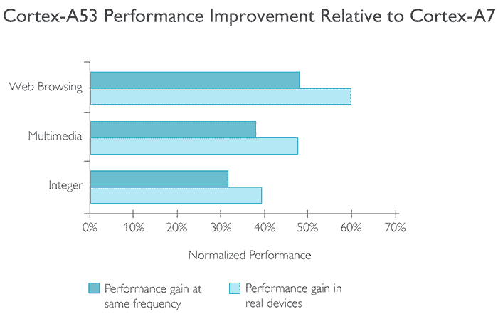
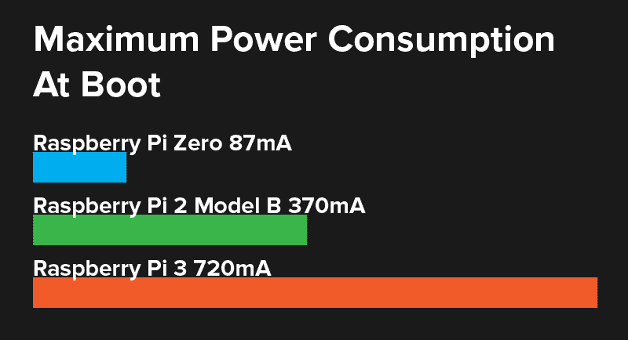
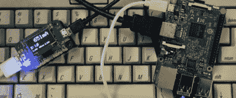
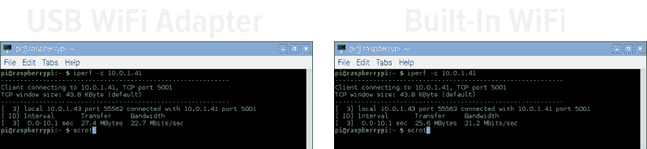

# Pi 3 基准:营销炒作是真的

> 原文：<https://hackaday.com/2016/03/01/pi-3-benchmarks-the-marketing-hype-is-true/>

正如你已经听到的，最新的 Raspberry Pi 的规格列表开始了:WiFi 和蓝牙，现在是标准。虽然这本身令人印象深刻，但这并不能说明全部情况。配有 ARM Cortex A53 的 Pi 3 比去年的 Pi 2 快了 50%。这是短短 12 个月内的惊人进步。

在玩了几个小时的 Pi 3 后，很明显 Pi 3 很快。它通过了可用性的门槛。Raspberry Pi 不再是一台仅仅放在架子上运行几个 cron 任务和闪烁 led 灯的电脑——这是一台可以作为电脑使用的电脑。但是有多快呢？幸运的是，Cortex A53 的官方网站为我们提供了该芯片与 Raspberry Pi 2 中 CPU 的直接比较:

image credit: [arm.com](http://www.arm.com/products/processors/cortex-a/cortex-a53-processor.php)

在真实的设备中，从 Pi 2 到 Pi 3 的性能提升在 40%到 60%之间。至少 ARM 和 Raspberry Pi 基金会是这么宣称的。这是真的吗？我们可以进行一些测试，市场营销这一次也不会太离谱。

## 基准

Raspberry Pi 和其他单板计算机的标准基准测试工具是 Roy Longbottom 的 Raspberry Pi 基准测试工具。这些基准能够测试 Pis 几乎各个方面的计算能力，从整数性能到浮点性能，到 NEON 指令的执行速度(奔腾 MMX 背后的相同想法)。有 OpenGL，内存速度，Java 的基准测试。

这些基准中的许多都可以忽略。没有必要测试 Pi 2 和 Pi 3 访问内存的速度；RAM 芯片是一样的。大约一百年后，Java 将缓慢而悲惨地死去。Pi 的 OpenGL 驱动程序的状态现在正在变化。对于这些测试，我将只关注 Pi 2 和 Pi 3 的整数和浮点性能。

Dhrystone 基准测试是衡量整数性能的标准，每秒产生数百万条指令(MIPS)。测试在运行 1 GHz 的 Raspberry Pi 2 和运行 1.2 GHz 的 Raspberry Pi 3 上进行。树莓 Pi 2 的速度为 1822 MIPS，树莓 Pi 3 的速度为 2451 MIPS，增长了 25%。

Linpack 双精度和 Linpack 单精度基准测试是浮点性能的标准衡量标准，每秒产生数百万条浮点指令(MFLOPS)。测试在运行 1 GHz 的 Raspberry Pi 2 和运行 1.2 GHz 的 Raspberry Pi 3 上进行。Raspberry Pi 2 的单精度和双精度 Linpack 分别为 151 和 157 MFLOPS。Raspberry Pi 3 的单精度和双精度 Linpack 分别为 181 和 192 MFLOPS。与 Pi 2 相比，Pi 3 的 Linpack 性能在单精度下提高了 17%,在双精度下提高了 18%。

## 力量

最初的树莓派选择电源连接器是一个辉煌的一笔。2012 年，每一部好的智能手机上都有微型 USB 连接器，充电器也很多。你可以走进任何一家一元店，找到一些可以将市电转换成 5v 直流电压的东西，插入 USB 插座。这些削减率电源的质量并不真的存在，但这并不重要。

Raspberry Pi 利用了手机充电器的普遍性，并将其用作电源连接器。当时，这是一个伟大的想法。一个股票树莓 Pi 不会吸引超过 500 毫安，保证来自这些电源适配器。有一段时间，它奏效了。

地球上的每个 USB 端口都应该能够为外围设备、Raspberry Pis 和 USB 供电的设备提供 500mA 的电流。如果你有一个好的电源，超过这个是可能的。虽然 Pi 1、Pi 2 和 Pi Zero 可用于任何电源，但对于 Pi 3 却不是这样。与圆周率零点相比，它很耗电。添加几个 USB 加密狗和新的板载 WiFi 适配器，你至少需要一个 2.5A 的电源。

## 建立工作关系网

到目前为止，Pi 只有一个联网选项。您可以使用板载以太网，或者使用无处不在的 802.11n WiFi 适配器并使用无线网络。注意，我说的是*一个*网络选项。

Raspberry Pi 的 USB 和以太网都通过一个芯片、LAN9514 组合 10/100 以太网适配器和四端口 USB 集线器实现。该芯片通过芯片组上的单个 USB 端口连接到 CPU，将以太网的四个 USB 端口*和*的带宽限制在 480Mbps 左右。真实世界的使用案例会有所不同。

树莓派 3 包括 WiFi 和蓝牙，但不通过 USB 端口。相反，现在将 Pi 3 连接到互联网的最佳方式是通过 CPU 上的 SDIO 端口。该端口可通过 GPIO 引脚[访问，并已在定制 WiFi 帽子](http://hackaday.com/2015/12/09/raspberry-pi-wifi-through-sdio/)中获得巨大效果，但它是否提供了更多带宽？

在本地网络上测试网络接口的标准方法是[iperf](https://iperf.fr/)；您需要做的就是在一台机器上运行 iperf 服务器，在另一台机器上运行测试。这不是一个能给出网络接口绝对吞吐量的测试。如果你在测试两台用以太网电缆连接的电脑，结果会很接近，但是在测量 WiFi 时，iperf 只能用作比较的基础。无论如何，这正是我们试图衡量的:Pi 3 的内置 WiFi 比 USB WiFi 适配器快还是慢？

结果微不足道。一个 Edimax 802.11n USB WiFi 适配器能够拉低 22.7 Mbps。Pi 3 的内置 WiFi 管理了 21.2 Mbps。那差不多是一样的。

## 真实世界的测试

Dhrystones、MIPS、Linpack 和其他基准测试工具就是这样；基准。它们不衡量您编写的代码的真实性能。有一种简单、标准的方法可以计算出一点点 Python 的运行速度:[找出所有小于一百万的质数](http://www.raspberrypi-spy.co.uk/2012/06/overclocking-benchmarking-the-raspberry-pi/)。有 78497 个，但是 Pi 3 能多快找到全部？

树莓 Pi 3 在一分钟内找到了所有一百万以下的质数，7.49 秒。在相同的 SD 卡上运行相同的 Python 脚本，Raspberry Pi 2 在两分钟五秒内找到了所有一百万以下的质数。

## 营销炒作是真的

Raspberry Pi foundation 在宣布 Raspberry Pi 3 时的亮点是 WiFi、蓝牙和比去年的 Pi 2 快两倍的 CPU。ARM 的营销材料对 Pi 2 中的 Cortex A7 和 Pi 3 中的 Cortex A53 进行了直接比较，后者的速度比前者快 40%到 60%。

这种宣传在很大程度上是真实的。在现实世界的测试中，Pi 3 的速度可能是它的两倍。在标准化的基准测试中，Pi 3 大约快 20-40%。尽管网络速度保持不变，但 Pi 3 仍然为有趣的应用打开了许多大门。我个人订购了一个 USB 任天堂 64 手柄。