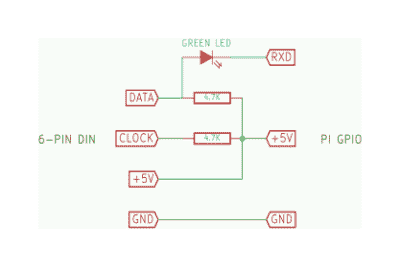

# 在你的 Pi Zero 上安装一个 PS/2 键盘

> 原文：<https://hackaday.com/2016/03/02/hack-a-ps2-keyboard-onto-your-pi-zero/>

针对 Raspberry Pi Zero 的黑客攻击是一个棘手的问题。无论你做什么，你都是在和一个名义上 5 美元的董事会一起工作，所以你的黑客不能太高调。例如，一个像样的 PS/2 转 USB 适配器的价格和 Zero 差不多，甚至更高。但是如果你只是需要 T1 来驾驶你的旧 M 型车的 Pi Zero(我们听到了！)你必须以低廉的价格做这件事。

所以当多产的 Pi hacker [mincepi] [着手打造 PS/2 适配器](https://hackaday.io/project/9922-ps2pi)的时候，有些偷工减料。PS/2 是一种时钟数据协议，但好消息是时钟不会像 I2C 或 SPI 那样一直开始和停止。这意味着如果你以正确的频率轮询数据线，至少原则上你可以忽略时钟。

这就是明斯皮所做的。正如您在示意图和横幅图像中看到的，这没什么。两个电阻为时钟和数据线提供上拉电压。这里有一个宝石:一个下降电压约为 2 V 的绿色 LED 将 5 V 数据线转换为 Pi Zero 的 3.3 V 不会被烧毁的东西。很可爱，而且非常符合黑客精神。为了安全起见，你可能会忍不住从某个地方找来一个 3.3 伏的齐纳二极管，但是记住，你保护的是一台 5 美元的电脑。

最后一部分是 Pi 的定制内核模块，它以正确的频率轮询 PS/2 数据线。如果你不是 Linux 用户，而且“编译内核模块”听起来很吓人，[mincepi]甚至为他正在使用的 Raspbian 发行版编写了一个很好的指南。对任何其他发行版稍加调整，它应该可以工作。

我们说过[mincepi]是一个多产的 pi 黑客，这里是证据:我们已经报道了他的快速和肮脏的 VGA 输出黑客和[一个将模拟声音输入到 Pi Zero](http://hackaday.com/2016/02/28/rasberry-pi-analog-input-using-only-passive-components/)的方案，就在最近几周。黑进去。