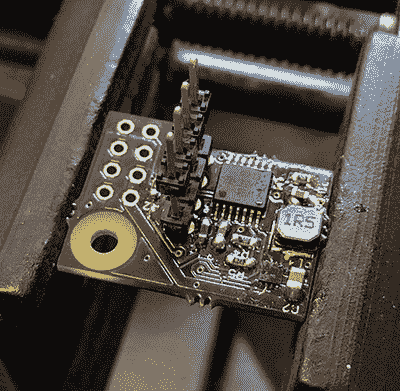

# 树莓派的备用电池

> 原文：<https://hackaday.com/2016/03/17/battery-backup-for-the-raspberry-pi/>

你可以去任何一元店，加油站，大盒子店，或者你最喜欢的网上零售商买一个 USB 电源银行。这是一个嵌在带 USB 端口的塑料外壳中的锂电池，可能设计得很差，但它确实为树莓派提供了很好的电源。对于我们在 hackaday.io 上运行的树莓派零竞赛，[Patrick] [建造了一个磷酸锂电池组](https://hackaday.io/project/9461-lifepo4weredpi)，它的工程设计要好得多，并且具有一些简单的 USB 电源库永远不会拥有的功能。

[Patrick]的 Raspberry Pi UPS 不仅仅是一个连接到电源轨的电池和充电控制器；该板有一个微控制器，可以完全控制 Pi 何时唤醒、何时进入睡眠状态，并且可以使 Pi 干净关断，即使在无头模式下也是如此。全世界的 SD 卡都欢欣鼓舞。

该项目的电子器件只是一个低功耗 MSP430 微控制器和一个升压调节器。电池组/电源管理器通过 Pi 的 40 针接头上的前几个 GPIO 针连接到 Pi。这足以接入 3.3 和 5V 电源，以及串行控制台，因此电源事件可以在 Pi 上编写脚本。

到目前为止，[Patrick]已经用他的锂电池备份、Pi 型号 A+和树莓 Pi 相机制作了几部延时电影。他设法在大约 24 小时内拍摄了 99 张照片，仅由一个锂离子电池供电。你可以看看下面的视频。

 [https://www.youtube.com/embed/w3fZp-thras?version=3&rel=1&showsearch=0&showinfo=1&iv_load_policy=1&fs=1&hl=en-US&autohide=2&wmode=transparent](https://www.youtube.com/embed/w3fZp-thras?version=3&rel=1&showsearch=0&showinfo=1&iv_load_policy=1&fs=1&hl=en-US&autohide=2&wmode=transparent)

* * *

树莓派零竞赛由 Hackaday 和 Adafruit 主办。奖品包括 Adafruit 的树莓派零和 Hackaday 商店的礼品卡！
[查看所有参赛作品](https://hackaday.io/submissions/adafruitpizerocontest/list) || [现在就进入你的项目吧！](https://hackaday.io/contest/9326-adafruit-pi-zero-contest)