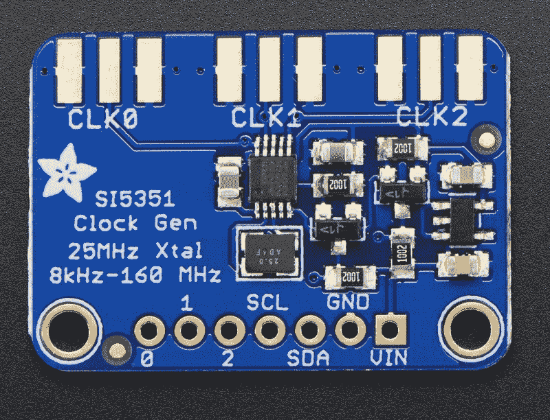

# 青少年 3.1 控制的 VFO

> 原文：<https://hackaday.com/2016/03/05/teensy-3-1-controlled-vfo/>

[汤姆·霍尔]和世界各地的许多业余爱好者一起[侵入了硅实验室 Si5351](http://ak2b.blogspot.com/2015/06/teensy-31-vfo-with-encoder-and-si5351.html) 来制造 vfo(可变频率振荡器)来控制接收器和发射器。休息过后，你可以在一段视频中看到他的工作成果。

【Tom】使用 Teensy 3.1 Arduino 兼容板来控制安装在 Adafruit 分线板上的 Si5351 [。LCD 显示屏显示当前频率，并提供一个简单的界面显示来改变输出。刻度盘编码器允许直接调节频率。ham 频带和每个编码器步长的频率增量由操纵杆控制。当你进入 10 米波段时，你肯定希望能够以 kHz 为增量跳跃，至少，因为该波段的范围是从 28 MHz 到 29.7 MHz。](https://learn.adafruit.com/adafruit-si5351-clock-generator-breakout/overview)

那么 Si5351 是什么呢？[数据手册](https://www.adafruit.com/datasheets/Si5351.pdf)称之为 *I2C 可编程任意频率 CMOS 时钟发生器+ VCXO。*唷！让我们把它分解一下。该芯片可以通过 I2C 总线由微处理器控制。该芯片的目的是产生 8 kHz 至 160 MHz 的时钟输出。不是所有的频率，但范围很广。VCXO 的意思是压控晶体振荡器。该晶体为 25 MHz，为芯片提供非常稳定的频率源。此外，Si5351 将产生三个独立的时钟输出。

[Tom]浏览他的 VFO 的代码，并通过 GitHub 提供它。这是一个有趣的项目，为想自己动手的人解释了很多细节。他的工作是基于我们之前发表的其他人所做的工作，这就是黑客的全部。

 [https://www.youtube.com/embed/791NupCbiWU?version=3&rel=1&showsearch=0&showinfo=1&iv_load_policy=1&fs=1&hl=en-US&autohide=2&wmode=transparent](https://www.youtube.com/embed/791NupCbiWU?version=3&rel=1&showsearch=0&showinfo=1&iv_load_policy=1&fs=1&hl=en-US&autohide=2&wmode=transparent)

