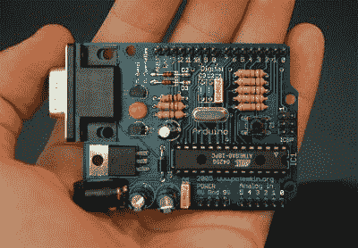

# 所以，你害怕表面贴装

> 原文：<https://hackaday.com/2016/03/17/so-youre-scared-of-surface-mount/>

如果你足够幸运地遇到一件 20 世纪 50 年代的自制电子产品，很可能在盖子下面的元件将被组装在焊接标签上，每个元件都有长导线和安装在底盘上的电子管插座。易于与大多数农用烙铁组装。

打开一个 20 世纪 60 年代或 70 年代初的家庭建筑，你可能会发现相同的无源元件与锗晶体管一起安装在一个奇怪的宽间距条板或甚至是一个带有粗宽轨道的自制 PCB 的孔中。

  Solder tags aplenty in a commercial transmitter from the early 1960s  Cutting-edge 1970s homebrew

到 20 世纪 70 年代末和 80 年代初，你会发现一个更熟悉的景象。间距为 0.1”的条形板上的双列直插式集成电路通孔，国产 PCB 开始出现在玻璃纤维板上。易于使用，易于焊接。熟悉。安全。差不多四十年后，你会在你的试验板上看到什么，你还会从许多套件制造商那里看到什么。

Nice and familiar, a through-hole Arduino.
[By Nicholas Zambetti](https://www.arduino.cc/en/Main/Gallery) CC BY-SA 3.0

但我们都知道，电子元件领域的进步并没有停滞不前。表面贴装元件的历史可以追溯到 20 世纪 60 年代，从 20 世纪 80 年代末开始出现在消费电子设备中。每平方英寸更多的元件，更小，更便宜的设备。如今它们无处不在，而且越来越多的新组件不再以通孔形式提供。如果你的实验仅限于 741 和 555，这不是问题，但如果你的口味扩展到微控制器或射频工作的新型传感器，这就有点束缚你的风格了。

这一发展引发了一系列反应。许多人已经欣然接受了这种新媒体，因此 [Hackaday.io 项目页面](https://hackaday.io/projects)充满了非常聪明的 SMD 项目。但是有相当多的人还没有能够跳到 SMD，也许他们被 SMD 元件的较小尺寸、他们可能需要的特殊工具或者他们必须学习的新技能所阻碍。当您销售带有 SMD 元件的套件时，您会听到那些喜欢该套件但希望它可以在通孔中使用的人的反应，因此这篇文章是为他们准备的。揭开 SMD 工作的神秘面纱，并证明 SMD 工作应该是几乎任何一个会使用烙铁的人都能掌握的。

### 但是它们太小了！

Tiny SMDs – fortunately most of which you will not have to worry about.

这可能是终身通孔焊接者的第一反应。SMD 器件通常非常小，即使是封装较大的器件，其引线也可能像猫身上的毛一样多而细，让外行人如惊弓之鸟。

但是重要的是退一步，理解并非所有的 SMD 都是平等的。它们中的一些非常小，只有拥有上帝般力量的人才能手工焊接，但是大量的器件采用 SMD 封装，对于普通人来说足够大。

所以，当你看到一块布满灰尘大小元件的电路板时，不要担心。很少有人能尝试这种水平的建筑，你的抄写员肯定不行。(我们期待着那些声称经常手工焊接千针 BGA 和 01005 芯片元件的评论者，但是如果没有证据，这种说法是没有用的。)

相反，专注于你能处理的 SMD 封装。SMD 芯片元件封装用与其尺寸相关的数字来指代。令人困惑的是，该方案有公制和英制两种版本，但格式是相同的:长度后跟宽度。

考虑上图中的 PCB 和卷尺，它是 Raspberry Pi 型号 B+的底面，将由机器人取放机组装。大多数组件确实非常小，但你会注意到 L3 是左下角的黑色组件，与它的邻居相比看起来很大。那个包裹是一个“1008”，长 0.1 英寸，宽 0.08 英寸。它仍然很小，但是想象一下在放大镜下用镊子把它夹起来。不算太糟，是吗？你以前可能接触过很多这种尺寸的东西，现在 SMD 器件看起来是不是很可怕？较大的组件——0805、1008 和 1206——出乎意料地在普通制造商的掌握之中。

### 但是我需要各种特殊的工具！

[Retro Populator](http://hackaday.com/2014/08/30/thp-semifinalist-retro-populator-a-pick-and-place-retrofit-for-a-3d-printer/), a homebrew pick-and-place machine we featured back in 2014

在商业环境中，SMD 器件将由机器组装。胶水或焊膏将印刷在电路板的相关部分，机器人取放机将从胶带包装中取出元件，并自动将其放置在正确的方向上。然后，电路板将在回流炉或波峰焊机中一次性焊接。

如果你是 SMDs 的新手，你不太可能在你的工作台上放着任何这种套件。有[自建的取放机](http://hackaday.com/tag/pick-and-place/)和[一系列自建的回流焊炉](http://hackaday.com/tag/reflow-oven/)，但可以肯定地说，它们仍然是相当先进的东西。

您还会看到针对台式 SMD 构造器的各种商业套件。热风焊接站或传统熨斗的 SMD 钻头，所有这些都非常有用，但价格昂贵。

好消息是，你不需要这些特殊的工具来把你的脚趾浸入贴片水中。几乎可以肯定的是，你已经拥有了你所需要的一切，如果你没有，那么你所缺少的东西中很少是专门针对 SMD 工作的。如果你有以下项目，那么你是好的:

A basic SMD soldering toolkit

**好光源**。即使是较大的 SMD 也仍然非常小。充足的光线确保你能清楚地看到它们。一盏向下的台灯就足够了。**清晰的高对比度表面**。因为 SMD 可能很难看到，所以在明亮的白色表面上操作会有所帮助。桌子上一张崭新的白色打印纸就是一个合适的工作区域。**良好的免提放大功能**。除非你有幸拥有惊人的视力，否则你需要一个像样的放大镜来处理表面贴装元件。展台上的“援助之手”类型是合适的。**非常小的一字螺丝刀**。焊接表面贴装元件时，你需要用这个压住它们。**一套质量上乘的精密金属镊子**。你将需要这些来拿起、操作和翻转表面贴装器件。**尖头烙铁**。如果你有一个标准的细铁头适合使用传统的 0.1”节距通孔组件，那么你应该装备齐全。

也就是说，有一个特殊的工具可能值得您考虑。焊接 SMD 器件时，有时似乎需要三只手才能完成，因此可以使用一两个工具。幸运的是，这是你可以自己建造的。看一看[SMD 喙，例如加重臂](http://hackaday.com/2015/02/05/diy-smd-twofer-manual-pick-and-place-and-the-beak/)，或者你的抄写员的[弹簧夹第三只手](https://hackaday.io/project/8605-spring-clamp-third-hand-for-hand-soldering-smds)。

### 对不起，这超出了我的焊接技术水平

Desolder braid and plenty of flux are your friends.

当你看到一个 SMD 集成电路时，很容易想象它的引脚太小、靠得太近，你不可能用手焊接它们。答案是，你当然可以，你只需要看看你如何以不同的方式焊接它们。

使用通孔 IC，您可以单独焊接每个 0.1 英寸间距的引脚。如果你设法在两个引脚之间放置一个焊接桥，然后你跑去找你的脱焊泵或编织带，这是一场灾难。

相比之下，对于表面贴装 IC，作为一个普通人，你几乎不可能单独焊接每个引脚，所以你甚至不去尝试。取而代之的是，你用过量的焊料一次焊接一整行，用脱焊器编织物去除产生的巨大焊料桥，留下一个非常整洁和专业的工作。表面张力和大量的焊剂是你的朋友，如果你是一个经验丰富的通孔焊接者，你不需要掌握很少的焊接技能。

如果你能把它压在电路板上，必要时用放大镜看清楚，那么不管是什么元件，你都可以焊接。试试看，你会让自己大吃一惊的！

### 接下来呢？

1206 chip discrete components hand-soldered to a PCB

所以我们希望我们已经说服了你这个 SMD 的怀疑者，你有能力自己使用 SMD。接下来呢？

从研读这个题目开始。你最喜欢的搜索引擎应该会提供，教程可以从 [Sparkfun](https://www.sparkfun.com/tutorials/category/2) ，从 [Adafruit](https://learn.adafruit.com/adafruit-guide-excellent-soldering/surface-mount) ，或者从 [Instructables](http://www.instructables.com/howto/smd/) 等许多网站找到。寻找视频，YouTube 上有大量的 SMD 焊接指南。

但是实践是不可替代的。找一块有合理尺寸的表面贴装元件的废板，试着返工。拆焊它的组件可能有点困难，但你应该很容易能够返工焊点。在集成电路的引脚上涂上厚厚的一层焊剂，试着让一滴熔化的焊料沿着引脚流动，然后用脱焊器去除多余的焊料。废板的伟大之处在于，如果你损坏了它也没关系，所以你可以尽情地练习这些技巧，直到你对新发现的技能感到满意为止。

所以你已经准备好向前迈进，开始你的第一个 SMD 项目。干得好！你接下来要做什么取决于你自己。设计自己的电路，制作 PCB，购买套件，或者在 Hackaday.io 上找到自己喜欢的 SMD 项目，下载 PCB 文件，然后订购自己的项目。

无论你做什么，都要为你克服了 SMD 恐惧而高兴，并下定决心在未来第一个尝试任何新技术！