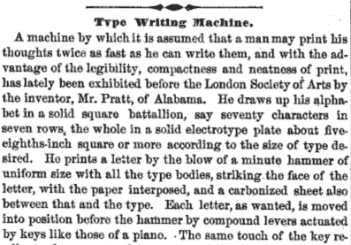
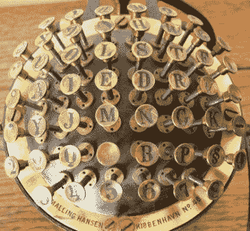
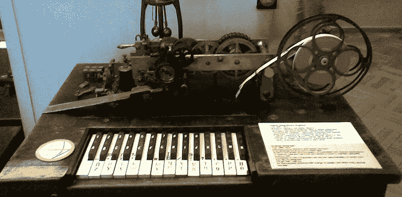
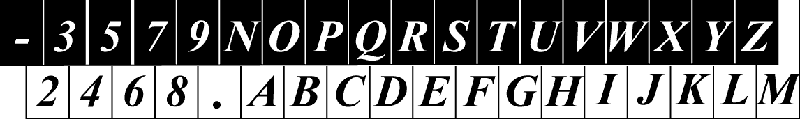
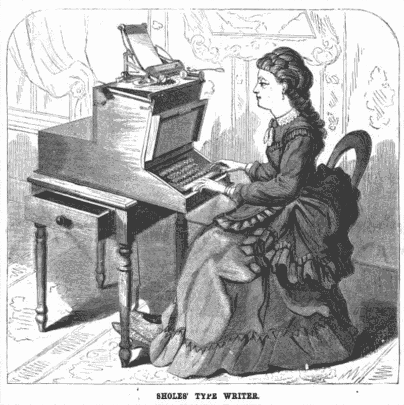

# QWERTY 的起源

> 原文：<https://hackaday.com/2016/03/15/the-origin-of-qwerty/>

很少有事情像打字机和键盘的 QWERTY 布局的起源那样被道听途说和谣言所包围。QWERTY 布局背后的原因并不像“这样每个字母的横条就不会相互碰撞”那么简单。这是胡说八道——在改变键盘的排列方式之前，改进机制会更有意义。

这并不是创造 QWERTY 的唯一谬误。这也被称为一种营销策略；史蒂芬·杰·古尔德推广了 QWERTY 键盘的概念，这样销售人员就可以啄出最上面一行的数字。这也没什么意义。为什么第一行而不是第二行有特权包含组成机器名称的所有字母。就此而言，如果打字者用一只手打字，推销会不会更令人印象深刻？

这并不意味着 QWERTY 的疯狂背后没有一种方法——它只是不像 19 世纪 70 年代卡住的打字机机制或满足推销员的愿望那么简单。虽然 QWERTY 不是凭空出现的，但这种键盘布局的民间故事历史是可悲的不足。

### 第一台打字机

The announcement of a type writing machine in the July 6, 1867 issue of Scientific American

任何键盘布局的发明都始于打字机的发明，而备受争议的打字机发明者是英国发明家亨利·穆勒(Henry Mill)，他在 1714 年获得了一项设备专利，该设备“用于单独或渐进地压印或转录字母，如此整洁准确，以至于无法与印刷区分开来，在结算和公共记录中非常有用”。换句话说，一个可以在纸上压印字母的装置。关于这个装置的其他信息很少，但有一点是清楚的:这个装置没有用墨水在纸上做标记；复写纸直到一百年后才被发明。

在 1867 年 7 月 6 日出版的《科学美国人》杂志上，首次提到了一种带有按键的机器，用于在一张复写纸上写字。这个设备是由约翰·普拉特发明的，它使用一个水平和垂直移动的铅字板，用锤子一次将一个字母压入一张纸上。

The Malling-Hansen Writing Ball, invented in 1865

虽然 Pratt 的设备使用了一系列排列成矩阵的按键，但它肯定不是我们今天所习惯的。Pratt 的“Petrotype”使用 17 个键沿着字符的列和行移动金属板。

1865 年发明的 Malling-Hansen 书写球是第一台使用单键书写每个字符的打字机。这个装置是一个布满按键的圆顶，每个按键都在一张纸上按下一个锤子。你看不到打出来的字母。

马林-汉森书写球上的按键布局不是随机的；最常用的字母就在写字最快的手指的正下方。这是第一台打印速度比人手写速度更快的打字机。

### 舒尔斯打字机

第一台商业上成功的打字机是由克里斯托弗·兰瑟姆·肖尔斯、卡洛斯·格利登、塞缪尔·w·索尔和詹姆斯·登斯莫尔设计的。肖尔斯和他的公司设计的第一台打字机是模仿 1848 年发明的早期设计——印刷电报。

Printing telegraph, c. 1849

印刷电报使用钢琴风格的键盘，每个键代表字母表中的一个字母。Sholes 的第一个键盘借鉴了这个想法，生产出了一个与 1868 年的雏菊轮打印机相似的键盘。这种“打字机”在美国获得了 7868 号专利，但是它在商业上并不成功。

The keyboard layout of Sholes’ Type Writing Machine, c. 1868

Sholes’ 1870 keyboard

钢琴布局很快让位，1870 年，肖尔斯生产了一种新的打字机，其键盘乍一看有些现代。这个键盘由大写字母、数字 2-9、连字符、逗号、句号和问号组成。Sholes 1870 年的键盘布局最有可能来自 Koichi 和 Motoko [2]，并保留了钢琴启发的印刷电报的大部分布局。字母几乎是按字母顺序排列的，尽管元音移到了最上面一行。

肖尔斯很快离开了打字机行业，但在此之前，他接触了美国电报公司的乔治·哈灵顿和丹尼尔·h·克雷格。哈林顿和克雷格承诺购买几台打字机，但在此之前已经做了一些改进，包括改变键盘布局。

### QWERTY 的起源

就这样，QWERTY 键盘的发展开始了。设计不是由销售部门决定的，也不是由第一台打字机的机械结构限制决定的。相反，QWERTY 键盘的设计是为莫尔斯电码而设计的，非常重视将最常用的字母放在主行上。

19 世纪美国使用的莫尔斯电码不是我们今天知道的莫尔斯电码。美国莫尔斯电码与今天使用的国际莫尔斯电码略有不同。美国莫尔斯电码将字母‘Y’编码为()；两个副本，一个空格，两个副本。“z”编码为( )，通常与“SE”混淆，尤其是以单词的第一个字母出现时。因此，“S”、“E”和“Z”键应该靠得很近。出于同样的原因，C-在莫尔斯，()-应该放在' S '，' I '和' E '附近。我们不再使用美国莫尔斯电码是有原因的。

The 1872 keyboard arrangement

这些努力最终成就了打字机，它成为了 1872 年 8 月 10 日《科学美国人》的封面。第一次，类似于现代 QWERTY 布局的东西出现了。它并不完美——“M”不在“N”旁边，“C”和“X”被调换了。字符、数字和标点符号遍布键盘，但这正是适合电报员的，并成为第一台商业上成功的打字机的基础。

Sholes、Densmore 和其他投资者最终联系了纽约伊利昂的 E. Remington & Sons 公司。虽然这家公司今天因生产枪支而闻名，但在 19 世纪，缝纫机是雷明顿目录中的奖品。1873 年初，Densmore 和 Remington 签署了一份制造 Remington 1 号打字机的合同，在 Sholes 拜访之后——他以 12000 美元的价格出售了他的专利份额——决定这种设备的品牌名称应为“Sholes & Glidden Type-Writer”

对雷明顿 1 号 Sholes & Glidden 打字机进行了改进，包括将“O”和“I”字符移近“9”数字。Sholes 要求将 Y 移到中间，紧挨着 T。

The Remington No. 2 Typewriter, c. 1882

1878 年，拜伦·奥尔登·布鲁克斯发明了压纸卷轴移动装置，这种装置可以让打字机用同一个键打出两个字符。这个想法被卖给了雷明顿父子公司，1882 年，雷明顿稍微改变了打字机的设计，部分是为了逃避专利，部分是为了安抚一个新的市场——短工。雷明顿 2 号的设计把‘M’移到了‘N’旁边，把‘C’换成了‘X’。这是现代的 QWERTY 布局。

### 我们今天知道的键盘

QWERTY 键盘不是为了防止打字机卡住而设计的。第一台打字机的主要用户是莫尔斯电报机，他们每分钟至少可以发送和接收 30 个单词。当速记员使用时，打字机每分钟可以记录一百多个单词。没有迹象表明，在进入这个新的消费者市场后，打字机的机械结构有所改善，而且 QWERTY“防止打字机卡住”的说法很容易被否定。在任何情况下，字符“R”比句号使用得更频繁，如果 QWERTY 的设计受到卡住的机制的影响，那么将句号移到键盘的一侧，而“R”移到中间是没有意义的。

QWERTY 键盘也不是为了营销而设计的。如果把打字机的品牌名称放在第一排字母上是一个优先事项，为什么不把品牌名称的其余部分也包括进去，包括“SHOLES”和“GLIDDEN”？QWERTY 作为一种营销策略的故事仅仅是史蒂芬·杰·古尔德在讨论进化、局部极小和德沃夏克键盘时提出的一个题外话。

事实是，QWERTY 受电报的影响更大，特别是美国的莫尔斯电码，还有一部分是受创造了一种新的打字方法的速记员的影响。

The Sholes Typewriter, as seen on the August 10, 1872 cover of Scientific American

* * *

[1]古尔德，斯蒂芬·杰伊。栗色 4《熊猫的拇指技术》中的*欺负雷龙*。纽约:诺顿出版社，1991 年。

[2]安冈幸一和安冈元子，“关于 QWERTY 的史前史”，载于*Zin bun*2011 年第 4 卷。

[3]拜伦·奥尔登·布鲁克斯，“打字机的改进”，美国专利 202923，1878 年 4 月 30 日。

[4]奥古斯特·德沃夏克和林子幸·迪利，“打字机键盘”，美国专利 2040248，1936 年 5 月 12 日。