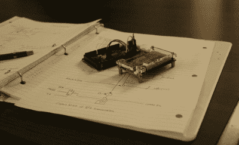
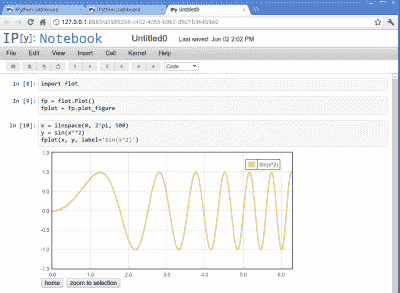
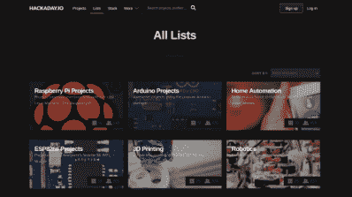

# 黑客的笔记本:每个项目的任务日志

> 原文：<https://hackaday.com/2016/03/21/the-hackers-notebook-a-mission-log-for-every-project/>

虽然“写下来”似乎是常识，但事实并非总是如此。从古希腊时代起，柏拉图就讲述了一个忧心忡忡的埃及国王的故事，他在目睹了书写的发明后说，

> “如果人们学会了这一点，就会在他们的灵魂中植入遗忘；他们将停止行使记忆，因为他们依赖于写下的东西，不再从他们自己内部，而是通过外部的标志来唤起记忆。[ [1](http://www.umich.edu/~lsarth/filecabinet/PlatoOnWriting.html) ]"

对一些人来说，笔记本是一个危险的设备，一个会偷走我们记忆的小偷。幸运的是，这些天来，从我们的心理学教科书中有大量的证据表明，我们人类在保持事实真相方面相当差劲。事实上，每次我们回忆起一段记忆，[我们就改变了它](https://www.technologyreview.com/s/515981/repairing-bad-memories/)！笔记本的妙处就在于此。对新项目有想法吗？为什么不把它记录下来以备将来参考呢？通过勤奋，笔记本可以成为我们激发新项目想法的个人中心。

## 项目日志和你

做一个笔记本需要时间——这些时间与实际的项目无关。尽管如此，我相信，一点精心编写的深谋远虑可以让你睁大眼睛，看到那些在我们关注细节时可能被隐藏的想法。

### 主参考

很难抑制想要投入并开始正面解决这个项目的冲动。稍后在试验板上安装几个电阻和运算放大器，也许我们已经成功了一半。毕竟，当你能画出电路时，为什么要慢下来呢？不幸的是，虽然我们可以在一个晚上走得很远，但我们并不总是能完成。当这种情况发生时，从一堆电线中重启要比从主基准电压源重启困难得多。笔记本的妙处就在于此。当我们强迫自己写下

every bit counts; some designs start on paper

一个想法，我们面临的挑战是给出一个我们试图构建的总体描述，并提供足够的细节来构建它。一旦我们实际上建立了 3D 打印机或电路试验板，我们就有了之前记录的尺寸或原理图，可以跳回到相同的上下文中。幸运的是，从框图到电路图符号，再到逻辑门，以前的工程师们已经创造了一整套相互交流的符号词汇。为什么不用它来和未来的自己交流呢？

### 多体解决方案

当我们写下或打出我们的想法时，我们会有意识地去娱乐它。也许这是机器人运动的另一种机制。也许这是一个开关电源的草图。不管怎样，为了以后记住它，我们需要给出足够详细的描述，以便在时机成熟时再次回忆起来。如果我们能促使自己把这个想法写进笔记本，我们就能获得一个有趣的收益。既然是在纸上或文本格式，它可以袖手旁观本身。

也许一两天后，当我们回顾我们所写的东西时，我们可以从外部的角度来看待它。阅读我们所写的内容，我们给了自己第二个角度来看待同一个想法——几乎就像是获得另一个人的意见。从某种意义上来说，的确如此。笔记本变成了与“昨天的你”的对话。我们赋予自己接受多种观点的能力，每一种观点都是在不同时期写下来的。

## 超越纸浆和纸张:21 世纪笔记本电脑

自从美索不达米亚人开始在泥板上涂鸦楔形文字以来，已经过了整整 3000 年。当然，我们可以做得更好！幸运的是，由于现代技术，我们不需要像穴居人一样不停地涂鸦来保持我们的想法。如今，在线构建日志和数字相册已经在帮助我们呈现想法，但它们也可以帮助我们产生想法。我想我应该给两个现代工具一些启发，这两个工具是为草稿而调整的。

### ipython 笔记本

Image Credit: [IPython Developers List](http://comments.gmane.org/gmane.comp.python.ipython.devel/11301)

有时，我们需要运行一段测试代码来处理一些数字。也许我们在实验室里，进行一个快速实验，或者我们只是需要仔细检查我们的位数学。IPython 将您的 web 浏览器变成一个交互式 Python 终端。小代码片段可以放入类似 Mathematica 的“细胞”中，通过简单的 **Shift+Enter** 就可以运行。基于浏览器的特性赋予了它在任何平台上运行的灵活性，您甚至可以在远程服务器上运行笔记本电脑，这样您就可以在任何有互联网连接的地方访问您的笔记本电脑。

IPython 是实验室科学家的现代任务日志。它将 LaTeX 渲染成漂亮的数学方程，并且拥有 Python 中所有可用的工具和库。它的细胞结构鼓励小的连贯片段。使用 IPython，您可以处理数字、绘制数据和导出 html 网页，所有这些都可以在您舒适的浏览器中完成。出于好奇，可以看看其他人的更加精致的在线实验室手册，其中一些足够干净，可以作为技术美的独立作品。

### IO:连接的构建日志

Hackaday.io; join the conversation as it happens

论文可能会给你一个机会重新审视你自己对一个项目的看法；但是，可悲的是，其他人没有成为这个反馈循环的一部分。在网上记录你的想法和项目让你比单独写笔记本多了一个优势:同行评议。保留一个笔记本给了我们一个优势，那就是用一种全新的视角重新审视一个深思熟虑的话题。然而，公布你的思维过程实际上给了我们许多新鲜的视角！如果你正在着手一个项目，并希望向世界开放，那么 [Hackaday.io](http://hackaday.io) 是一个启动项目的绝佳地点。没有一个项目需要完成来吸引一些人的注意，要求反馈，并让其他人就你正在进行的项目交换一些专业建议。

## 从精神上搁置下来，写在纸上

无论我们是使用一个成熟的 IPython 解释器，您在 Hackaday.io 上构建的选集，还是在几张纸片上乱涂乱画，我们都在推广临时计算。随着时间的推移，我们可以从脑海中闪过的众多想法中挑选一两个，在它们溜走之前抓住它们。这些想法中的大部分可能不会在成熟的项目中实现，但是没关系。随着我们的想法出现在纸上、文本文件中或网上，我们已经给了这些想法诚实的对待，只要把它们写下来，它们就应该得到娱乐。

当然，有更多的技术可以帮助我们保存我们的思想。谷歌的 Keep 、 [Github Gists](https://gist.github.com/) 和 [DEVONthink](http://www.devontechnologies.com/products/devonthink/overview.html) 都是帮助我们记录想法的软件的优秀例子。如果你有特别好的记笔记的方法，我们很乐意在评论中听到。

## 参考资料:

**【1】柏拉图论写作。**http://www . umich . edu/~ lsarth/file cabinet/platoon writing . html

作为记忆辅助工具的笔记本:早期现代英格兰的戒律与实践。理查德·杨。Sage 出版物 2008。