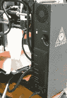
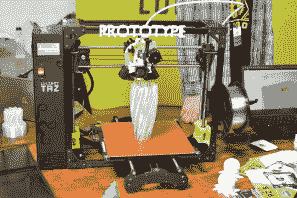
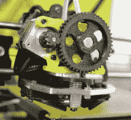
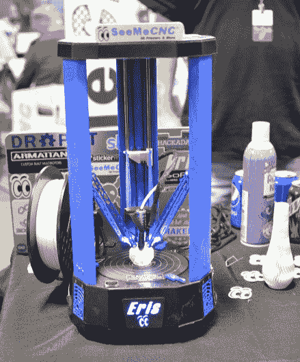
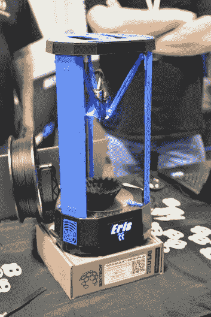
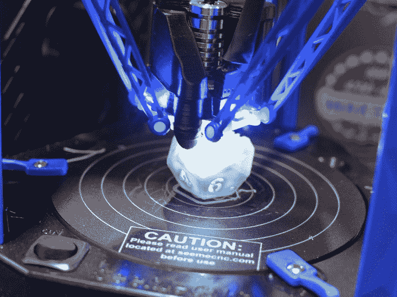
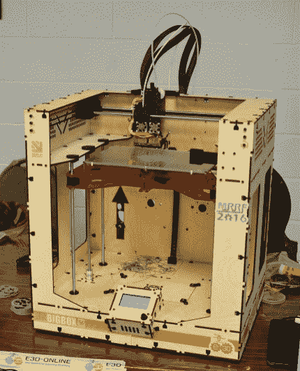
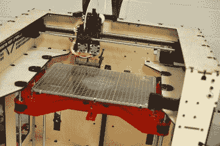
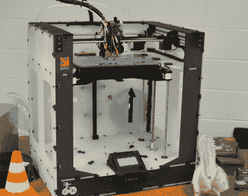
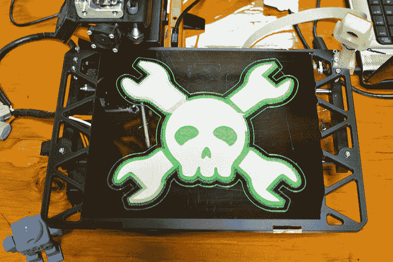

# MRRF 3D 打印盛况

> 原文：<https://hackaday.com/2016/03/19/mrrf-3d-printing-spectacular/>

MRRF，中西部说唱节，正在如火如荼地进行着。会场座无虚席，今年的出席人数大幅上升，全景令人印象深刻:

The 2016 Midwest RepRap Festival. Click to embiggen.

### ~~新型打印机~~

MRRF 并不是真正的贸易展览。是的，这里有公司(谷歌今晚为中餐买单)，但这无疑是一个围绕开源硬件的基于社区的活动。也就是说，Lulzbot 在这里，SeeMeCNC 在主持，E3D 和 Ultimachine 都在这里。今年，有一些新的打印机。

Lulzbot 的 Taz 6——其旗舰打印机的最新升级版在今年的 MRRF 首次公开亮相。Lulzbot 的产品更新不同于普通公司的产品发布。Lulzbot 正在使用快速原型法制造(！).他们可以快速迭代，并在 Stratasys 提出设计的时间内发布两款新打印机。这也意味着发布是增量的。

点击休息时间查看更多照片和更新。

新的 Taz 6 包括各种类型的塔，取代了 Taz 5 侧面的小电子箱。这个金属板塔容纳所有的电子设备，包括集成电源、LCD 和控制板。Lulzbot 将单独出售这座塔，这是一个非常酷的宣布，因为他们已经受到了一点批评，因为他们使 Taz 6 在家里从源头上建造起来有点困难。

同样来自 Lulzbot 的是改进的双头挤出机。这个新的工具头有一个金属框架，正好撞在 x 轴轨道上。这是非常坚实的，并产生一些非常好的打印质量。

        

SeeMeCNC 很长一段时间以来一直致力于一款小型 delta 打印机，即厄里斯打印机。终于完成了。厄里斯的关键设计元素是几乎所有零件都是注塑成型的。虽然这与 Lulzbot 在 3D 打印机上制造打印机的理念形成了鲜明对比，但厄里斯还是很不错的。

一个创新的功能是通过加速度计的床水平。厄里斯在工具架中有一个小的加速板，允许控制板在喷嘴撞击床时进行感应。喷嘴接触床上的三个点，水平校正发生在软件中。

      

 [https://www.youtube.com/embed/dM--z7qAZ60?version=3&rel=1&showsearch=0&showinfo=1&iv_load_policy=1&fs=1&hl=en-US&autohide=2&wmode=transparent](https://www.youtube.com/embed/dM--z7qAZ60?version=3&rel=1&showsearch=0&showinfo=1&iv_load_policy=1&fs=1&hl=en-US&autohide=2&wmode=transparent)

E3D 今年又去了印第安纳州，他们有很多东西可以炫耀。从改良的韦德挤压机到定制的可溶解细丝，应有尽有。我们很快就会迎来双挤压成为所有 3D 打印机标准配置的时代。

今年，E3D 推出了他们自己的 3D 打印机系列，与他们每年运送的数万台酒店设备一起销售。它被称为大盒子，是的，它是一个大盒子。

      

这个周末会有进一步的更新，这只是中午的综述。[请务必观看活动](http://hackaday.com/2016/03/18/live-from-the-midwest-reprap-festival/)的现场直播。

Want to know how to get your printer on Hackaday?