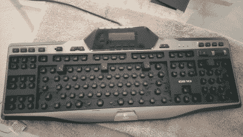

# 把键盘变成踏板

> 原文：<https://hackaday.com/2016/03/27/turning-a-keyboard-into-a-pedal-board/>

电脑专用脚踏开关可能非常昂贵。另一方面，键盘尽管有更多的按钮，却非常便宜！如果你可以用键盘来制作踏板会怎么样？这个[黑客是如此简单，几乎是别出心裁。](http://imgur.com/a/oyztz)

[Shrodingers_Cat]拿出他的一个备用键盘，  一个相当不错的罗技 G510 游戏键盘，把除了四个键以外的所有键都拔了出来。你可以用平头螺丝刀很容易地做到这一点——它也相当令人满意地发送刀片的每一个轻弹键飞行。

然后，他把一些备用的 DVD 盒剪了下来，把它们变成了踏板盖。它们实际上只是嵌套在键盘内部——他添加了一些电工胶带以确保它们保持在适当的位置，并将其放在他的桌子下进行第一次测试——它工作得非常好！

当然你**可以**总是用[一个 Arduino 和一些碎木头来做这样的东西……](http://hackaday.com/2013/02/26/simple-to-build-programmable-foot-switches/)

[通过 [r/DIY](https://www.reddit.com/r/DIY/comments/4b6ia7/turned_old_usb_keyboard_into_foot_pedals_my_feet/)