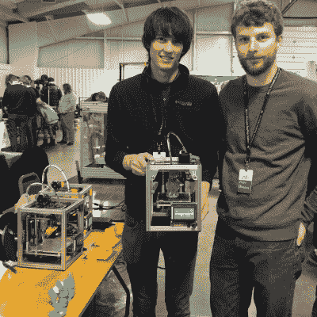
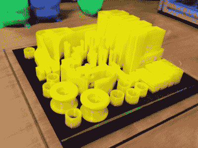
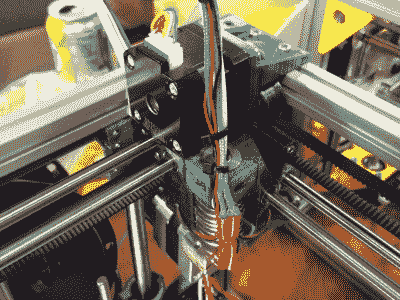
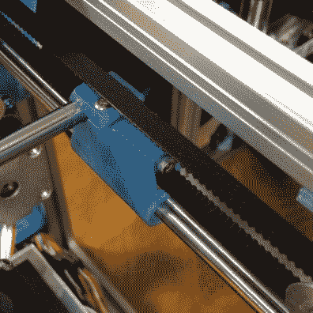
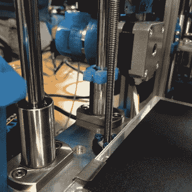

# MRRF:推出一款有趣的可爱打印机

> 原文：<https://hackaday.com/2016/03/31/mrrf-launching-an-adorable-printer-for-fun/>

Patrick and Matt hold a running Kitten Printer. The frame is stiff enough that the printer can be held or turned upside down and it can keep printing without visible defects in the print.

[Patrick]和[Matt]过去几年一直从明尼阿波利斯来参加中西部说唱节,并带着他们可信赖的[Tantillus](http://reprap.org/wiki/Tantillus)打印机。然而，在今年和去年之间的某个时候,[Patrick]决定制作自己的 3D 打印机会非常有趣，并且喜欢 Tantillus 的尺寸和精度，就从那里开始了。

这款尺寸可爱的打印机也有一个可爱的名字:小猫 3D 打印机。打印机当然是发烧友的选择。1200 的价格很贵，而且很小，但是做工非常好。这是一大优势？它能打印非常精确的零件。

Tantillus 的印刷效果也很好，但挤出机还有很多不足之处，低拉伸渔线运动很难拉紧到合适的程度。除了良好的设计之外，Tantillus 和 Kitten 出色的印刷质量背后的秘密是挤出机设置的小 xy 移动和低重量。通过在非常小的范围内移动，结构中的累积误差永远不会累加。此外，振动不太可能表现出来，关节上的力矩越小，意味着运动极限处的弯曲越小。

Really stunning print quality almost entirely free of ringing and z-wobble. 100mm x 100mm tray. These are very small parts.

[Patrick]是一名机械工程师，因为这只是一台好玩的打印机，所以他没有偷工减料。框架由 Misumi 挤出和线性运动组成。构建板位于机加工铝板上。它不会弯曲或移动。

对我来说，这款打印机最突出的一点是它有许多精巧的小功能，显示了我的深思熟虑。例如，挤出机机芯恰好位于其中一个电机下方。除了一个零件之外，所有零件都可以在没有支持的情况下打印在其构建信封内。它使用了大约 200 克塑料。每个轴都受到足够的约束，而不是困扰 3D 打印机设计的过度约束的常见趋势。规格表读起来像我的打印机零件愿望清单:邦德科技挤出机，兰博板，E3d 喷嘴，加热床，平面硼硅酸盐构建板，名牌线性运动，以及设计良好的 z

The entire extruder assembly tucks under one of the XY motors at the corner of its movement. Compare its size to the size of a NEMA14 stepper motor.

该设计的另一个有趣的方面是极轻的挤出机组件。挤压机越轻，零件在高速运转时产生的振动就越小。这是我见过的最紧凑的设计之一。它由两个风扇，一个 E3d v6 lite 喷嘴和两个小直线轴承组成。冷端由位于打印机后部的鲍登装置和 [Bondtech](http://www.bondtech.se/) 挤压机处理。让它更轻的唯一方法是不同的喷嘴，比如即将在电影节上亮相的来自 B3 的疯狂之光 [13g Pico。我还很感兴趣地看到，支撑轨道上的轴承是印刷衬套，以保持更低的重量。[nop 头]已经广泛测试了这些，他们](https://b3innovations.com/)[应该没问题，只要棒有一个好的光洁度](http://hydraraptor.blogspot.com/2012/01/bearings-bushings-and-bars.html)。

我以前提到过尺寸，但是如果没有看到它，很难理解这台打印机有多可爱。构建信封为 100 毫米 x 100 毫米 x 100 毫米，打印机本身为 200 毫米 x 200mm 毫米 x 240mm 毫米。这仅比建筑占地面积宽 50 毫米。这是一个非常有趣的设计，看看他们是如何把所有东西都放进去的。皮带路线和零件设计有许多巧妙的小技巧，可以让一切顺利。

对于发烧友来说，这将是一个很好的小型零件打印机和旅行打印机。然而，对我来说，看到人们仍然开始尝试设计自己的打印机是一件好事。在某些方面，3d 打印机运动已经变得充斥着中国山寨产品，我很高兴在这个节日里看到一些新东西。这不是唯一的新打印机设计，但它对我来说是最突出的。我喜欢它不妥协的本质，许多人试图设计最低的 BOM，而不是更好的打印。3d 打印机世界中仍然有许多唾手可得的果实，其中许多只是刚刚得到[技工的权利](http://hackaday.com/2016/03/07/its-time-the-software-guys-and-mechanical-guys-sat-down-and-had-a-talk/)。

  PLA Bushing  Seriously serious Z.

[Patrick]和[Matt]带着他们的打印机来到电影节，看看人们是否会喜欢它。他们并没有销售成吨的打印机并赚上百万的宏伟梦想。他们很清楚自己的价位和小尺寸并不适合所有人。然而，他们的桌子总是有一小群人。他们真的很喜欢 3D 打印机，这种诚实引起了共鸣。在会议开始时，他们甚至没有一个网站，但是到了会议结束时，他们收到了太多的请求，不得不答应。他们预计在四月底会有 3 个工具包可供选择。如果你感兴趣，他们的网站上有一个[邮件列表注册](http://printerkitten.com)。让我们希望明年我们能在 MRRF 再次看到他们，看到另一个很酷的设计。