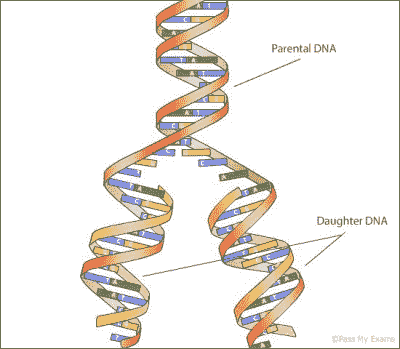

# 来自深层的酶——聚合酶

> 原文：<https://hackaday.com/2016/03/22/enzymes-from-the-deep-the-polymerase/>

我们的身体依靠 DNA 发挥作用，它经常被描述为[“生命的秘密”](http://www.amazon.co.uk/DNA-Secret-Life-James-Watson/dp/0099451840)。描述如何制造一个人的计算机程序。不管这些类比多么不准确，DNA 是生命的基础。为了让生物体生长和复制，它们需要复制自己的 DNA。

DNA [structure and replication](http://www.passmyexams.co.uk/GCSE/biology/dna-replication.html)

自从 1953 年发现其结构以来，用于复制 DNA 的近似方法是显而易见的。DNA 中的信息编码在 4 个核苷酸中(我们称之为 A、T、G 和 C)。这些分子成对地相互结合，形成相互镜像的两条互补的链。这种结构自然有助于复制。这两条链可以分离(受热时我们称之为熔化)，新的链围绕每个单链模板形成。

然而，这种复制过程不可能自己完成，它需要帮助。直到我们发现了一种叫做 DNA 聚合酶的酶，我们才明白这是如何工作的。与其他酶一起，双链 DNA 解链成 2 条单链，并被聚合酶复制。

 [https://www.youtube.com/embed/bee6PWUgPo8?version=3&rel=1&showsearch=0&showinfo=1&iv_load_policy=1&fs=1&hl=en-US&autohide=2&wmode=transparent](https://www.youtube.com/embed/bee6PWUgPo8?version=3&rel=1&showsearch=0&showinfo=1&iv_load_policy=1&fs=1&hl=en-US&autohide=2&wmode=transparent)

这是一个美好的过程(我强烈推荐埃里克·兰德关于这个主题的讲座)。

在体外，我们经常想扩增 DNA 用于其他目的。也就是说，取少量的 DNA 并复制它，这样我们就有大量相同的拷贝用于进一步的实验。1983 年，Kary Mullis 发明了一种方法来实现这一点，并因此获得了诺贝尔奖，他将自己的成功归功于 LSD 的使用:

 [https://www.youtube.com/embed/CC5ApU4YKBU?version=3&rel=1&showsearch=0&showinfo=1&iv_load_policy=1&fs=1&hl=en-US&autohide=2&wmode=transparent](https://www.youtube.com/embed/CC5ApU4YKBU?version=3&rel=1&showsearch=0&showinfo=1&iv_load_policy=1&fs=1&hl=en-US&autohide=2&wmode=transparent)

聚合酶链式反应(PCR)通过首先连接引物来复制单链 DNA。这些是合成 DNA 的短片段，旨在与原始链互补。没有小片段的启动，聚合酶就无法工作。随着工作的开始，聚合酶发现当提供游离单核苷酸添加到链中时，更容易继续复制链。有了这个，聚合酶以每秒 1000 个碱基的速度向原始链添加。这样，一条 DNA 链就变成了两条。

### 热循环

使用这种复制方法制造大量 DNA 的关键是热循环。通过加热，DNA 熔化(将双链 DNA 断裂成 2 条单链)。不幸的是，热量杀死了大多数聚合酶，所以我们需要在融化后降低温度，并添加更多的聚合酶(有一个技巧可以避免这种情况，我们将在稍后讨论)。加入额外的聚合酶后，引物再次连接到这些新的单链上，该过程再次开始以指数形式复制片段。这种加热和冷却过程是循环进行的，DNA 片段的数量呈指数增长。如果一开始有 1 个碎片，随着循环的进行，将会有 2，4，8，16，32，64，128 个碎片。

 [https://www.youtube.com/embed/hBbvfsPhS64?version=3&rel=1&showsearch=0&showinfo=1&iv_load_policy=1&fs=1&hl=en-US&autohide=2&wmode=transparent](https://www.youtube.com/embed/hBbvfsPhS64?version=3&rel=1&showsearch=0&showinfo=1&iv_load_policy=1&fs=1&hl=en-US&autohide=2&wmode=transparent)

我提到过热循环过程会杀死聚合酶。第一个已知的聚合酶[聚合酶 I](https://en.wikipedia.org/wiki/DNA_polymerase_I) 就是这种情况。这是非常恼人的，因为如果没有这一点，这个过程可能是平凡的自动化和循环可以继续只是通过循环的热量。因此，科学家们开始寻找能够在熔化 DNA 的高温下存活的聚合酶。从逻辑上讲，他们从极端爱好者开始，这是一种喜欢自然界最极端环境的生物。他们首先寻找的地方是天然温泉，这导致在一种名为水生栖热菌的细菌中发现了一种聚合酶，他们将这种聚合酶命名为 Taq。Taq 已经成为 PCR 中使用的标准聚合酶，这让科学家们非常高兴:

 [https://www.youtube.com/embed/3LcgUzt0rAk?version=3&rel=1&showsearch=0&showinfo=1&iv_load_policy=1&fs=1&hl=en-US&autohide=2&wmode=transparent](https://www.youtube.com/embed/3LcgUzt0rAk?version=3&rel=1&showsearch=0&showinfo=1&iv_load_policy=1&fs=1&hl=en-US&autohide=2&wmode=transparent)

但是总是不满足的科学家们已经找到了更强大的聚合酶，从深海热液喷口中提取出来。聚合酶已被发现，并被设计成与怪异和奇妙的人工碱基一起工作，并使标记 DNA 的掺入取得了进展，形成了现代 DNA 测序(阅读)技术的基础。

### 基本设备

有了这些新的聚合酶，PCR 过程就变成了用正确的试剂循环温度的小事。商用热循环仪是标准的实验室设备。但是黑客们也开发了一些开源热循环仪，比如 [openPCR](http://openpcr.org/) 或者甚至[更便宜的黑客组合](http://www.instructables.com/id/Arduino-PCR-thermal-cycler-for-under-85/)替代品。

虽然 PCR 是扩增 DNA 的一项伟大技术，但你也可以用它做其他有用的事情。通过仔细选择引物，您可以扩增样品中的特定区域。这是一种叫做 DNA 指纹技术的基础。

在 DNA 指纹分析中，PCR 用于扩增你基因组中的 13 个特定区域。这些区域由长度不同的重复序列组成。因为这些区域的长度因人而异，所以形成了独特的标记。

有了包含这 13 个扩增区域拷贝的样本，你现在可以使用一种叫做[凝胶电泳](https://en.wikipedia.org/wiki/Gel_electrophoresis)的过程来确定它们的长度，并将其与已知的指纹进行比较。不久前，OpenPCR 描述了这种技术如何被用于识别[奥萨马·本·拉登](http://openpcr.org/v1story/2011/05/dna-fingerprinting-osama-bin-laden)。

聚合酶不仅是生命的基础，通过 PCR，它已经成为分子生物学家不可或缺的工具。随着生物黑客的出现，像 OpenPCR 这样的工具已经向更广泛的受众开放了这些技术。随着生物黑客社区的发展，希望我们能看到聚合酶以更令人惊讶和有趣的方式被黑客攻击。