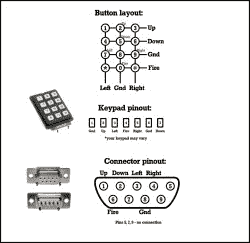

# 复古游戏的键盘游戏手柄

> 原文：<https://hackaday.com/2016/04/01/a-keypad-joypad-for-your-retro-gaming/>

[TK]是一个复古的计算机爱好者，他在为他值得信赖的 Amiga 500 寻找操纵杆时遇到了一些困难。“新”棍子很贵，80 年代遭受重创的幸存者买的比他们应该买的更多。

幸运的是，这些旧控制器是简单的设备，只有五条控制四个方向的控制线和一个低电平有效的点火按钮。[TK]因此寻找可用的组件，并决定[用数字键盘](https://hackaday.io/project/10403-the-keypad-joypad-amiga-atari-c64)制作自己的控制器。

Numerical joypad schematic

数字键盘可能无处不在，但它们不是游戏手柄的完美选择。它们不是单个的开关，而是连接成一个矩阵。[TK]的控制器在这种约束下工作，不会破坏键盘 PCB，尽管他的布局在上下按钮下面有左右按钮。看着示意图，我们想知道 4-5-6 和 7-8-9 行是否可以互换，尽管 joypad 的布局可能是个人选择的问题。

制作控制器很简单，只需按正确的顺序将 pad 连接到 9 针 D 插座，然后将其插入 Commodore。他报告说，它使用起来很舒服，比以前市场上一些质量较低的操纵杆要好。Amiga gaming 的资深玩家会理解这种情绪，当时有一些真正令人震惊的产品。

这些年来，相当多的国产游戏控制器登上了这些页面。有[这一个使用触觉开关和圆珠笔](http://hackaday.com/2009/09/17/build-your-own-joystick/)，和[一根从剩余录像机的滚轮制成的棍子](http://hackaday.com/2009/06/07/2-axis-joystick-from-vcr-parts/)，但是垃圾箱操纵杆的最终王冠应该属于[这一根由衣夹制成的操纵杆](http://hackaday.com/2005/04/01/joysticks-made-from-clothespins/)。如果我们从所有这些自制控制器的独创性中拿走一样东西，那就是真正重要的不是硬件，而是游戏性。