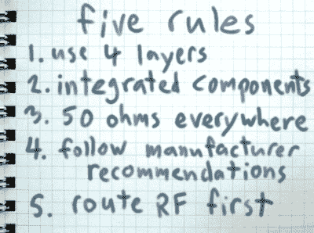

# 迈克尔·奥斯曼让你成为射频设计英雄

> 原文：<https://hackaday.com/2016/03/23/michael-ossmann-makes-you-an-rf-design-hero/>

对很多人来说，射频(RF)设计是一种魔法。即使你已经建立了一些射频项目，并通过低洼的 gotchas 你的方式工作，你可能仍然有一个健康的尊重小精灵埋伏在每一个昏暗的角落。[Michael Ossmann]在 [Hackaday Superconference](https://hackaday.io/superconference/) 举办了一场超级研讨会，带你参观射频设计中照明更好的空间。

 【迈克尔】是一名黑客设计师，他对射频电路设计的见解来之不易，靠的是做东西。HackRF One 可能是他最著名的(也是最复杂的)项目，但他也设计和制造了许多更简单的射频设备。他演讲的要点是，有一个*大范围的*有趣的项目是可能的，而无需让自己陷入 RF 设计的边缘(这需要昂贵的测试设备、严肃的建模或电波方面的博士学位)。

你应该[看看下面嵌入的【Mike】的工作室](https://www.youtube.com/watch?v=TnRn3Kn_aXg)。也就是说，这是剧透。[Mike]建议五条规则，让你的射频设计保持绿色，而不是粗糙。

### 1.使用四层

四层 PCB 的价格已经大幅下降，电路板内部的不间断电源层使设计更加简单，并有助于始终保持一致的 RF 环境。你*可以*在两层板上构建它，但是当它不工作时，你将需要昂贵的测试设备。保持布局简单，RF 走线全部在顶部，电源层在中间，这是防范小淘气的保证。

### 2.尽可能使用集成度最高的组件

围绕你能找到的集成度最高的器件来设计你的电路板。这意味着要选择一款集成收发器 IC，它的一切都是由硅制成的。这是一大堆棘手的设计工作，你不必去做。这同样适用于过滤器；你可以花几个小时设计一个奇特的滤波器和布局，或者你可以找到适合你的设计的正确部分([Mike]非常喜欢 SAW 滤波器)。

### 3.各处设计为 50 欧姆

阻抗匹配:你就是绕不过去。不过，大多数制造商的器件都是为 50 欧姆输入和输出而设计的，因此在这方面你没有什么可做的。您唯一的工作是确保器件之间的走线具有 50 欧姆的特性阻抗。你是怎么做到的？KiCad 有一个工具，除此之外还有互联网。你只需要从制造商那里知道你的 PCB 的一些特性，把它们插入计算器，然后你就可以得到一个走线宽度，它会给你整个电路板 50 欧姆。还记得你的四层叠层中第二层的那个完整的电源层吗？它使相同的走线宽度在任何地方都有效。这是 RF 设计中最难的部分，完成了。

### 4.遵循制造商的建议

如果你绝对需要使用一个不符合 50 欧姆标准的部件，该怎么办？除非他们不想要你的生意，否则制造商会为你提供一个将输出转换为 50 欧姆的参考电路。你的工作是利用他们的应用工程师的工作。通常会指定布局，有时甚至会细化到零件号。如果他们告诉你如何让他们的芯片的输入或输出与 50 欧姆的单端传输线一起工作，你就照做。

### 5.首先布线射频部件

RF 信号是电路设计中最敏感的部分。我们已经知道所需的 RF 走线宽度是多少，所以剩下的就是进行布局了。[Mike]建议您相对于感兴趣的频率来说，保持轨迹较短。放置好 RF 信号后，尽可能让数字走线远离 RF 走线。就是这样。

## 例子

在演讲的后半部分，[Mike]讲述了他的一些 RF 设计，并展示了他如何应用简单的五条规则来构建一些有趣的器件。参考设计、短走线和集成器件比比皆是。他不是在开玩笑。在某些器件中，“RF 部分是最容易布局的，我只是从数据手册中复制过来的！”

我们不打算研究他的例子。我们不会公正地对待它们，这里有大量的 RF 设计花絮。你只需要看一下视频。尽情享受吧！

 [https://www.youtube.com/embed/TnRn3Kn_aXg?version=3&rel=1&showsearch=0&showinfo=1&iv_load_policy=1&fs=1&hl=en-US&autohide=2&wmode=transparent](https://www.youtube.com/embed/TnRn3Kn_aXg?version=3&rel=1&showsearch=0&showinfo=1&iv_load_policy=1&fs=1&hl=en-US&autohide=2&wmode=transparent)

