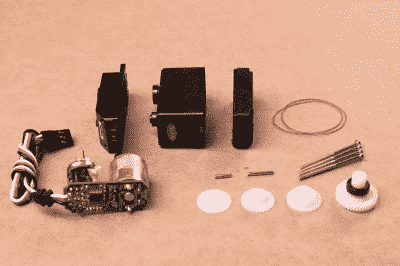
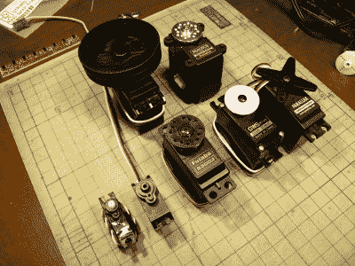

# 黑客字典:伺服电机

> 原文：<https://hackaday.com/2016/03/24/hackaday-dictionary-servo-motors/>

你如何让事物移动？你加上一个将电能转化为运动的马达。这是一个简单的想法，但是你怎么知道马达在哪里呢？这就是伺服电机的用武之地。通过在该机构中添加传感器和控制器，这些电机可以计算出它们旋转了多远，并保持该设置，而无需任何外部控制。

A disassembled servo motor showing the controller, motor, rotary encoder and gears. By [oomlout, CC BY-SA 2.0](https://commons.wikimedia.org/w/index.php?curid=40552299)

### 什么是伺服电机？

这些简洁的设备可大可小，但它们都有相同的基本特征:一个连接到传动机构的电机和一个检测电机运动和速度的编码器。这种组合意味着控制设备不需要了解电机本身的任何信息:伺服电机上的控制器处理向电机馈送适当功率的过程，直到电机到达请求的位置。这使得用伺服电机制造东西变得容易得多，因为设计师已经为你做了所有的艰苦工作。

大多数人遇到伺服电机的第一个地方是用于遥控车辆的小型业余爱好伺服电机。由 Hitec 和 Futaba 等公司制造，这些驱动齿轮或臂传递电机的旋转来执行任务，如转动车轮以驾驶汽车，在 RC 平面上移动控制表面，或任何需要高精度小范围运动的任务。伺服电机中的传动装置比直接将轴连接到电机上提供了更大的扭矩。这种类型的大多数业余伺服系统被限制在一定的运动范围内(通常为 180 度)，因为位置编码器是一个连接到输出轴的简单电位计。

A selection of different sized servo motors. By [Osamu Iwasaki](https://www.flickr.com/photos/osamu_iwasaki/4033295521/)

伺服电机通常有三根连接线:电源线、接地线和信号线。信号线被馈入脉宽调制(PWM)信号，该信号决定伺服电机移动的角度。顾名思义，脉冲的长度(或者宽度，如果你在示波器上看的话)是控制伺服移动到的角度的东西:短脉冲(1 毫秒)将其设置为零度角，而长脉冲 2 毫秒将其设置为最大角度。这两个极限之间的脉冲长度向伺服电机发出信号，使其移动到相应的角度:1.5 ms 将使其设置为 90 度。

需要注意的是，伺服电机和步进电机不是一回事。两者都用于定位，但步进机通常没有反馈。相反，步行者以不连续的步伐转弯(顾名思义)。要找出步进电机的位置，需要一个限位开关，然后驱动步进电机，直到它被触发。如果你一直数它走过的步数，你就知道它在哪里了。这就是为什么像喷墨打印机或 3D 打印机这样的设备在启动时会移动到它们的极限，因此控制器可以检测到被驱动的机械装置的远极限，并据此计算当前位置。

### 你如何使用伺服电机？

因为伺服电机的设计者已经为你做了大部分艰苦的工作，伺服电机非常容易使用。要驱动它们，你只需要给它们供电(通常是 5V)，给伺服电机馈送 PWM 信号。您可以使用一个[库从 Arduino 或类似的微控制器直接驱动它们，该库将角度转换为一个输出引脚上的 PWM 信号](https://www.arduino.cc/en/Reference/Servo)。

如果以这种方式驱动，每个伺服电机都需要一个专用的输出引脚，所以如果你要驱动很多伺服电机，专用控制器更有意义。像 [Adafruit Servo Shield](https://www.adafruit.com/products/1411) 和 [Pololu Maestro](https://www.pololu.com/category/12/rc-servo-controllers) 这样的设备允许您从微控制器上的单个输出引脚控制多个伺服系统:微控制器向设备发送信号，依次寻址每个伺服系统，设备将其转换为每个伺服系统的 PWM 信号。如果你需要驱动一批*伺服系统*，那么 [SD84](http://www.robot-electronics.co.uk/htm/sd84tech.htm) 可以从一个 USB 端口同时控制多达 84 个伺服系统。

(头条图片机器人:[鲍勃](https://hackaday.io/project/3736-bob-biped-robot)和[六足机器人](https://hackaday.io/project/3217-hexapod4-spider-robot-instruction-manual)。)