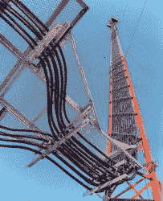

# 北美通信塔野外指南

> 原文：<https://hackaday.com/2016/04/05/a-field-guide-to-the-north-american-communications-tower/>

几个世纪以来，对清晰可靠通信的需求推动了技术的发展。交流的距离越长，世界就变得越小。说到手机，无缝网络覆盖和低功耗是不断催生 R&D 和最终部署新设备的理想。

如今，几乎我们所有人都带着手机。无论我们是否将它们用作电话，都需要大量的基础设施来支持它们。基础设施中最容易辨认的部分是通信塔。但是你对他们了解多少？

### 什么是通信塔？

通信塔以各种形状和形式存在于我们周围。一些信号塔提供几种信号。它们传输单向广播，如 AM/FM 广播和电视信号，同时还使用各种协议处理双向蜂窝通信。

大多数发射塔只是抬高和支撑通信天线，但也有一些被称为桅杆辐射器的天线，实际上充当天线本身。调幅广播和其他低频塔就属于这一类。在本文中，我将重点介绍一种特殊的通信塔——蜂窝通信塔。

Cellular antennas on a lattice tower.

蜂窝基站主要由两部分组成:工作在蜂窝频率上的双向天线阵列，以及使之成为可能的设备。从技术上讲，它们被称为基站发射机(BTS)。您可能会看到“蜂窝基站”和“蜂窝基站”可以互换使用，但这两个术语并不是同义词。蜂窝基站或 BTS 包含了在设备之间传输和处理蜂窝信号所需的所有设备。这包括覆盖不同蜂窝频段的天线、信号放大器、现场处理设备以及到核心网络的回程连接。手机信号发射塔只是用来提升天线和支撑设备的结构。

发射塔本身可以由一个或多个运营商共享，每个运营商都有自己的蜂窝基站。这种排列叫做搭配。无论哪家运营商先到达那里，他们的天线都会处于最高仰角。之后的每一个都占据下一个最高的位置。然而，该塔可能不属于任何手机运营商。其中许多是由像美国大厦这样出租空间的公司所拥有的。

并非所有的手机基站都在信号塔上。它们中的许多建在屋顶上，有些栖息在街灯顶上。有些是为了不被注意而设计的，隐藏在门面后面。他们装扮成当地的树木、仙人掌、尖塔，甚至艺术装置。按一下以嵌入以下伪装的网站。

### 天线杆、手机发射塔和手机基站

有几种类型的塔和网站。这些塔的外观和高度是由它们所占据的面积和地面用户的需求决定的。

A guyed mast in the suburbs

严格来说，拉线桅杆根本不是塔。这是一个狭窄的网格结构，由锚定在地面上的拉线支撑着。建造桅杆相当便宜，但它们占地面积大，需要大量土地。由于它们的建造方式，桅杆可以达到 2000 英尺高。超过一定高度的桅杆通常被漆成飞机橙色和白色相间的条带，以增加能见度。

A lattice tower with four cell sites.

格构塔是有三面或四面的自支撑结构。这些容易建造，容易攀爬，并为安装设备提供了大量的空间。

A monopole planted in the back of a shopping center.

在单极塔上经常可以找到郊区塔蜂窝基站设备。这些光滑的杆子看起来像带着脚钉的高耸的街灯。比起格子塔和桅杆，单极天线的建造成本更高，工人攀爬起来也更困难。我镇上的一些单极天线直接安装在电线杆上，这看起来很浪费空间。

A Nextel COW parked outside the 2005 Rose Bowl. Image via [Wikipedia](https://en.wikipedia.org/wiki/Cell_on_wheels#/media/File:CellularPCScom1.jpg)

称为“车轮上的蜂窝”(COW)的临时站点用于处理网络流量的短期增长。他们经常被推出去参加像超级碗这样的大型活动。奶牛还被用于远程救援和在低覆盖或无覆盖地区的协调行动。这些网站被安装在车辆上或拖在拖车上，并具有多种功能。

Street light cell site above a major thoroughfare.

如果一个区域的覆盖不均匀，但这些间隙不能保证一个成熟的蜂窝基站，您可能会发现一些路灯蜂窝基站。这些是所谓的分布式天线系统的一部分，但它们通常被称为小蜂窝。分布式天线系统利用常规蜂窝基站的功率和覆盖范围，并将其分配给几个小型基站。如果一个基站是一块蛋糕，那么分布式天线系统就是一批蛋糕。分布式天线系统和小型蜂窝也用于室内，通常用于办公室、医院和体育场等繁忙场所。

### 天空中的低音鼓

Bass drum in the sky, courtesy of [CommScope](http://commscope.com)

塔组件将根据位置和该地区用户的需求而有所不同，但有一些东西你会看到塔与塔之间非常一致。最明显的是，手机信号发射塔有几种类型的天线，可以处理不同的频率和蜂窝技术。这些是平行于塔安装的细而垂直的杆。一般来说，天线越长，频率就越低。但是单根天线的物理尺寸并不能说明发射塔的传输能力。天线的数量决定了蜂窝基站能够处理的流量。

每根天线都通过几根电缆连接到基站。单极塔的中心有一个导管来容纳电缆，但在格子塔上，电缆从外面穿过。根据不同的装置，它们会从一座冰桥上通过，这样它们就被抬高了。基站的大小从简单的全天候机柜到小房子大小的设备掩体不等。

Ice bridge or waveguide bridge. Image via [Wireless Estimator](http://wirelessestimator.com)

你会经常在手机信号塔上看到一两个抛物面天线。它可能是一个网格风格或一个实心盘子，但你可能会看到一些看起来像一个大低音鼓的东西。这些都是微波天线的种类，它们被用于将流量回传到位于中心局的移动交换机。如果你看不到任何天线，回程是通过光纤或铜缆。

微波回程天线有几种类型。有些是简单的无屏蔽抛物面天线，就像那些接收电视信号的深灰色天线。其他的用圆形天线罩屏蔽，保护天线免受灰尘和雪的影响，并减少风力负载。我个人最喜欢的是那些看起来像低音鼓的。这些是高容量、高性能的天线，直径可达 15 英尺或更大，重数百磅。如果没有鼓皮和边缘，它们看起来会像实心抛物面天线。这些额外的东西只是一种不同的天线罩，通常由玻璃纤维或聚四氟乙烯制成。

### 小盒子，大影响

Remote Radio Head unit. Image via [CommScope](http://commscope.com)

在较新的基站系统中，你会看到一种叫做远程无线电头端(RRH)的设备。这些用于在塔和地面之间分配基站设备。RRH 本身是塔上的一个小矩形盒子，通过光纤链路连接到基站。这些远程无线电头提高了效率，并释放了地面空间，但也有权衡。它们是复杂的设备，必须能够经受住恶劣的天气。

Tower Mounted Amplifier. Image via [Foresite Group](http://www.fg-inc.net/)

为了提高上行链路增益，运营商通常会安装另一个称为塔式放大器(TMA)的小矩形盒子。上行链路增益是从用户手机到基站的信号传输。TMA 对你我来说都很棒，因为我们的手机能够使用更少的电池电量和更少的数据与发射塔通信。他们也给了我们更大的覆盖面。

Static dissipation brushes. Image via [Tower Beacon](http://towerbeacon.com)

最后但并非最不重要的是避雷器。你可能会猜到这是干什么的——它吸收雷击，并将它们安全地卸载到地面上。静电耗散刷只是防雷保护的一种。

### 地面组件

你在塔上看到的东西只是故事的一半。首先，实际路由呼叫和提供信号需要很多设备，更不用说电源和线路整流了。所有这些都在塔脚下的地面上的柜子和掩体里。

地面上的主要组件是基站收发器。这些是遥控收音机头的对应部件。2G 和 3G 等老技术将拥有自己的收发器，独立于 4G/LTE。小区站点路由器管理基站收发器和中心局的移动交换机之间的流量。如果回程是通过微波完成的，避难所将有一个基带微波处理器来处理信号。

其余的地面设备与电源相关——提供-48VDC 或+24VDC 的整流器和发电机，以便在出现问题时保持正常运行。许多网站还有可以持续几个小时的备用电池。

Inspection footage from a drone. Image via [YouTube](http://www.youtube.com/watch?v=mo598T1ek-8)

### 安装、维护和拆除

美国有几十万个手机信号塔，都要定期检查。在过去的几年里，公司一直在使用无人机拍摄视频和高分辨率照片，这些照片可以用来审计设备的状态。安装和维护发射塔是一项危险的工作，对脑力和体力都有很高的要求。对于技术人员来说，从一个塔开始一天的工作，然后开车几个小时去另一个塔工作并不罕见。

Removing a 6′ microwave dish. Image via [YouTube](http://www.youtube.com/watch?v=J360aVtQv6c)

一旦塔建好，[天线和其他设备通过绳索和滑轮系统](http://www.youtube.com/watch?v=a_SAtieS-58)慢慢升起，正如你在视频中看到的。如果一个天线需要在桅杆上更换，它不能就这样被卸下来扔掉。如果天线在下降的过程中绊住了一根拉线，整个天线杆就会倒塌。这里有一个视频展示了[移除一个低音鼓天线有多乏味。](http://www.youtube.com/watch?v=NMpkDkmG_Ik)

通信塔通常竖立在山丘和山顶上，尤其是用于远距离微波中继。这一高度有助于确保微波传输所需的视线传播路径畅通无阻。如果蜂窝基站已经在一座山或小山上，它可能不需要很高。不幸的是，这使得天线和设备更容易受到野生动物的攻击。这里有一段视频展示了一两只勤劳的橡子啄木鸟对屏蔽天线造成的损害。

### 手机基站的未来

蜂窝技术正在发生变化的一种方式是设备到设备(D2D)技术的出现，也称为 [LTE Direct](http://qualcomm.com/invention/research/projects/lte-direct) 。这使得每一个支持 D2D 的设备都成为传输网络的一部分。实际上，如果两个支持 D2D 的设备相距约 500 米，它们就可以直接通信，而不需要基站。

这项技术基本上将手机变成了可以在全双工模式下工作的对讲机。这对于覆盖拥挤或完全受损的灾难恢复情况非常有用。它对于地理围栏、增强现实和零售店中的信标也很有用，可以吸引你的目标顾客。

D2D 比蓝牙或 WiFi 上的发现更节省电池，因为它发生在服务层。D2D 的隐私比基于云的方法更好，因为它不会持续跟踪你设备的位置。那样的话，未来看起来相当不错。