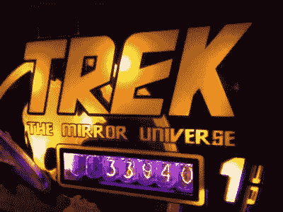
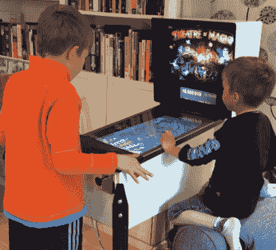
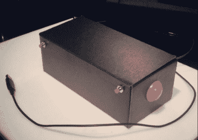
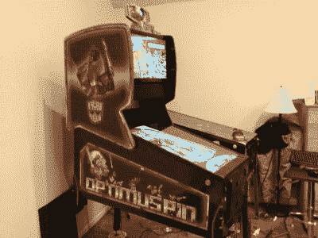

# hack let 101–弹球项目

> 原文：<https://hackaday.com/2016/03/26/hacklet-101-pinball-projects/>

有一些关于弹球吸引了黑客，制造商和工程师。也许是闪烁的灯光，声音，复杂的机械运动。会不会是掌握游戏所需的精妙战术？不管什么原因，每个人都喜欢弹球，不少黑客已经把他们的时间和金钱投入到构建、恢复和破解弹球机上。本周的 Hacklet 是关于 [Hackaday.io](https://hackaday.io) 上最好的弹球项目！

 我们从【zittware】和[星际迷航:镜像宇宙弹球](https://hackaday.io/project/674)开始。[Zittware]与[clay]、[fc2sw]和[steve]一起创建了这个令人敬畏的项目。他们拿了一台 1978 年的 Bally Star Trek 弹球机，重建了一个邪恶的镜像宇宙版本。电子设备包括谢妮电子管和基于 ATX 电脑设置的防弹电源。新的游戏场元素和硬件是在 CNC 上创建的。邪恶的图形是在 Photoshop 的帮助下创建的。这款游戏完全可以玩，并且是[黑客日科幻竞赛](http://hackaday.com/2014/05/08/sci-fi-contest-winners/)中最受欢迎的游戏。电子设备和橱柜都是开源的。不幸的是，那些讨厌的版权法阻止团队共享作品。

 接下来是【厄兰·列文】和[瑞尼格弹球模拟器](https://hackaday.io/project/5154)。一些黑客有几个真正的弹球机的空间。对于我们其余的人来说，有虚拟弹球。[Erland Lewin]用胶合板、一些真实的弹球硬件和大量的独创性建造了这个迷你虚拟弹球机。游戏场地是一个 24 英寸的戴尔电脑显示器，而后玻璃是一个 20 英寸的显示器。最终的 15 英寸显示器取代了弹球机上常见的点阵显示器(DMD)。整个系统由英特尔 i3 电脑驱动。[Erland]将尝试使用板载显卡。如果他遇到麻烦，他总是可以切换到独立显卡。这台机器变得很棒，他的儿子们喜欢在他们自己的“儿童尺寸”桌子上玩经典的弹球机。

 如果虚拟弹球对你来说还是有点大的话，【忠实 J】已经用[弹球盒 Jr](https://hackaday.io/project/3039) 给你盖好了。桌面电脑虚拟弹球游戏自 Windows XP 时代就已经存在。不知何故，敲击键盘按键与敲击真正的鳍状按钮并不完全相同。Pinbox Jr .是一款原型弹球控制器，内置于一个纸板盒中。Teensy 3.1 将按钮转换为 USB 键盘输入。两个大的街机按钮充当脚蹼，而两个小按钮可用于游戏选项和其他功能。[royal J]甚至添加了一个三轴加速度计，因此 pinbox 可以通过倾斜来响应粗暴的游戏！这个项目只需要一个螺线管来复制真实的弹球感觉。

 在虚拟弹球山顶站着【兰迪·沃克】和[擎天柱](https://hackaday.io/project/3631)。擎天柱是一个全尺寸的虚拟弹球柜。这是一个 3 屏幕的事情，很像上面的 RINNIG 弹球。[Randy]用一个绝对华丽的定制橱柜把事情带到了一个新的水平。受变形金刚启发的艺术品是由商业艺术家[Javier Reyes]委托创作的。Optimus 真的用放置在柜子周围战略位置的 8 个螺线管再现了玩弹球的感觉。甚至运动场马达的呼呼声也被隐藏的大众汽车雨刷马达所复制。Optimus 还配备了一个完整的灯光秀，包括 RGB LED 灯条、闪光灯和一个摇动器，可以摇动整个橱柜。

如果你想看到更多的弹球项目，请查看我们全新的[弹球项目列表](https://hackaday.io/list/10526-pinball-projects)！如果我错过了你的项目，不要害羞！[在 Hackaday.io 上给我留言就行](https://hackaday.io/adam)。这就是本周的 Hacklet。一如既往，下周见。同样的黑客时间，同样的黑客频道，带给你最好的 [Hackaday.io](https://hackaday.io/) ！