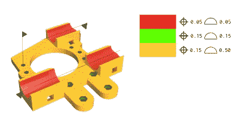
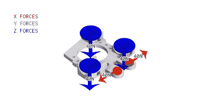
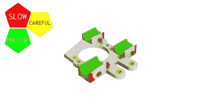
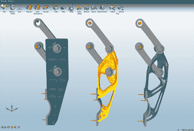
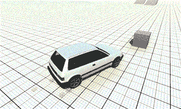

# 切片的未来展望

> 原文：<https://hackaday.com/2016/04/07/a-look-into-the-future-of-slicing/>

这些年来，我和一些人就 3D 打印的未来进行过几次对话。经常出现的一个话题是切片器，这是一种将 3D 模型转化为 3D 打印机路径的软件。我认为这将是一个很好的主意来想象切片，以及延伸的 3D 打印。我一直支持只做一些事情，但有时很容易不断完善我们现有的解决方案，而不是寻找和想象可能的解决方案。我将提到的许多事情已经在一个或另一个上下文中被处理或解决了，但是没有混合成一个内聚的包。

我认为熔融沉积成型(FDM)是最便宜和最常见的技术，如果处理得当，可以生产出优于其他生产技术的零件。应该有可能生产以独特方式处理力的部件，使得机械加工、模制、烧结和其它通常实施的方法在许多应用中难以与之竞争。

重新设想切片器不是一件小事，所以我将在三篇文章中解决这个问题。第一部分，在这里，将涵盖 2D 和分层高度模型的改进。这是切片技术改进的第一个也是最容易实现的途径。它将需要编写新的软件，但不会显著影响今天 3D 打印机的当前结构。它应该翻译成每一台打印机目前正在运行，甚至没有固件的变化。

第二部分将涉及对打印机进行机械上的改变:至少包括多种材料、温度和喷嘴尺寸。切片机将需要与打印机的新功能，以充分利用它们。

最后，在第三部分，我们将考虑添加更多的轴。具有先进软件、不同喷嘴几何形状和多种材料功能的五轴 3D 打印机将能够生产重量显著减轻的零件，同时在许多方面结合超过我们当前复合材料的内部特征。五轴路径开始允许 3D 打印机放下的层中的编织技术和高级“纹理”。

## 第一部分:改善我们所拥有的

切片器当前的目标是获取一个模型并尽可能精确地渲染它。切片器不关心零件的强度，也不知道它在组件中的位置。它只是试图生成一个尽可能与原始曲面匹配的外部流形曲面。它通过将模型分割成层，然后通过填充算法在该层内绘制 2D 路径来实现这一点。除此之外还有更多的东西，但在很大程度上，它完全忽略了设计意图。相反，它通过在生成阶段上下移动层来检查 3D 打印过程中的故障点。如果结果形状的外部与输入文件匹配，切片器就满意了。

### 告诉软件它为什么要制造

要真正开始充分利用简单的 3D 笛卡尔打印，我们必须告诉软件的不是我们零件的几何形状，而是它的设计意图。如果我们能给切片器关于将来如何使用该部件的信息，它就能开始优化它选择的路径和填充。例如，将作为凸轮或齿轮齿的曲面需要多个塑料周边和这些层后面的更多填充物。从机械上来说，齿轮在齿和轮毂之间不需要很多填充物，但是轮毂可能需要更多填充物和层。

给软件的另一组有用的指令是零件的尺寸和公差。全球范围内的行业标准是 GD&T。有多少次您打印了带有槽和键的零件，却发现它们没有按预期滑动？有太多塑料的角落，或打印机选择开始层的斑点，阻碍了良好的机械配合。当 GD&T 与切片机通信时，它可以知道有用的信息，例如，这个塔是装饰性的，但是这个圆柱体是轴，需要在 0.25 毫米以内，否则它就不合适。通过这种方式，打印机可以在轴上减慢速度，甚至包括停留时间，以额外确保所有尺寸都是准确的。

### 一种方法是，一个新的软件界面。

A mock-up of the “rigid” engineering interface. Surfaces and holes are painted with a color indicating the desired tolerances. Datums are fully defined (note, defining datums is where I’m weakest, so flame gently if I’ve managed to get it totally wrong)

那么我们如何将物体上的力输入到软件中呢？一个解决方案是严格的工程方法:一个人选择一个洞，然后说它将接受十磅平行于轴的力。或者 GD&T 被严格而恰当地定义，就好像我们坐在花岗岩板上一样。

还有更简单的方法。例如，一个人可以使用一个非常像 Z-brush 的软件。然后，这个人可以在模型上画出预期力的“热图”。这不一定会传达与工程版本相同的有用信息，但它可以让切片器自动确定该位置的壁厚。

Painting on the maximum potential forces in the X and Z experienced by the Prusa i2 printer carriage.

同样的“热图”技术可以用来显示几何精度提高的表面。一个人可以在“高精度”或“±05”毫米上作画。在这些区域，印刷机可以选择实现更高的层高度分辨率或显著降低速度，以减少最终印刷中由加速引起的伪像。它将缺少孔和公差堆栈之间的位置关系等信息，但在大多数情况下，它是有用的。

硬工程方法确实有其优势。尤其是在集会的时候。您可以告诉软件，步进电机将向零件上的一个孔传递 80N 的力，并让软件从中确定装配所需的其余力，从而自动优化零件。在后面的章节中，当我们开始研究多材料和轴打印的一些潜力时，硬工程方法也将有额外的好处。

Painting on tolerances with abstracted vocabulary. I really should have picked a better color scheme.

最后，可以在切片器中使用“热图”技术来指示您希望切片额外关注的区域。我认为这是实施最迅速的策略。它与应用公差的方法非常相似，但它只是用户告诉打印机在某些区域减速或动态调整层高度的一种简单方法。例如，如果你打印一次，发现打印机完全破坏了一个重要的角落，只需打开切片机，用颜色画出那个角落的细节。切片机将会减慢速度，慢慢绕过这些角落，以产生更精确的切片。

### 计算倾斜的有限元分析集成。

[Solidthinking’s](http://www.solidthinking.com/) inspire software uses computer simulation to remove unnecessary material from a part.

这一点在前面的章节中有所涉及，但是一旦设计意图开始传达给切片机，[有限元分析]([https://en.wikipedia.org/wiki/Finite_element_method](https://en.wikipedia.org/wiki/Finite_element_method))(FEA)可以用来帮助生成高级路径。

有一些商业解决方案可以为机械加工或铸造的零件提供类似的功能。FDM 3D 打印机在这一领域也比 SLA 和 SLS 打印机有优势。只有 FDM 可以在流形体积内创建空心截面。SLS 和 SLA 打印机可以从右侧 Solidthinking 的解决方案中获益更多。

在最简单的水平上，填充和层密度可以在印刷的内部体积的区域增加，以增加强度。没有理由说一根承受巨大负荷的柱子不能有最靠近负荷的实心填充物，并且随着力的消散而散开成更稀疏的填充物。打印机还可以在应力集中的区域停留时间，以加强层间结合。

切片器还可以生成路径，这些路径中的颗粒在零件将看到的载荷的正确方向上。我有一些零件失败了，因为我没有正确地旋转零件，以使 3D 打印的环正确地抵抗这些力。通过有限元分析功能，切片机可以模拟零件上的负载，然后在不同的方向上进行尝试，直到层接缝不再导致故障。

一旦你开始考虑它提供的额外可能性，就很难停下来。

## 下一个合乎逻辑的步骤是全新的文件格式

目前没有普遍接受的文件格式来传达设计意图。如前所述，如果开源社区联合起来，或者如果一个开源公司能够监督这种格式的创建，他们将会引领世界。这种格式应该能够传达一些重要的东西。

1.  制造方法:SLA、SLS、FDM、注塑、冲压、车削、机加工等。包含这些信息将有助于未来的软件自动处理几何图形和模拟。
2.  尺寸和公差:使用 GD&T，该文件应包含所有必要的信息，以生成用于制造和检验的 2D 或 3D 图纸。软件将使用它来自动调整制造方法的 CAM 生成。
3.  设计意图、特点:机械设计中有非常标准的东西，如孔、焊件、活铰链、复合层、凸轮面等。告诉软件这是一个孔，它有一个公差，这很重要。
4.  设计意图，力:定义零件将看到的力，或者定义组件中另一个将力传递给它的零件。
5.  设计意图，装配:哪些零件链接到文件？这不仅可以进行模拟，还可以让计算机检查公差堆栈，找出配合的问题。
6.  设计意图，复合材料:零件是否由两种塑料制成？一个文件如何定义两种颜色的树蛙的例子？还是一个内硬外软的遥控汽车车轮？
7.  设计意图，材料:零件预期由什么材料制成？特别是对于多材料印刷，这将是重要的。它还允许软件以最少的配置进行模拟。
8.  参数化几何体数据:以尽可能多代的格式存储几何体的数据文件，而不是必须缩放或细分的刚性多边形。OpenSCAD、Soldiworks、Inventor 和其他软件都是这样工作的。他们计算几何图形，而不是存储它。
9.  扩展性。以一个简单的、文本可编辑的容器格式作为核心开始会很好。这也避免了一次性编写整个格式的需要。
10.  标准库:格式应该总是包含最新的材料定义，但是应该有自我更新的能力。如果陶尔曼想要拥有一个关于其灯丝的数据仓库，软件应该能够找到最新版本并进行更新。

### 打印机到切片机校准:

当今切片器的一个主要问题是，它们很大程度上反映了 3D 打印的大杂烩进化性质。输入切片机以确定打印速度和进给的值与为喷嘴挤出塑料的实际力学和动力学没有什么关系。这些程序不是基于您所拥有的配置来确定体积输入、体积输出，而是依靠您通过打印几何图形、测量几何图形以及任意更改乘数来调整到预期的结果，直到打印的几何图形与预期的几何图形相匹配。虽然从表面上看，这似乎是一个很好的和令人信服的解决方案，但它却导致了填充太少的印刷品，或者在奇怪的边缘情况下有过多的塑料。对喷嘴压力、几何形状和灯丝特性的更好理解将允许我们更好地校准我们的软件。

## 第一部分结论

Oh sure, Video games can use all the cores in my computer plus my graphics card to do live physics but 15fps is standard for CAD. Game play footage from [Beamng](http://beamng.com/).

最后，这些只是我对未来的想法。熔融沉积成型技术自 80 年代就已经出现了。但是，36 年了，它的核心技术一点都没有提高。我使用过工业系统，它们也可以处理图层、填充和周界。事实上，在许多方面，它们比现在的开源解决方案更糟糕、更难使用。

至少在软件方面，3D 制造远远落后于其他领域。我最喜欢的例子是游戏。视频游戏拥有令人难以置信的工具——这些工具让 3D 打印领域最好的实体建模师和最好的模拟器相形见绌。像欧特克这样的一些公司已经开始拓展新的领域，但是在大多数情况下，这个领域进展缓慢。循序渐进固然很好，但展望未来总是好的。也许我们会开始意识到我们没有的东西，并产生建造它的冲动。

编辑:在与评论中的[Rev Tactule]讨论后，我认为最好做一个小小的编辑。先明确一点，我这里说的大部分想法其实在行业内都挺老的了。在这方面已经做了很多工作，并且正在常用的开源项目中进行。更不用说，三巨头，欧特克，西门子和达索都有自己的 GD & T 容器格式和配套软件来做公差堆栈以及软件辅助设计，仿真和制造。他们只是难以使用和专有。

见鬼，ISO 10303 规范始于 1984 年，对于 STEP 格式，我提到的所有内容都有规定。只是没有人使用这些功能。请记住，那是在 1984 年，这意味着我提到的所有东西从 70 年代起就已经以某种形式在使用了。(也许正确的方法是开始使用 STEP？)我所说的一些内容可能是新的，但并不令人惊讶，任何了解该领域和历史的人都可以很容易地在短时间内对这些技术做出类似的表述。

我在这里的目标是将业内所有公知的技术汇编成一个关于切片和 3d 打印未来可能实现的统一愿景。正如[Rev]指出的，许多人已经在这方面做了大量的工作。只需查看[Rev]、[Joshua Elsdon]和[Dan#9445376854 ]的评论，就能了解投入其中的大量工作的例子。我的希望不是声称或窃取信贷。(顺便说一句，评论是吹牛的好地方)这只是让更多的人思考，并希望他们对自己的现状不满意。不满终究孕育创新:)