# 自举工具，实时停止运动，和一台迪卡侬电脑

> 原文：<https://hackaday.com/2016/03/27/bootstrapped-tools-live-stopped-motion-and-a-dekatron-computer/>

德克萨斯州的达拉斯上周末举办了一场盛大的黑客聚会。达拉斯的创客空间很友好地打开了他们的大门，我们确实使用了他们。出席人数超过了容量，通宵排队丝网印刷你自己的 t 恤，一系列持续近两个小时的闪电讲座，以及大量的硬件展示和讲解。

我们将从展示的三个最令人印象深刻的构建开始。首先是一套简单的设计，可以用来在世界上甚至一把锤子都是奢侈品的地方制造工具。然后是一个聪明的娱乐设备，它使用离散的定格小雕像来制作现场动画。我们将看看女巫-E 项目，这是建立一个著名的基于迪卡侬计算机的复制品。最后以聚会的惊喜结束。

## 来自无国界工程师的酷工具

 [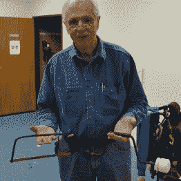](https://hackaday.com/2016/03/27/bootstrapped-tools-live-stopped-motion-and-a-dekatron-computer/larry-bentley-brace-and-hacksaw/) Lawrence Bentley (he goes by Larry) [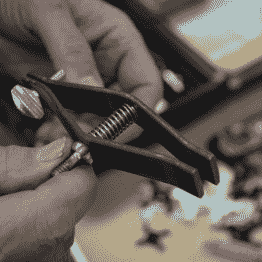](https://hackaday.com/2016/03/27/bootstrapped-tools-live-stopped-motion-and-a-dekatron-computer/dsc_0777/) a simple vice grips [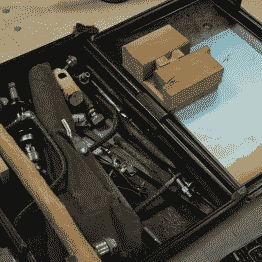](https://hackaday.com/2016/03/27/bootstrapped-tools-live-stopped-motion-and-a-dekatron-computer/dsc_0778-2/) tool box

很高兴见到拉里·本特利，他做了一个精彩的闪电演讲，讲述了他为发展中国家设计的工具。

闪电般的演讲只有 7 分钟，但拉里花了整晚的时间和围在他桌子周围的人一起看他用最基本的材料制作的非常实用的工具。在上面你可以看到他拿着一把锯子和一个支架，都是用钢筋制成的。

拉里活跃于无国界工程师组织，这让他去了世界上许多不同的地方。对于一些社区来说，甚至一把锤子都是遥不可及的工具。看看上面他的工具箱，你会看到一根插着大螺栓的棍子。从财务上来说，这是一个更加平易近人的锤子版本。

 [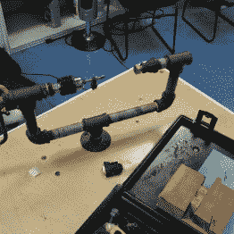](https://hackaday.com/2016/03/27/bootstrapped-tools-live-stopped-motion-and-a-dekatron-computer/dsc_0780/) Drill press [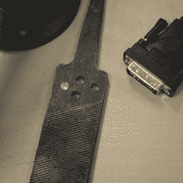](https://hackaday.com/2016/03/27/bootstrapped-tools-live-stopped-motion-and-a-dekatron-computer/dsc_0789/) Cut through hardened steel  Homemade bearings

那么如何在棍子上凿洞来做锤子呢？拉里带来了他自己做的 DIY 钻床。我们的花式电钻压力机旋转到高转速，但这个使用低转速和高压力。当用手扭转钻头时，螺栓用来对工件施加杠杆作用。看看那个机械装置的近景。它使用凹痕垫圈和一些滚珠轴承来创建一个 DIY 轴承。它可以很好地钻透坚硬的钢锉！

## 实时停止运动

 [https://www.youtube.com/embed/X2ys5IEwVAw?version=3&rel=1&showsearch=0&showinfo=1&iv_load_policy=1&fs=1&hl=en-US&autohide=2&wmode=transparent](https://www.youtube.com/embed/X2ys5IEwVAw?version=3&rel=1&showsearch=0&showinfo=1&iv_load_policy=1&fs=1&hl=en-US&autohide=2&wmode=transparent)

真人和定格是对立的，对吧？真的很难在摄像机上捕捉到这种效果，但亲自来看，这种定格动画看起来令人难以置信。科林·麦吉恩通过在链条上安装小雕像来建造它。每个图形是动画的一个不同的帧，一个同步的 LED 充当“快门”。我可以为他担保，但如果你需要更多的证据，专利局也认为他有所发现:他刚刚获得了一项专利。

 [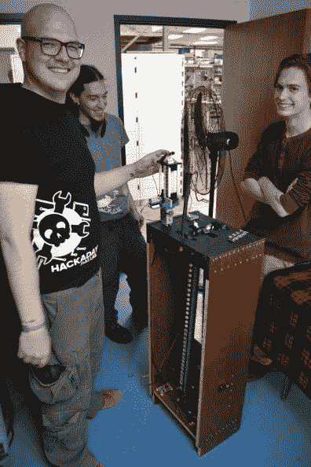](https://hackaday.com/2016/03/27/bootstrapped-tools-live-stopped-motion-and-a-dekatron-computer/dsc_0797/) Colin in his freshly screened shirt [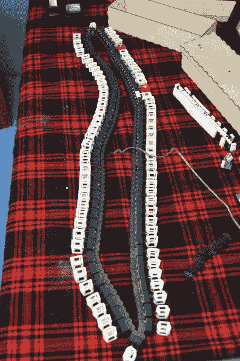](https://hackaday.com/2016/03/27/bootstrapped-tools-live-stopped-motion-and-a-dekatron-computer/dsc_0801/) Switch animations by changing chains [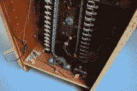](https://hackaday.com/2016/03/27/bootstrapped-tools-live-stopped-motion-and-a-dekatron-computer/dsc_0806/) Inside of the machine [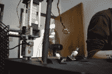](https://hackaday.com/2016/03/27/bootstrapped-tools-live-stopped-motion-and-a-dekatron-computer/dsc_0808/) Top of the machine with LEGO version  LEGO version  Colin’s notebook

科林注意到这不是一个传统的装有图片或模型的圆形桶。这是他如何描述这个被称为 Tru 的系统。d:

> 真的。D 3D 是一个 3D 视频系统。它不需要投影，不需要光学，也不需要眼镜。与提供“3D”电影的影院不同，这是真正的 3D 视频

这个版本的设备使用链条，科林的下一个迭代将是一个使用许多滑轮来回传送链条的系统。目标是得到一个持续大约 90 秒的动画！你能想象这个放大到剧院大小的装置吗？这个想法的物理含义变得非常有趣。

## Witch-E 项目是一台德卡龙计算机

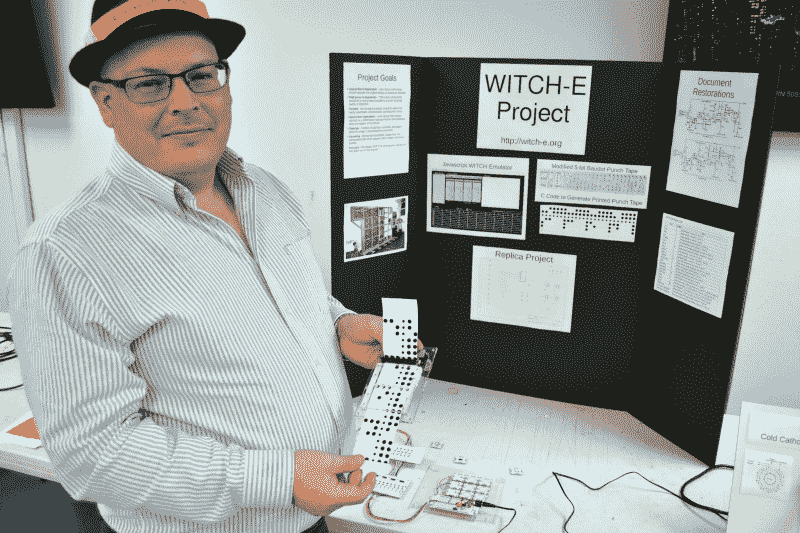

很高兴能遇到大卫·安德斯，他已经在 Hackaday 上出现了无数次(这是他在早期 Linux 平板电脑上的一次黑客攻击)。他做了一个报告，并展示了[女巫 E 项目](http://www.witch-e.org/)的进展。

哈威尔·迪卡侬电脑也被称为女巫。大卫是将计算机重新创造为教育机会的努力的一部分，他们已经取得了很大的进展。当然，像这样的项目不能依赖于德卡龙电子管和驱动它们的所有部件，所以戴夫设计了一个基于 LED 的替身，展示如下。

 [https://www.youtube.com/embed/tl-ruOP-ipw?version=3&rel=1&showsearch=0&showinfo=1&iv_load_policy=1&fs=1&hl=en-US&autohide=2&wmode=transparent](https://www.youtube.com/embed/tl-ruOP-ipw?version=3&rel=1&showsearch=0&showinfo=1&iv_load_policy=1&fs=1&hl=en-US&autohide=2&wmode=transparent)

 [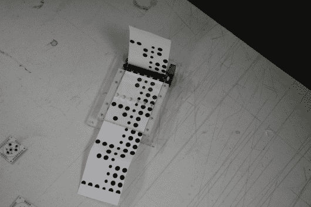](https://hackaday.com/2016/03/27/bootstrapped-tools-live-stopped-motion-and-a-dekatron-computer/dsc_0760/)  [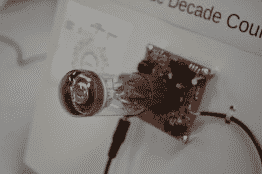](https://hackaday.com/2016/03/27/bootstrapped-tools-live-stopped-motion-and-a-dekatron-computer/dsc_0757/)  [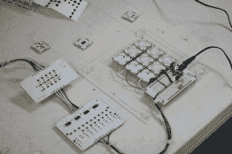](https://hackaday.com/2016/03/27/bootstrapped-tools-live-stopped-motion-and-a-dekatron-computer/dsc_0753-colorbalance/) 

不过，迪卡龙只是拼图的一部分。你还需要一个穿孔带阅读器(和写入器)来编写原始的女巫程序。对于 Witch-E 程序，有一个基于磁带的阅读器，它使用计算机打印机在计算器纸上打印点，用光电晶体管读回数据。谁知道现代打印机仍然有横幅模式，用于在连续磁带上打印？右边是计算机的工作原型，它包括一个寄存器，用于从磁带阅读器或开关获取输入，并将它们推入 dekatron 寄存器。注意头版，布兰登很快会在女巫 E 上发表一篇完整的文章。

### 黑客日达拉斯

这只是活动中的一小部分。感谢布兰登·邓森为这个非常成功的夜晚做了这么多的准备。感谢达拉斯创客空间让我们使用他们的会议室。非常感谢 Hackaday 的母公司 Supplyframe 为 100 多人提供披萨和饮料，并赞助了 t 恤丝网印刷。

 [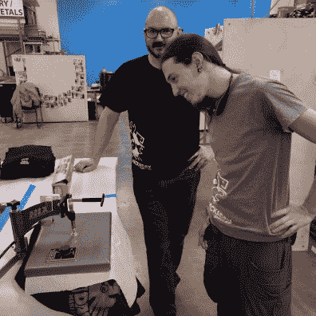](https://hackaday.com/2016/03/27/bootstrapped-tools-live-stopped-motion-and-a-dekatron-computer/img_20160319_160419/) Pearce Dunlap and Brandon Dunson curing a test print [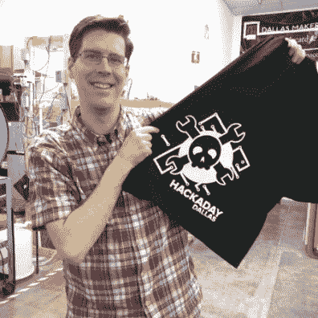](https://hackaday.com/2016/03/27/bootstrapped-tools-live-stopped-motion-and-a-dekatron-computer/szczys-screen-printing/) Mike Szczys with DIY shirt

说到这里，皮尔斯·邓拉普领着衬衫丝网印刷。看看他和布兰登在猛攻开始前看起来有多冷静。皮尔斯那天晚上做了大量的工作。我们手头上有 25 件衬衫，并告诉人们早点来，因为我们很快就会用完衬衫。然后很多人都带了自己的衬衫！

在我们的衬衫供应结束后，我们一直让屏幕保持忙碌。我相信我们甚至用完了为这次活动购买的白色墨水。这是一个很好的问题，也是一个夜晚的隐喻——这么多有趣的人，这么多要做的事情。这是一次我将会铭记很久的聚会。