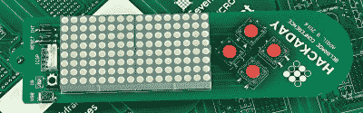
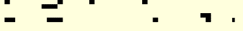

# 这就是生活…在黑客徽章上

> 原文：<https://hackaday.com/2016/04/05/thats-life-on-a-hackaday-badge/>

我们的 Hackaday 主管(Mike)前几天给我发了一封电子邮件，里面有一个贝尔格莱德 Hackaday 徽章模拟器的链接。他显然想让我在[演示场景竞赛](https://hackaday.io/contest/10521-belgrade-badge-demoscene)中加入一些东西。好消息是，因为有了模拟器，你不必离开你的办公桌去参与。坏消息是，月底我剩下的时间不多了，所以我想在[做一些吸引人的事情](https://hackaday.io/project/10632-conways-life-on-a-hackaday-belgrade-badge)，但必须相当容易推出。我最终做了一个非常快速的项目，但它有一些我认为应该分享的优点。最终目标是在徽章上有趣地展示[康威的生活游戏](https://en.wikipedia.org/wiki/Conway%27s_Game_of_Life)。

顺便说一句，在 Hackaday.io 上有一个由[Jeremias]做的目标相同的完全不同的项目，据我所知，这只是两个人开始做同样事情的结果。你会看到用户界面有点不同，所以你可能会看到你更喜欢哪个。

如果你没看过，真正的徽章在下面。当然，模拟器只是作为一个窗口在你的电脑上运行。对于那些将参加会议的人，或者只是想编程更接近实际硬件的人，现在有一个针对 PIC18LF25K50 的预配置 MPLABX 框架和运行在这个徽章上的引导加载程序/内核。

[](https://hackaday.com/wp-content/uploads/2016/03/badge-demoscene-feature.jpg)

## API

如果你看一下[原始框架](https://github.com/Hack-a-Day/Belgrade_Badge_Demoscene)中的示例代码，你会发现创建你的演示只需要几个调用:

*   display pixel–将 x 和 y 坐标上的一个像素设置为开或关(在真实徽章上，这是即时的；在模拟器上，它只在调用 displayLatch 时生效)
*   display latch–将像素写入显示器(在真正的徽章上，此调用不做任何事情)
*   get control–返回向上、向下、向右、向左或退出(退出在真正的徽章上不存在)
*   显示关闭–关闭模拟器

H 文件中有几个调用可以忽略，因为框架会在内置的 main 函数中为您调用它们。该函数还调用 animateBadge，这是您的主要入口点。那么，你的代码可能非常简单。编写一个 animateBadge 函数，该函数使用 display 调用来创建动画，如果您愿意，还可以使用 getControl 来接受输入。

还有另外两个有趣的调用:getTime 和 controlDelayMs。getTime 返回一个向上计数的 32 位计时器，其中每个计数值为一毫秒。对于真正懒惰的人来说，你可以调用 controlDelayMs 来把所有事情都阻塞一段时间。

## 这个计划

由于基本上很懒(老实说，时间很紧)，我出去寻找一个简单的 C 语言生命实现。我最终在 [RosettaCode](http://rosettacode.org/wiki/Conway%27s_Game_of_Life#C) 找到了一个(这本身就是一个有趣的网站)。我首先按原样编译它，以确保它能够工作，当然，它确实工作了。

原始代码使用基于控制台的输出(见下文),我注意到，对于 8×16 的网格，它倾向于最终进入空白板，当然，会停止。我知道这将是一个问题。

[](https://hackaday.com/wp-content/uploads/2016/03/life-con.png)

看看代码结构，很明显我只需要做四件事:

1.  重写 show 函数以在工卡上显示
2.  重写主函数来启动一切
3.  固定网格的大小以匹配徽章
4.  获得一个随机的种子变化，使游戏不总是玩同样的模式。

最后一个有点棘手。游戏函数中，原代码使用 C 库 rand 调用随机填充棋盘。问题是，如果没有随机种子，大多数实现将产生相同的数字序列。这是为了提高声望，但是对于游戏来说，这是错误的方法。此外，我想添加一些额外的功能，但首先，我需要让它全部运行起来。

## 港口

重写节目很容易，直到我开始添加功能。我只是使用了一个循环来扫描每个像素并调用 display latch:

```
 for_xy displayPixel(x, y, univ[y][x]?ON:OFF);
 displayLatch(); // update
```

for_xy 构造是来自原始代码的宏。

重写 main 也不是很难:

```
// Badge "main"
void animateBadge(void) {
 unsigned int seed;
 // assume the framework main called all the init* calls

 while(1) {
     seed++; // get a quasi random seed
     switch (getControl()) {
         case (ESCAPE):
             displayClose(); // exit (only for emulator)
             return;
         case (DOWN): // set up new game on down key
             srand(seed);
             game(8,16);
             break;
    }
}
```

通过调用 getControl，徽章可以在开始之前等待用户按下向下箭头。它会递增种子值，直到发生这种情况，因此随机数生成会得到一个不可预测的种子值。此外，对游戏的调用有 8 和 16 个硬编码，所以这一段代码负责 3 个不同的端口目标(数字 2、3 和 4)。

## 额外功能

在这一点上，徽章(嗯，技术上来说，是模拟器)工作了，但是它有一些令人讨厌的东西。首先，它太快了(我去掉了 usleep 调用，因为我不确定它是否在物理硬件徽章上)。第二，大部分游戏收敛到一个稳态。如果这种稳定状态是一个循环，其中 led 似乎在移动，这没什么大不了的。但是静态显示器(或者更糟，所有的 led 都变暗)不是很有吸引力。

很明显，在表演程序中设置一个计时器可以控制速度。稳态问题更有趣一点。首先，我将清除棋盘的代码分解到一个名为 init 的函数中，并更改了游戏函数来调用它，而不是在内部完成这项工作。init 函数使棋盘随机化。

下一步是改变进化函数。这是从当前像素计算下一代像素的代码。该过程的最后一步是将新游戏板复制到旧游戏板上。

我提供了一个变化变量，然后测试这两个数组，看它们是否相同。如果不是，代码会像以前一样继续复制。如果它们相同，那么我们处于静态显示中，所以代码调用 init，然后一切都重新开始。

在表演中，我需要的不仅仅是一个计时器。我需要另一个对 getControl 的调用来在游戏开始后提供一个用户界面。左右箭头控制速度变量。向上箭头暂停，向下箭头调用 init，这样如果你厌倦了当前的游戏，你可以重新开始。

## 无溢出计时

时间是一段有趣的代码。定时器是 32 位毫秒定时器。由于每一次滴答都是一毫秒，实际上，您永远不会看到计时器溢出(假设它每次都从零开始)。毕竟 32 位存储了大约 42 亿毫秒，也就是不到 50 天。

然而，旧习难改，我总是担心如果计时器确实溢出了会发生什么。例如，如果它不是从零开始，或者如果它是一个更快(或更短)的计数器，那就可能发生。

像这样处理计数器的典型方法是添加您想要的延迟，然后测试计数器。如果您确定您将至少测试一次每个滴答，您可以测试计数是否等于目标。否则，您需要测试计数是否大于或等于目标值。

举个例子，假设计数器是 100，你想要 500 毫秒的延迟。您会认为目标是 600 毫秒，然后循环等待，直到计数达到 600 或更大。

问题是，如果计数器即将溢出会发生什么？让我们考虑一个更短的计数器，这样更容易理解。16 位计数器将在 65535 之后翻转(假设它是无符号的)。让我们尝试同样的例子，但是这次使用 65200 作为起点。将 500 相加(假设 16 位数学)得到 164。

您可以检测到翻转将要发生，然后在测试前等待。如果你没有，那么你可能会问 65201 是否大于或等于 164，并发现它是，使一个非常短的时间延迟。还有其他简单的方法来处理翻转，但我更喜欢一种简单的方法——如此简单，以至于即使在这种可能无关紧要的情况下，我还是会使用它，因为使用它实际上没有任何损失。

诀窍是像往常一样计算目标。然后，使用相同的位宽，从当前值中减去目标值，而不是对其进行测试。如果结果设置了最高位，则循环还没有结束。

下面是代码的摘录(记住，它使用 32 位):

```
tick=getTime()+*speed;
. . .
if (getTime()-tick<0x80000000UL) break;
```

我很想把这个戏法归功于自己，但我不能。但是，用了这么久，都想不起来是在哪里捡的了。

## 结果呢

最后，一切都成功了，你可以在下面的视频中看到。不过，这个项目的真正关键在于，它非常简单，因为不仅找到了任何示例代码，而且找到了一段干净的代码，这些代码被很好地划分为显示和处理功能。这导致了一个简单的攻击计划和一个非常快速的徽章代码转身。

诚然，生活展示游戏并不十分新颖(我们已经在[时钟](http://hackaday.com/2014/01/11/extremely-slick-game-of-life-based-clock/)甚至[音乐版](http://hackaday.com/2011/03/27/music-synthesized-from-the-game-of-life/)上看到过)。另一方面，与其抱怨，为什么不从 GitHub 获得代码，为[的徽章](http://hackaday.com/2016/03/25/hack-the-hackaday-demoscene-from-your-own-home/)创建自己的演示呢？你的期限是 4 月 9 日。

 [https://www.youtube.com/embed/1SU_792ONzs?version=3&rel=1&showsearch=0&showinfo=1&iv_load_policy=1&fs=1&hl=en-US&autohide=2&wmode=transparent](https://www.youtube.com/embed/1SU_792ONzs?version=3&rel=1&showsearch=0&showinfo=1&iv_load_policy=1&fs=1&hl=en-US&autohide=2&wmode=transparent)

