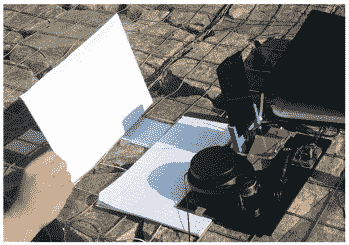
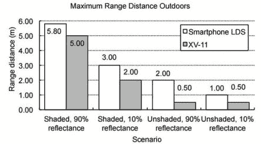

# 智能手机和红外线激光测距

> 原文：<https://hackaday.com/2016/04/04/smartphone-and-ir-line-laser-measure-distance/>

使用激光测量距离是自动驾驶汽车和雄心勃勃的机器人项目的支柱。麻省理工学院计算机科学和人工智能实验室(CSAIL)的优秀人员决定以一种创新的方式解决问题。[Jason H. Gao]和[Li-Shiuan Peh]在智能手机上使用了红外线(IR)激光和摄像头。他们的原型只花了 49 美元，因为他们用的是手边的智能手机。这篇文章报道了在户外阳光直射下使用该设备的良好结果，这对于廉价的激光雷达来说通常是一个挑战。

  Testing smartphone and XV-11 lidars  Range for smartphone and XV-11 lidars outdoors.

线激光产生一条水平线，反射回手机上的摄像头。激光在相机图像上的垂直位置让手机通过[视差](https://en.wikipedia.org/wiki/Parallax)计算距离。为了显示微弱的激光反射，该算法比较了四张图像——两张激光打开，两张激光关闭——并减去背景。使用智能手机是最理想的，因为它可以自动调节光线水平，并且可以很容易地升级到具有更好相机的新手机。

这应该是一个便宜且易于复制的设置。如果你做了一个，请告诉我们。如果你需要更精致的东西，可以看看这篇关于 Neato 真空吸尘器的 XV-11a 激光雷达与树莓派接口的文章。

 [https://www.youtube.com/embed/ynAOpZpWCGQ?version=3&rel=1&showsearch=0&showinfo=1&iv_load_policy=1&fs=1&hl=en-US&autohide=2&wmode=transparent](https://www.youtube.com/embed/ynAOpZpWCGQ?version=3&rel=1&showsearch=0&showinfo=1&iv_load_policy=1&fs=1&hl=en-US&autohide=2&wmode=transparent)

[Jonathan Piat]在 2014 年之前的一些业余爱好工作也类似，使用可见线激光器、BeagleBone 和 LOGI 骨 FPGA cape 来处理处理。

 [https://www.youtube.com/embed/SGZVa55p9Lo?version=3&rel=1&showsearch=0&showinfo=1&iv_load_policy=1&fs=1&hl=en-US&autohide=2&wmode=transparent](https://www.youtube.com/embed/SGZVa55p9Lo?version=3&rel=1&showsearch=0&showinfo=1&iv_load_policy=1&fs=1&hl=en-US&autohide=2&wmode=transparent)

