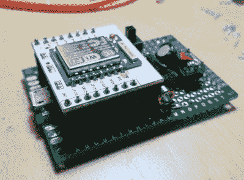
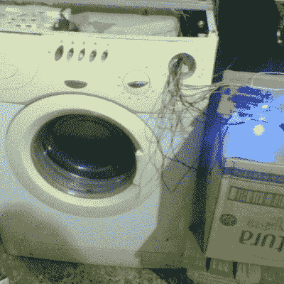
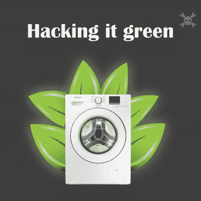
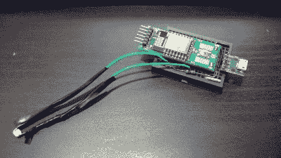

# 黑客 102-洗衣项目

> 原文：<https://hackaday.com/2016/04/02/hacklet-102-laundry-projects/>

啊洗衣日。洗衣机、干衣机、熨烫和折叠。没有人是洗衣服的粉丝，但我们(我希望)都是拥有干净衣物的粉丝。黑客、制造商和工程师总是在寻找方法让一个单调乏味的任务变得简单一点，洗衣肯定是那些单调乏味的任务之一。本周我们将在 [Hackaday.io](https://hackaday.io) 上盘点一些最好的洗衣项目！

 我们先从【放屁教授】和[洗钱](https://hackaday.io/project/2164)说起。任何与室友共用洗衣机和烘干机的人都会告诉你这有多令人沮丧。你把脏衣服拿到楼下，却发现洗衣机正在使用。等太久，已经有人跳到你前面了。洗衣店解决了这一切。使用电流传感器，Laundrify 可以判断机器是否正在运行。ESP8266 监控电流传感器，并将数据上传至云端——在本例中为 Raspberry Pi。用户通过在 Pi 上打开一个网页来访问这个洗衣服务系统。该页面包括显示每台机器当前状态的图标。如果一切都在使用中，用户可以加入一个队列，以便在机器空闲时得到通知。

 接下来是【何塞·伊格纳西奥·罗梅罗】带着[博格洗衣机](https://hackaday.io/project/4241)。[Jose]发现了一台机械性能完美的洗衣机。电力是一个不同的故事。最大的问题是失败的机械计时器，它总是让他穿着湿漉漉的衣服。洗衣机定时器归结为机械定时多极开关。更换它们也很昂贵。[Jose]做得更好——他制造了一个电子控制器来振兴他的洗衣机。处理器是 PIC16F887。大部分电源电平切换由继电器处理。[Jose]使用 [LDmicro](http://cq.cx/ladder.pl) 对新系统进行编程，这是一种用于微控制器的梯形逻辑实现。对于门外汉，梯形逻辑是一种编程语言，常用于工业可编程逻辑控制器(PLC)系统。新命名的博格机器现在比以往任何时候都运行得更好。

接下来，我们有[Michiel Spithoven]和[热灌装洗衣机](https://hackaday.io/project/607)。在北美，大多数洗衣机都有冷热水供应。热水来自家里的热水器。荷兰的情况并非如此，那里的机器被设计成用电来加热冷水。[Michiel]知道他家的热水器比他机器内置的电加热器更有效。[Michiel]通过使用两个电磁阀和一点铜管构建一个自动化混合歧管，将他的机器改造成绿色。这些阀门由 PIC 微处理器控制，该微处理器监控进入机器的水的温度。PIC 调节阀门，使水保持在[Michiel 的]选定循环的合适温度。[Michiel]一直在跟踪新系统的效率，已经为他节省了 97 欧元！

 最后我们有【马克·库尔曼】和[朗德斯](https://hackaday.io/project/10614)。[马克的]洗衣机有一个令人讨厌的习惯，会失去平衡而关机。这使他穿着湿透的衣服，浪费了重新装载的时间。[Mark]想在不直接修改他的机器的情况下解决问题，所以他想出了 LaundrEsp。当机器正常运行时，控制面板上的“门锁”灯亮起。一旦洗衣机关闭——由于正常循环结束或故障，门解锁，灯熄灭。[Mark]用胶带将 CdS 光检测电阻器粘在灯上，并将其连接到 ESP8266。用 [Thinger.io](http://thinger.io/) 和【马克的】机器编写一点程序，现在让他知道什么时候需要注意。

如果你想看更多的洗衣项目，请查看我们全新的[洗衣项目列表](https://hackaday.io/list/10674-laundry-projects)！如果我错过了你的项目，不要让我破产！[在 Hackaday.io](https://hackaday.io/adam) 上给我留言，我会立刻把你的项目洗好、叠好，并添加到列表中。这就是本周的 Hacklet。一如既往，下周见。同样的黑客时间，同样的黑客频道，带给你最好的 [Hackaday.io](https://hackaday.io/) ！