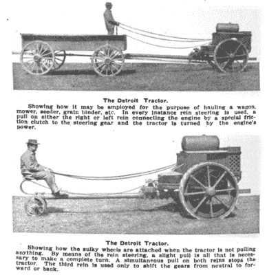
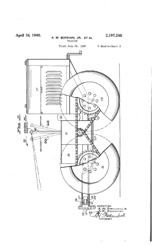

# 拖拉机:用缰绳操纵的拖拉机

> 原文：<https://hackaday.com/2016/04/08/retrotechtacular-rein-operated-tractors/>

新技术保留之前技术的痕迹并不罕见。如果一个行业有一种以特定方式做事的惯性，那么对于任何新贵来说，建立在这些既定惯例之上，而不是不被采用，是有商业意义的。因此，举例来说，一些具有非常现代的内部结构的工业 PLC 可以提供可以追溯到其基于继电器的祖先的接口，或者在您的移动电话内部，可能仍然存在从 20 世纪 80 年代早期的调制解调器发出的熟悉的 at 命令。

虽然只是偶尔，将新技术与旧技术结合的尝试会立即成为时代错误，这在当时可能是有意义的，但从历史的角度看似乎有点疯狂。所以我们来到了这件作品的主题，缰控农业拖拉机。

An advertisement for the Detroit Tractor Company in the Automobile Trade Journal, July 1913\. Public domain, via [Wikimedia Commons](https://en.wikipedia.org/wiki/File:Detroit_Tractor_in_Automobile_Trade_Journal_1913.png)

在二十世纪初，当第一台内燃机驱动的拖拉机被开发出来时，农民们已经用马作为动力好几个世纪了。蒸汽动力对农业来说并不陌生，但对日常使用来说并不实用。铁路可以负担得起员工和基础设施来全天候支持蒸汽机车，而农民负担不起。

因此，拖拉机制造商试图给农民提供一些他可以利用现有技能甚至现有马拉工具的东西是有意义的，因此几家制造商提供了不是由杠杆、踏板或方向盘控制，而是由缰绳控制的机器。历史广告和照片，比如来自威斯康星历史协会的这张照片，或者像[这种罕见的幸存者在 Flickr](https://www.flickr.com/photos/bparo2003/1126923052/) 上发现的双缸福勒显示，这些机器在上世纪头几十年由各种品牌提供。

我们现在称之为传统控制的坐式拖拉机当然占了上风，到 20 世纪 20 年代，它们在田地里占据了主导地位。马拉的工具适应了他们，农业世界继续前进。

 

美国专利 US2197248A，1937 年。邦汉兄弟的马力拖拉机。Via [谷歌专利](https://patents.google.com/patent/US2197248A/en)。但是，缰绳拖拉机的故事并没有结束，因为在 20 世纪 30 年代中期，犹他州的两兄弟[艾伯特]和[邦德·邦汉姆]发明了动力马，一种滑移转向的四轮驱动小型拖拉机。虽然它是一台功能强大的机器，其四轮驱动在许多方面都领先于时代，但这些缰绳、其复杂性以及其相对较高的价格意味着它未能占领一个重要的市场。

动力马是缰绳操作拖拉机中数量最多的幸存者，因此有大量的图片和 YouTube 视频可以找到。所有人都认为它们需要一些驾驶技能，因为虽然它们的操作类似于最近的机器，如[山猫滑移装载机](http://www.bobcat.com/loaders/skid-steer-loaders/features)，但出现错误的可能性很大。举例来说，本能地拉缰绳来阻止一队马，可能会使马力强劲的马倒退。

如果从手控拖拉机的故事中可以得出一个现代的相似之处，那就是用户界面如何与智能机器协同工作。缰绳对一群马起作用，因为马并不像它看起来那么笨。自我保护的本能可能会阻止马做一些灾难性的事情，例如倒车撞到谷仓的墙上，而拖拉机没有这样的顾虑，需要更多的动手操作界面。

因此，缰绳操作的拖拉机仍然只是农业展览中的一个好奇的对象，就像休息时间下面的视频中显示的动力马一样。经典的复古素材，复杂的机器，在它们被发明的时候比事后来看更有意义。

 [https://www.youtube.com/embed/22TgS6bj-6s?version=3&rel=1&showsearch=0&showinfo=1&iv_load_policy=1&fs=1&hl=en-US&autohide=2&wmode=transparent](https://www.youtube.com/embed/22TgS6bj-6s?version=3&rel=1&showsearch=0&showinfo=1&iv_load_policy=1&fs=1&hl=en-US&autohide=2&wmode=transparent)

使用大型农业机械有一种非常令人满意的感觉，尤其是那些稍微有点与众不同的机械。这些年来，我们在这里展示了一两台拖拉机，最近的是[一台螺旋驱动转换拖拉机](http://hackaday.com/2016/04/04/screw-drive-tractor-hasnt-conquered-canada-yet/)和一台[自主谷物收集拖拉机](http://hackaday.com/2016/04/05/autonomous-tractor-brings-in-the-harvest/)，我们报道了[一台工业拖拉机的修复](http://hackaday.com/2013/10/02/restoring-an-industrial-tractor/)，以及[John Deere 尝试使用 DRM 将拖拉机所有者锁定在他们的维护计划中](http://hackaday.com/2015/05/12/ask-hackaday-fixing-your-tractor-could-land-you-behind-bars/)。

* * *

**Retrotechtacular is a column featuring hacks, technology, and kitsch from ages of yore. Help keep it fresh by [sending in your ideas for future installments](mailto:tips@hackaday.com?Subject=[Retrotechtacular]).**