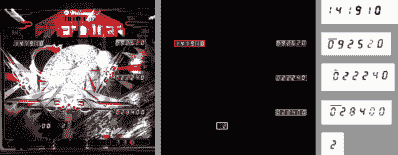

# 最身临其境的弹球机:超新星项目

> 原文：<https://hackaday.com/2016/04/08/the-most-immersive-pinball-machine-project-supernova/>

在[Truthlabs]，一台 30 岁的弹球机被诊断出其游戏设计存在重大缺陷:它一次只能娱乐一个人。[Dan]和他的同事们开始改变这一点，将 ol' pinball 传奇“火力”转变为值得 21 世纪的壮观、身临其境的游戏体验。

他们想要克服的一个主要限制是屏幕尺寸。安装在天花板上的投影仪应该将机器后面的整面墙变成一个巨大的 15 英尺的运动场，供房间里的任何人欣赏。

有这么多空间要填充，团队组装了一个视觉概念，与街机经典的原始故事情节无缝融合，研究了机器的艺术作品，并深入挖掘了科幻档案。然后，他们利用 Cinema4D 和 WebGL 以及常用的设计师工具箱，将他们的想法转化为 3D 图形。增加了激光和爆炸，准备由机器上的游戏交互触发。

为了将增强功能与弹球机自己的游戏进度挂钩，他们精心设计了一个优雅的解决方案，结合 OpenCV 和 OCR，从单个网络摄像头读取机器的所有五个 7 段显示器。机器内部的 Arduino 接入众多的机械开关和指示灯，使 Node.js 服务器不断更新被按下的按钮、点击、“Lange Change”和投入的球。

结果就是你在下面的视频中看到的激情和技巧的令人印象深刻的展示。我们真的很喜欢自定义着色器效果。没有它们我们怎么玩弹球呢？

[https://player.vimeo.com/video/161542312](https://player.vimeo.com/video/161542312)