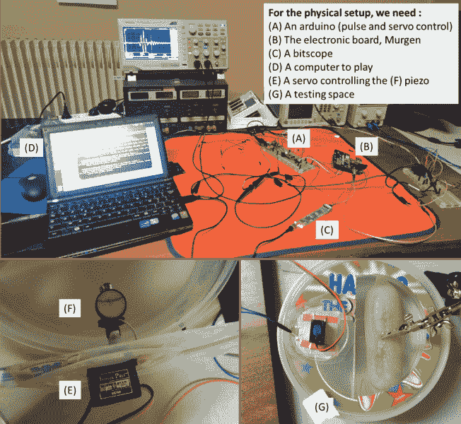

# 医疗超声开发套件

> 原文：<https://hackaday.com/2016/04/12/a-developers-kit-for-medical-ultrasound/>

从观察手术中的心脏瓣膜到在宝宝出生前与她见面，超声是现代医学中最有价值和侵入性最小的成像工具之一。当然，你要为价值买单，价格超过 10 万美元的超声波仪器，这可能会让许多发展中国家买不起。听起来像是黑客要解决的问题，为了帮助实现这一目标，2016 年 Hackaday 奖的参赛作品旨在创建一个开发套件，以实现低成本的医疗超声。

作为开源项目 [echOpen 项目](http://www.echopen.org/)的分支，【kelu124】的 Murgen 项目旨在让黑客们创造出 500 美元价位的超声波听诊器。看一看测试台就知道不需要太多的专门设备。除了 Murgen 开发板本身，测试台上的所有东西都是标准配置。就连测试目标——本文开头的超声波图像——也是非常普通的东西——一个装满木薯淀粉和琼脂的避孕套。Murgen 板本身是一个 BeagleBone 黑色斗篷，并提供完整的原理图和代码。

我们将密切关注超声开发套件的结果。也许像这个增强现实超声波观测仪一样酷？

&nbsp

The [HackadayPrize2016](http://hackaday.io/prize) is Sponsored by:       