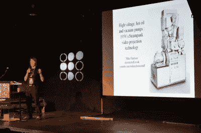
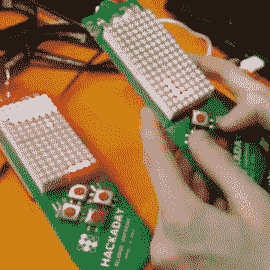
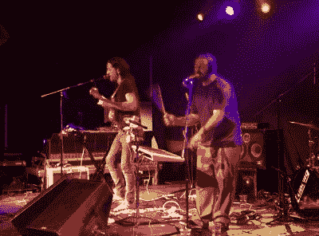
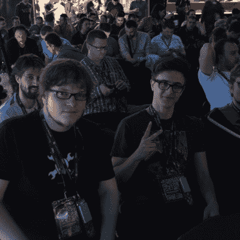
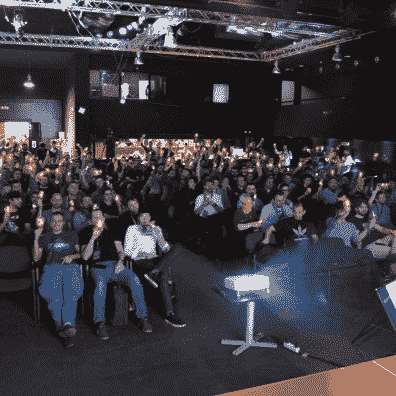
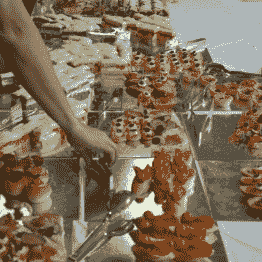
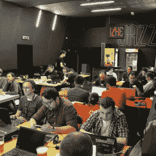
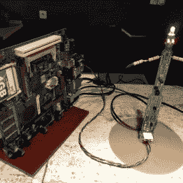

# 周六，贝尔格莱德是世界硬件中心

> 原文：<https://hackaday.com/2016/04/11/hackaday-belgrade-was-hardware-center-of-universe-on-saturday/>

在周六的贝尔格莱德会议上，我最喜欢的话题之一是关于越境问题。这个人说，进入塞尔维亚的边境站需要一个单独的车道，数字标志上有头骨和扳手，因为很明显，他们前面的两辆车也挤满了来参加骗局的人(以及与 Hackaday 人群一起旅行的所有定制硬件)。一想到满载硬件黑客的大篷车正在前往这场史诗般的聚会。

我们挤满了这个地方，在过去的几周里，我们卖出了至少 50 张票，超过了我们的限制，卖给了那些只想进去，并且不介意不能得到一个甜蜜徽章的人。我记得见过来自罗马尼亚、保加利亚、希腊、斯洛文尼亚、西班牙、意大利、瑞士、美国、德国、法国、英国，当然还有塞尔维亚的人。如果你在那里，而我想念你的国家，请在评论中告诉我们。

Mike Harrison talking about the Eidophor

显然，主要事件是在我们的会议上发生的令人难以置信的一系列会谈。在去年 11 月的超级会议上，我们有很棒的演讲者，这是我们的第一次年会，所以我们很高兴地说，我们的第二次会议也一样好。(我们预计今年秋天会有三分之一。)Hackaday 非常感谢所有贡献出时间和才华与我们全球社区分享知识和经验的演讲者。

其中我最喜欢的是 [Seb Lee-Delisle 的](http://seb.ly/)关于他的许多大型激光和投影制图装置的演讲， [Mike Harrison 的](http://www.electricstuff.co.uk/)关于 Eidophor 投影仪系统的绝对令人惊叹的工程的深入研究， [Dejan Ristanovic 的](https://en.wikipedia.org/wiki/Dejan_Ristanovi%C4%87)关于互联网在塞尔维亚时断时续的历史的精彩演讲， [Sophi Kravitz 的](https://hackaday.io/sophikravitz)关于偏振材料的合作工作，以及 [Voja Antonic 的](https://hackaday.io/voja)关于设计的许多试验的演讲如果你错过了这些演讲的直播，不要担心，我们把它们都录下来了。编辑和发布它们需要一点时间，所以请关注首页。

会议期间游戏被黑到徽章上【视频 via[@ nmiljkovic](https://twitter.com/nmiljkovic/status/718784010424610816)】

徽章被黑再一次蔚为壮观。这是我们的第一个电子徽章——一个由 PIC 驱动的 Voja Antonic 作品，包括一个 8×16 LED 显示屏、五个用户按钮和 IR TX/RX。徽章预装了 Voja 的汇编代码演示，带有滚动消息和俄罗斯方块。这些信息可以用他为这次活动建造的红外站来定制。

该设置包括一个 USB 引导加载程序，这样你就可以轻松地将你自己的代码闪存到徽章上，并且整天都有很多这样的事情发生。最后一分钟加入骗局的是 Voja 的加密挑战，第一组花了大约两个小时的工作才破解。一般徽章黑客比赛发生在午夜之前，我们将很快有一篇关于所有这些黑客的专门文章。感谢 Microchip 为徽章捐赠微控制器。

晚上八点刚过，会谈就结束了，然后我们开始了有史以来第一次的黑客活动:现场音乐！首先出场的是 Infinite Jest，这是一个五人组合，他们立刻让观众兴奋起来。紧随其后的是 Grupa TI，他的电子流行音乐拥有完整的声音，我仍然很惊讶只用两个音乐家就能做到。在徽章黑客演示之后，传奇的 [DJ Boza Podunavac](http://happyness4ns.tripod.com/clubbing/djs/BozaPodunavac/boza.htm) 让我们一直工作到凌晨三点。幸运的是，贝尔格莱德的夜生活从不停止，我们能够在睡觉前找到一个大陀螺。

Grupa TI on stage at Hackaday Belgrade

贝尔格莱德 Hackaday 在 Dom Omladine Beograda 举行，非常完美！那里有一个很大的公共区域，里面有咖啡吧、餐点和小吃、新鲜果汁和水、当地的桶装啤酒、衣帽间(这是不可低估的！)，还有充足的社交空间。谈话空间有足够的空间放舒适的椅子，一边有高顶，还有一个足够高的舞台，有一个大屏幕，所以房子里的每个座位都很棒。公共区域的另一边是一个用于研讨会的大工作室，其余时间里挤满了徽章黑客。

所有这一切都顺利进行，这要归功于位于贝尔格莱德的供应商框架工程师的出色规划和日常工作。我们也有来自会场的优秀的活动工作人员，包括音频和视频工程师，他们确保演示文稿被无问题地看到和听到。

将会议门票价格保持在尽可能低的水平对我们来说很重要——我们设定它们只是为了弥补徽章的生产成本。如果没有 [Supplyframe](http://supplyframe.com/) 和另外两家也在贝尔格莱德有大量业务的公司 [SevenBridges](https://www.sbgenomics.com/) 和 [Vast](http://www.vast.com/) 的支持，我们不可能有如此惊人的成功。这些公司分享黑客社区的价值观。感谢您与我们合作，让 Hackaday Belgrade 取得巨大成功！

  Familiar faces from [Hack Chat](https://hackaday.io/project/5373-hacker-channel): Dave Darko, Michele Perla  Hold up your badges!  Snacks between sessions  Badge hacking in full swing  IR kiosk for flashing messages to badge

你希望下一次黑客大会在你的城市举行吗？从展示你所在地区的 Hackaday 社区有多活跃开始。开始你自己的黑客日聚会，并参加 4 月 23 日的[黑客日世界创造日。](https://hackaday.io/event/10664-hackaday-world-create-day-2016)