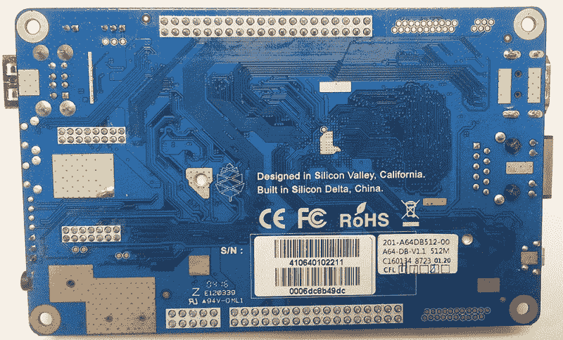

# 联合国的审查

> 原文：<https://hackaday.com/2016/04/21/pine64-the-un-review/>

甚至在宣布和介绍 Raspberry Pi 3 之前，一些非常强大的单板 ARM Linux 计算机的消息就流出了中国。硬件就在那里——强大的 64 位 ARM 芯片已经存在，只需要几个工程师将这些芯片安装到电路板上，几个营销人员和一个合同制造商。

第一批 64 位主板之一是 [Pine64](https://www.pine64.com/) 。Pine64 通过 Kickstarter 向世界介绍，从 36，000 名支持者那里净赚了 170 万美元，已经非常受欢迎。这些公告板开始出现在支持者的门口台阶和邮箱上，最初的印象出现在官方论坛和 Kickstarter 活动评论中。

我向 Pine64 Kickstarter 认捐了 15 美元，作为回报，我收到了一块 512MB 内存、4K HDMI、10/100 以太网和 1.2 GHz ARM Cortex A53 CPU 的主板。这篇文章不是评论，因为我不能完全记录 Pine64 的体验。我的初步印象？这很糟糕。这太糟糕了。

Shenzhen and Guangzhou, the ‘Silicon Delta’

### 五金器具

本次联合国审查涵盖了最便宜的 Pine64，具有 1.2 GHz 的 Allwinner A64，512MB 的内存，以太网，HDMI 和两个 USB 端口。这是向 Pine64 Kickstarter 活动认捐 15 美元的奖励。根据 Kickstarter 的宣传活动，这款主板应该在 2 月份发货。4 月 13 日到的。对于 Kickstarter 活动来说，这是令人惊讶的快，而不是对 Pine 团队的打击。

目前，Pine64 [有三种配置可供预订。最低的一层，也就是这里要讨论的，是 15 美元的全球运费。Pine64+包括 1GB 的 RAM、千兆以太网以及用于摄像头、LCD 和触摸屏的连接器。这个版本售价 19 美元，美国运费 7 美元，世界其他地方 12 美元。顶级 Pine64+ 2GB 包括 2GB 内存，售价 29 美元，美国运费 7 美元，世界其他地区 12 美元。](http://www.pine64.com/product#pricing)

虽然这对于硬件回顾来说有点深奥，但我想提一下 Pine64 的机械布局。它是巨大的。它只是一根大于 3 英寸×5 英寸的头发，更确切地说是 127 毫米×79 毫米。这明显大于目前的覆盆子和奥德罗 C2 的产量。

Pine64 上有很多空间，接头、端口和插头充分利用了这一点。电源、以太网和 HDMI 都在电路板的一侧，USB 和 3.5 毫米麦克风和耳机插孔在对面，SD 卡在旁边。有一个 DSI 接头来连接触摸感应 LCD，但触摸板的连接器在电路板的另一侧。

关于运送给我的具体松木，我不得不评价大会有点平淡无奇。电路板本身在中间*弯曲*，电路板和引脚接头的垫片之间有明显的间隙。很难拍照，但你可以一目了然。如果我给 Pine 的 QA 评分，这将是一个实实在在的 D——该板有效，但我很惊讶它确实有效。

A very slight bend in the middle of the Pine64\. This would never pass QA from any manufacturer.

硬件与你对 64 位 ARM 板的期望相差无几。四核 ARM A53 Allwinner CPU 实际上与 Raspberry Pi 3 中的 CPU 相同。然而，GPU 完全不同。不幸的是，该 SoC 采用了 Mali 400-MP2 图形处理器，这种 GPU 没有得到很好的支持，并且落后于在 Raspberry Pi 中找到的 Broadcom VideoCore IV 的开源工作。平心而论，单板 Linux 电脑上的 GPU 支持几乎总是很可怕；Mali 400 只是比任何其他选择稍微可怕一些。

就软件而言。Pine64 wiki 上有许多可用的发行版[，包括 Ubuntu、Arch 和 Android images。](http://wiki.pine64.org/index.php/Pine_A64_Software_Release)

### 入门指南

Allwinner’s PhoenixCard utility.

如果你买了一台打印机，你得到的不是一张装满软件的光盘。如果您购买了笔记本电脑，所有的恢复软件只能通过下载或在恢复分区上获得。没有人再提供软件了，Pine64 也不例外。你可以直接从 Pine64 wiki 获得 SD 卡图像[，Ubuntu、Arch 和 Android Lollipop 发行版都有提供。这里有一个问题——pine 64 没有使用他们自己的主机，而是依靠 Google Drive 和 Torrents 向每个人分发他们的软件映像。Ubuntu 的图片有 7gb，当我写这篇文章的时候，它的下载速度大约是每秒 2 兆。你可以计算一下。至少他们为 SD 卡图像提供了一些种子。我怀疑，一旦 Pine64s 发行给支持者，种子数量增加，这些洪流会更快。](http://wiki.pine64.org/index.php/Pine_A64_Software_Release)

有了图像，你会期望将图像写入 microSD 卡与 Raspberry Pi 或任何其他单板计算机完全相同——使用 Win32DiskImager 或 dd 并将图像写入卡。并非所有发行版都是如此。根据 Pine wiki 和论坛，推荐将映像刻录到 SD 卡的软件是 PhoenixCard，这是 Allwinner 开发的一款将磁盘映像写入 SD 卡的软件。它可能会以中文用户界面启动，根据社区成员[Michael Larson] [的说法，在向 SD 卡写入图像时，每十五次](https://www.youtube.com/watch?v=TjJ62s5DxPc&feature=youtu.be)就有一次失败。

通过某种可靠的方式将软件映像写入 SD 卡，您可能会认为引导 Pine64 很容易。并非如此。在撰写本文时(经过多次尝试)，有几个发行版映像根本就不工作。Android 发行版无法在我的机器上启动，Arch 发行版无法运行。Ubuntu 的图像起了作用，[但是这是社区成员的努力](http://wiki.pine64.org/index.php/Pine_A64_Software_Release#Ubuntu_Linux_Image_base_on_Longsleep_20160403-1_image.2C_courtesy_of_Michael_Larson) [Michael Larson]:

Yes, a Pirates of the Caribbean desktop will be most people’s first experience with the Pine64

Pine64 上的 Ubuntu 体验非常慢，我经历了几次重启。在撰写本文时，我已经在 Pine64 wiki 上测试了所有的软件发行版[。只有 Ubuntu 发行版表现不佳，现在我认为 Pine64 浪费了 15 美元。这将有望在不久的将来改变，当我可以启动松树时，我会很高兴地写一篇新的评论。](http://wiki.pine64.org/index.php/Pine_A64_Software_Release)

### 外围设备和扩展

Linux 单板计算机最大的吸引力之一是过多的管脚、GPIOs 和外设。Pine64 有很多引脚，包括一个基于 Raspberry Pi 扩展端口的 40 引脚接头。这太棒了——有数百顶“帽子”可供 Pi 使用，尽管其中许多是围绕 Pi 的特定 SoC 构建的，但在 Pine 上提供人工 Pi 标准是很棒的。

还有其他端口和接头，包括 34 针欧拉总线。什么是欧拉巴士？这是你能在欧拉巴士上找到的最多的信息，链接到[谷歌文档](https://drive.google.com/file/d/0B0cEs0lxTtL3YU1CNmJ2bEIzTlE/view)。有一个红外接收器，耳机输出，UARTs，SPI，甚至 I2C。还不错。

### 结论

我有世界上第一千个 Pine64s 中的一个。每一台 ARM/Linux 单板机都是建立在主板周围社区的努力之上的，Pine64 也不例外。像[Michael Larson]这样的 Linux 黑客的努力已经把 Pine64 从一个从回流焊炉里滚出来的东西变成了一个有点有用的板。

然而，派恩，或者派恩背后的人，并没有履行他们的承诺。捡个几千的 ARM 芯片，雇个 EE 一两个月生产个单板电脑，找个国内的代工厂商，相对容易。困难的部分是让软件工作，让文档在一起，并培养一个社区，而不是在黑暗中跌跌撞撞地试图让这个板工作。这就是 Pine64 失败的地方。论坛现在一团糟，Kickstarter 活动的评论也好不到哪里去。

软件支持和文档是如此稀少，我简直不能进入 Linux 终端。花了一天时间来设置 Pine，我只有一张*海盗* *加勒比海*桌面的图片，它是由一个与 Pine 团队完全无关的人制作的发行版。这也不仅仅是我。一些黑客时代的霸主开发者也尝试了松树。结果并不确定。

这不是对 Pine64 的评论，因为正确的评论应该查看硬件和软件，进行一些基准测试，闪烁几个 led 灯，并可能尝试让 Dreamcast 仿真器工作。我做不到。反过来，这又变成了对松树背后的人的审查。Raspberry Pi 基金会已经表明，你可以依靠社区和用户论坛来获得大量的支持，但你需要提供的不仅仅是一个由合同制造商创建的董事会。我在 Pine64 上没有可用的操作系统，Pine 团队也未能满足我的最低期望。