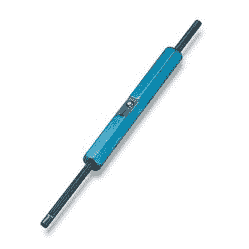

# 莫尔斯电码瀑布比你五年级的科学展项目还酷

> 原文：<https://hackaday.com/2016/04/19/morse-code-waterfall-is-cooler-than-your-fifth-grade-science-fair-project/>

在她的科学展项目中，[大卫]的女儿想到了将鸡蛋浸在咖啡中，或者展示苏打水对不知情的牙齿有多危险。无聊。相反，她雇佣她的父亲来帮助她建造一个莫尔斯电码瀑布。

A more civilized wea– tool from a more elegant age. Young Jed–Engineer.

[David]和他的女儿一起工作，给她所需要的知识的乐高积木，但是她自己编码，建造，并且，很明显，自己绕线。印象深刻！

她用两个 Arduinos 完成了这个魔术。一个人控制一个继电器来倾倒一股水流。另一只手表用一对红外发射器和探测器组成的光学中断来获取信息。

要发送信息，请在键盘上键入。瀑布会喷射出水，然后在解码器显示屏上显示信息。相当酷。我们也喜欢脉冲长度表盘。led 背后的解决方案非常聪明。休息后的视频。

 [https://www.youtube.com/embed/jJDcaR8LAz4?version=3&rel=1&showsearch=0&showinfo=1&iv_load_policy=1&fs=1&hl=en-US&autohide=2&wmode=transparent](https://www.youtube.com/embed/jJDcaR8LAz4?version=3&rel=1&showsearch=0&showinfo=1&iv_load_policy=1&fs=1&hl=en-US&autohide=2&wmode=transparent)

 [https://www.youtube.com/embed/KnTlhasgVMQ?version=3&rel=1&showsearch=0&showinfo=1&iv_load_policy=1&fs=1&hl=en-US&autohide=2&wmode=transparent](https://www.youtube.com/embed/KnTlhasgVMQ?version=3&rel=1&showsearch=0&showinfo=1&iv_load_policy=1&fs=1&hl=en-US&autohide=2&wmode=transparent)

