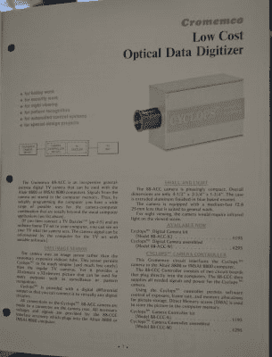
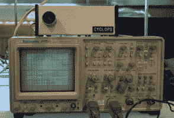
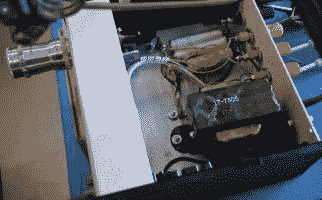
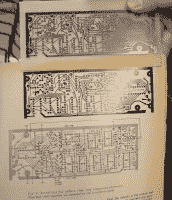

# 建造第一台数码相机

> 原文：<https://hackaday.com/2016/04/17/building-the-first-digital-camera/>

虽然数码相机的正式历史始于 1975 年一名柯达工程师摆弄数码电子设备，但第一台数码相机实际上是在几个月前制造的。在东部老式电脑节上，[威廉·萨德布林克]重建了第一台数码相机。这也不是特别难:这是 1975 年 2 月《大众电子》杂志封面上的一个项目。

Cromemco catalog page for the Cyclops, the first digital camera

[William]的展览， *Cromemco 配件:Cyclops & Dazzler* 展示了你可以为 S-100 系统购买的最棒的显卡，以及非常罕见、非常怪异的固态电视摄像机。[1975 年 2 月号的*大众电子*中介绍，独眼巨人是第一台数码相机。这不是一个使用 CCD 或普通图像传感器的设备。独眼巨人中的图像传感器是来自 MOS 的 1 千位 DRAM，产生 32 像素见方的数字图像。](http://www.computinghistory.org.uk/det/2858/Popular-Electronics-February-1975/)

完整的描述、原理图、电路布局和工作原理见*大众电子*文章；所有[威廉]要做的就是蚀刻一个印刷电路板和来源的组件。关键部分——一个装在金属罐封装中的一千位 MOS DRAM，小心地解封装——的日期代码是 1976 年，但这是重建这个经典电路的最新组件。

为了把这个 DRAM 变成数码相机，电路扫过 DRAM 阵列的行和列，把每个单元的电荷变成模拟输出。这不是黑色的*或*白色的摄像机；这里是灰色的，如果你把它接到示波器上，就是绿色的。

这个在*大众电子*的项目将于 1975 年末由 Cromemco 制造，并于 1976 年 1 月作为他们的第一个产品发布。Cromemco 是作为一种数码相机销售的，设计用于与 MITS Altair 8800 计算机接口，允许任何人将数字图像保存到磁盘上。这是发明的第一台数码相机，也是卖给消费者的第一台数码相机。这是一段令人惊叹的历史，非常高兴[威廉]能够将它拼凑起来，并在本周末的[老式计算机节](http://vcfed.org/wp/festivals/vintage-computer-festival-east/)上展出。

  The Cyclops and oscilloscope  The internal layout of the cyclops  Circuit, board layout, and fabricated PCB