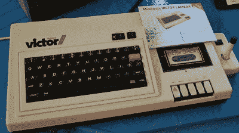
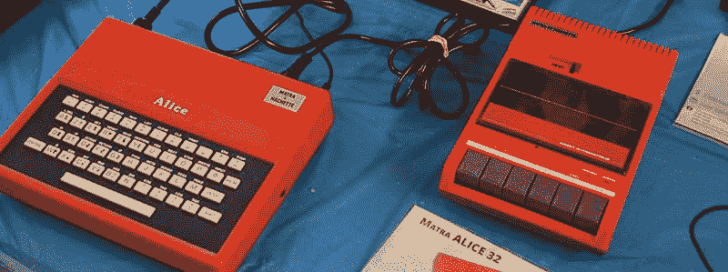
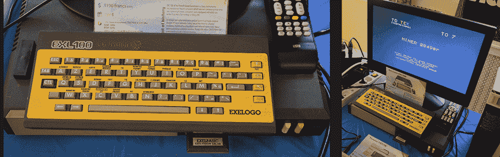

# 自由、平等、博爱、阿泽西

> 原文::1230【https://hacked ay . com/2016/04/20/liberte-egalite-brotherhood-azerty/

在美国，我们很少听到英语圈以外的人谈论计算。我们已经从铁幕后面看到了一些家用电脑的克隆体，但是很难获得关于它们的任何信息。如果你在美国发现一个 QWERTZ 布局的旧键盘，甚至是几个西里尔字符，这是一个稀罕物。迄今为止，Hackaday 上唯一的法国电脑是[一台老式迷你电话哑终端](https://hackaday.com/2011/05/22/shoehorning-rs-232-into-a-minitel-terminal/)。为了帮助纠正这种情况，来自魁北克的[杰里米·马森]、[蒂埃里·马佐莱尼]和[让·保罗·马里]将 20 世纪 80 年代法国计算机革命的精华带到了今年的东方计算机节

The American-designed French Victor

本次展览的卫冕冠军的演变始于 Micronique Victor Lambda，这是一台纯美国计算机的许可副本，即[互动家用计算机系统](http://www.old-computers.com/museum/computer.asp?c=1004)。这台电脑的特点是 2 兆赫 8080A，8 或 16 kB 的内存，并很快停止生产。法国公司 Micronique 很快购买了原始设计，并在法国重新销售该计算机。

在短短的几年里，Micronique 采用了这种设计，并把它变成了 Hector。这台机器配备了 5 MHz Z80、48 kB 内存、高分辨率图形(243×231，四种颜色)并包括基本的*和* Forth 解释器。

Victor 和 Hector 是当时最好的家用电脑，但对于每一台 Commodore 或苹果电脑，你都需要一个 ZX 频谱。这种微型计算机的法国版本是 Matra Alice 32，它配有 1 MHz 6803、16kB 内存和真正的 80×25 文本模式。Alice 在很大程度上基于美国的 TRS-80 MC-10，配有 SCART 连接器和 AZERTY 键盘。

最古怪的电脑[Jeremie]、[Thierry]和[Jean Paul]带出来的？那就是 Excelvision EXL100。无论好坏，20 世纪 80 年代是 Z80 和 6502 的时代。EXL100 运行着完全不同的东西。这台家用计算机使用德州仪器公司的 TMS7020 CPU、语音合成器和无线键盘。非常奇怪的时间和相对便宜；在 1984 年，这台电脑的价格只有₣3190，大约 550 美元。

[Jeremie]、[Thierry]和[Jean Paul]举办了一次展览，展示了 Francosphere 在 80 年代和 90 年代为计算机世界提供的最佳产品。我们还没有看到足够多的来自美国以外的早期计算机，所以我们很高兴在第 11 届年度东部计算机节上见到这些家伙。