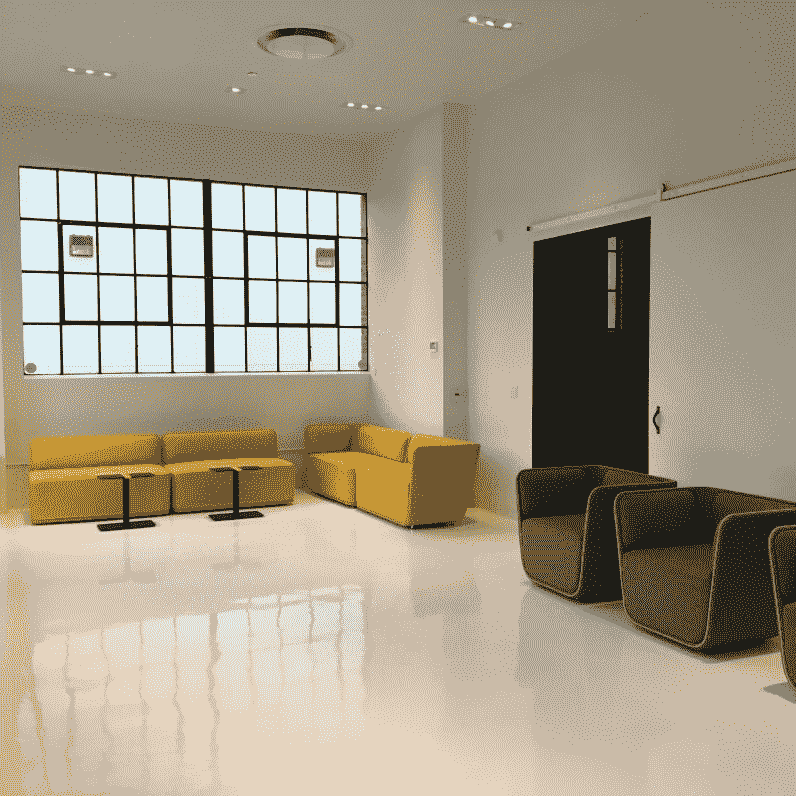
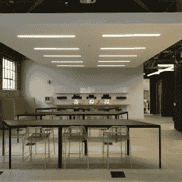
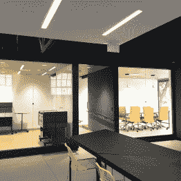

# 供应商框架设计实验室常驻申请现已开放

> 原文：<https://hackaday.com/2016/04/20/supplyframe-design-lab-residency-applications-now-open/>

加州帕萨迪纳的[供应框架设计实验室](http://supplyframe.com/designlab)即将开业。这个空间致力于实现伟大的想法。它配备了最先进的工具，有足够的空间用于上课和协作。

专业级工具和可用的研讨会只是难题的一部分。要想获得真正的成功，伟大的人需要通过鼓舞人心的建筑和前瞻性的冒险，将空间带入生活。如果你想成为这个社区的一员，并且一直在构思你的下一个产品或项目，考虑[申请资助居留](http://goo.gl/forms/xlVPv2W9nS)。

       [")](https://hackaday.com/2016/04/20/supplyframe-design-lab-residency-applications-now-open/img_2560-2/) 

艺术，产品和技术项目都将被考虑。被选中的人每月将获得高达 2000 美元的资助。我们希望看到雄心勃勃的项目在设计实验室实现，所以不要害怕想大的。为了帮助策划最好的资助项目，我们希望看到你以前的一些工作。如果你还没有，请在 Hackaday.io 上分享你的一些构建。第一轮资助项目最早可于 6 月 1 日进行。