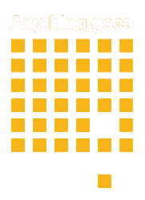
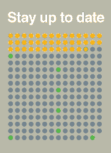

# 2016 Hackaday 奖重新开始，一切皆有可能

> 原文：<https://hackaday.com/2016/04/25/2016-hackaday-prize-begins-anew-and-anything-goes/>

今天标志着[*一切皆有可能*挑战赛](https://hackaday.io/prize/details#two)的开始，这是一场 2016 年的 Hackaday 奖竞赛，将奖励 20 名决赛选手 1000 美元，用于解决技术问题，并有机会赢得整个 Hackaday 奖:15 万美元和帕萨迪纳 Supplyframe 设计实验室的实习机会。

 黑客日奖让黑客、设计师和工程师能够利用他们的时间**建造一些重要的东西**。在接下来的五周里，重要的是解决一个技术问题。有没有一个给车辆提供动力而不污染大气的想法？太好了！想知道如何让你的洗衣机更好地工作吗？我们也想看。任何事情都会发生，所以设计它，制作它的原型，记录它，你就有可能成为进入最后一轮的 20 名参赛者之一。

我们已经看到 Hackaday 奖取得了巨大的进步。第一轮，*设计你的概念*，有[五百多份参赛作品！但是今天是全新的一天，新的挑战，一切都结束了。这是你加入这项运动的完美开端。](https://hackaday.io/submissions/prize2016/list)

[现在就开始你的项目](https://hackaday.io/project/add?light&tag=2016HackadayPrize)  并提交给 Hackaday 奖。如果您之前已经启动了一个项目页面，您可以使用项目页面左侧栏上的“提交项目至”下拉菜单将其添加到*一切顺利*挑战中。

谈论你的想法，记录你的计划直到完成，然后当你开始在原型上工作时，开始写构建日志。5 月 30 日，我们的评委小组将审查所有参赛作品，并选出 20 件展示 Hackaday 奖最佳作品的作品。

你有这个天赋。你可以腾出时间。你会有所作为的。世界上最伟大的事情都是从小事开始的，但是充满激情。这是你的时刻，现在开始你的旅程。

 [https://www.youtube.com/embed/Z2wWUilmWrg?version=3&rel=1&showsearch=0&showinfo=1&iv_load_policy=1&fs=1&hl=en-US&autohide=2&wmode=transparent](https://www.youtube.com/embed/Z2wWUilmWrg?version=3&rel=1&showsearch=0&showinfo=1&iv_load_policy=1&fs=1&hl=en-US&autohide=2&wmode=transparent)

The [HackadayPrize2016](http://hackaday.io/prize) is Sponsored by:       