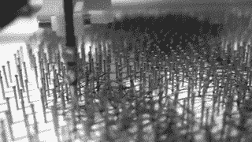
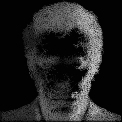

# 亲笔签名:一个字符串艺术打印机

> 原文：<https://hackaday.com/2016/04/28/autograph-a-string-art-printer/>

“线艺”是一种艺术形式的名称，它将数千根钉子和数英尺长的线变成独一无二的杰作。一些艺术家已经开发出了创造照片般逼真的弦乐艺术作品的技术，但直到现在，还没有办法绕过繁琐耗时的制作过程。根据尺寸不同，手工完成一件作品可能需要几个月的时间。

The threading process as shown in [this video](https://www.youtube.com/watch?v=jJ1GhwqgfrA) – [(c) Laarco 2016](http://www.laarco.com/).

现在，你可能会想，建造一台复杂的“钉子和线”机器来处理整个组装过程，从将钉子放在板上到将线缠绕在钉子上，这不是很好吗？英国伦敦设计工作室 Laarco 背后的人正是这样做的。他们的项目“亲笔签名”实际上是一个大型的弦艺术“打印机”，能够满足对这种图像复制形式日益增长的需求。

虽然他们不羞于展示他们的惊人成果，主要是名人的字符串艺术转换照片，我们可能不会得到一个完整的签名背后的硬件和软件文档。毕竟，他们花了四年时间开发制造这台全自动机器，他们即将把他们的弦乐老板变成一个强大的企业:你现在可以[购买他们独特的弦乐艺术品](http://www.saatchiart.com/account/artworks/875885)起价 1100 美元。

String path and height visualization – [(c) Laarco 2016](http://www.laarco.com/)

太贵了？嗯，你仍然可以自己制作:机器的大脑是一个树莓 Pi，它向配备 3D 打印机护罩的 Arduino Mega 发送命令。龙门设计看起来非常类似于一个流行的低成本数控轧机，但是，他们增加了一个定制的工具头来定位和展开线，同时保持线处于张力下。

在装配过程的准备中，钉子的位置从 [Voronoi 图](https://en.wikipedia.org/wiki/Voronoi_diagram)、[得到，然后一个未知的机构](https://www.reddit.com/r/raspberry_pi/comments/4ghkme/autograph_a_galleryworthy_nail_and_thread_artwork/)拾取钉子并将其放入预先钻好的孔中。在[穿线过程](https://www.youtube.com/watch?v=jJ1GhwqgfrA)中，工具头的高度随着过程的进行而增加，以避免与之前的管柱段发生碰撞。

过去，我们已经看到了各种形式的绘图机器人、极坐标图和机器人艺术家，但可以肯定地说，这是有史以来第一台弦乐艺术机器。也就是说，请欣赏视频:

 [https://www.youtube.com/embed/mAPLx17B2AM?version=3&rel=1&showsearch=0&showinfo=1&iv_load_policy=1&fs=1&hl=en-US&autohide=2&wmode=transparent](https://www.youtube.com/embed/mAPLx17B2AM?version=3&rel=1&showsearch=0&showinfo=1&iv_load_policy=1&fs=1&hl=en-US&autohide=2&wmode=transparent)

