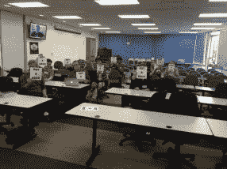

# 世界创造日的巨大成功

> 原文：<https://hackaday.com/2016/04/27/the-incredible-success-of-world-create-day/>

当人们走到一起，伟大的事情就会发生。上周末，世界各地的黑客社区自发组织起来，聚集在 64 个城市庆祝世界创造日。这是那些想要改变生活，而不想孤军奋战的人们的结合。感谢每一个参与的人，感谢那些组织他们自己的本地活动的人，感谢每一个在线参与的人。让我们来看看发生了什么。

  Lagos, Nigeria  Lagos, Nigeria  Cape Town, South Africa  Cape Town, South Africa

尼日利亚的电网不可靠，等待不会让问题变得更好。聚集在拉格斯的人们用世界创造日的时间讨论如何在 T2 解决电网问题，并改善每个人的用电状况。

[南非开普敦](https://twitter.com/museandpoet/status/723997595379503104)参加人数众多！他们有演讲者、闪电式演讲、项目演示，并分成小组来集思广益。

  Adelaide, Australia  Perth, Australia

珀斯会议讨论了如何管理对无家可归者的捐赠。这背后的想法是，人们不再携带大量现金。他们设想[一个基于 NFC 的系统](https://hackaday.io/project/11241-helpinghand-donation-and-payment-system)，可以让你用手机扫描一个有需要的人或慈善组织的标签。捐赠的钱可以在食品市场兑换，用于医疗保健等。

在阿德莱德他们在[举办了一场全面的黑客马拉松](http://hackerspace-adelaide.org.au/blog/2016/04/24/adelaide-iot-hackthon-2016/)。上面你可以看到其中一个分组就他们的创作接受采访。由此产生的建筑包括[垃圾互联网](https://hackaday.io/project/11236-10cent-internet-of-trash)、[城市范围的漏水监控](https://hackaday.io/project/11238-city-wide-water-leakage-monitoring)和局部区域通知屏幕。

  Nagpur, India  Bangalore, India

[印度那格浦尔会议](https://www.facebook.com/MakerWorksSpace/posts/1140167899347457)在 MakerWorks 举行，与会者年龄从 15 岁到 50 岁不等。他们甚至召开了一次团队成员视频会议来进行头脑风暴。

在班加罗尔，Workbench Projects 举办了一个世界创造日聚会。作为活动的一部分，我们进行了简短的谈话，讨论正在研究的想法。上面你可以看到【akshah induekhar】[在谈论他的项目](https://twitter.com/Brindaalakshmi/status/723883724312444931)控制汽车的二氧化碳排放。

  Austin, TX USA  San Jose, CA USA  Pasadena, CA USA

这里有三个在美国举办的聚会。德克萨斯州奥斯汀这一天来了很多人，他们结识了新朋友，谈论了未来会发生什么。实际上，我通过视频会议为加州圣何塞的会议[谈到了 Hackaday 奖。我认识一些开玩笑的人，他们用我最喜欢的黑客评论“不是黑客”来问候我，正如你在上面看到的。在加州](https://twitter.com/SJ_HaD_Meetup/status/723970197183291392)[帕萨迪纳](https://twitter.com/hackadayio/status/723990026275581953)度过了愉快的一天，那里充满活力的 Hackaday 社区集思广益，提出了技术解决方案，并进行了精彩的演讲。

  Munich, Germany  Oxford, UK  La Perdoma, Tenerife

[在德国慕尼黑](https://twitter.com/andreyrobo/status/723877099078049793)，meetup 来到了海边。他们正在研究海底探险的新思路。西班牙加那利群岛[的奥拉塔瓦黑客空间](https://twitter.com/Orohack/status/723943620508815361)在世界创造日入住。除了提出一些想法，他们还[展示了我们发给他们的贴纸](https://twitter.com/Orohack/status/723500658444386305)。

在英国的牛津 Hackspace，他们以一种非常民主的方式作为一个团队工作。上面你可以看到他们的笔记，讨论了对付蚊子、认知性痴呆、弱势人群的交易保护、数字保姆以及利用区块链进行食品商品市场的初步想法。投票后，他们花了一下午的时间研究认知性痴呆问题。

  Mexico City  Managua, Nicaragua  Tangamandapio, Mexico

我们从[墨西哥城的聚会](https://twitter.com/psyrax/status/723921104067129344)中得知，他们有 11 个人参加，气氛与他们习惯的不同。听起来该领域的许多黑客马拉松都是竞争性的，这会抑制协作。他们的世界创造日以公开分享想法和强烈的社区意识为标志，这产生了一些关于[远程通知在油箱](https://hackaday.io/project/11267-notificador-para-el-tanque-de-gas)耗尽之前重新加满油箱的想法。

在墨西哥的其他地方，Tangamandapio 有一个聚会，分成小组，然后在活动结束时展示。我们甚至听到了来自 T2 马那瓜的一个小组的消息，他们从观看过去两年 Hackaday 奖决赛选手的视频中获得了灵感

使用 [#WorldCreateDay 标签](https://twitter.com/hashtag/WorldCreateDay)查看所有发来的推文。如果你有来自你自己聚会的照片，我们仍然想看到它们，所以请使用这个标签来发布！我们也[一起收集了一些](https://storify.com/HackadayPrize/worldcreateday)。

面对面的聚会传播思想，传播快乐。除了短信、推文甚至视频电话，它还有切实的价值，因为在有意义的对话之间说的事情通常会引发下一个有趣的话题。我们很兴奋，你们这么多人抓住了这个机会，聚集在一起度过一个愉快的下午，我们迫不及待地想看看接下来会发生什么。

The [HackadayPrize2016](http://hackaday.io/prize) is Sponsored by:       