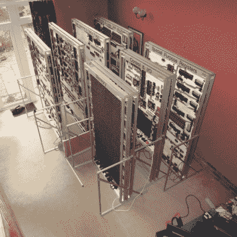

# 巨型处理器是一种宏微处理器

> 原文：<https://hackaday.com/2016/04/30/megaprocessor-is-a-macro-microprocessor/>

如果我们必须列出一个既疯狂又令人敬畏的项目清单，这可能是前三名。在过去的几年里，[詹姆斯·纽曼]一直在忙着建造[巨型处理器——一个由成千上万个晶体管和 LED](http://www.megaprocessor.com/)组成的巨大微处理器。“我一开始想了解晶体管。[事情失去了控制。](http://www.megaprocessor.com/GBU_evolution.html)“非常恰当地说，他来自剑桥——这座“[挥汗如雨的梦想之城](https://en.wikipedia.org/wiki/List_of_city_nicknames_in_the_United_Kingdom#C)”。“为什么”部分非常简单——因为他可以。我们[在 10 个月前发布了他的构造](http://hackaday.com/2015/06/23/discrete-transistor-computer-is-not-discreet/)，但是从那以后他已经取得了很大的进步,更新似乎也在进行中。

 它有多大？首先，8 位加法器模块长约 300 毫米(1 英尺)——他正在使用其中的 5 个。完全完工后，它将延伸 14 米宽，2 米高，占据一个 30 平方米的房间，由 7 个独立的框架组成，构成了巨型处理器的一部分。

最初的计划是九个框架，但他设法将所有部分都压缩到七个，去年建造了三个，此后又增加了另外四个。组装各个电路板(门)，将它们放在一起形成模块，然后将它们安装到框架上，并铺设近 10 公里的电缆，这是一项缓慢而艰苦的工作，但他最近几个月一直在努力。他已经成功地测试和集成了这里显示的机架，甚至运行了一些代码。

这个巨型处理器有一个 16 位架构，7 个寄存器，256 字节的 RAM 和数量可疑的 PROM(取决于他的焊接耐力，他说)。它消耗 500 瓦，大部分用来点亮所有的 LED。他猜测它大约有半吨重。处理器使用了 15，300 个晶体管和 8，500 个 LED，而 RAM 有 27，000 个晶体管和 2，048 个 LED。就晶体管数量而言，它介于 8086 和 68000 微处理器之间。他最近计算了一下迄今为止在这上面花的钱，总共超过了 4 万英镑(将近 6 万美元)！你可以在[成本和材料](http://www.megaprocessor.com/Cost_Materials.html)页面上看到许多其他有趣的统计数据。

他那疯狂的忍者技巧，在总数超过 250，000 个的焊点中，只修补了几个失败的、不良的焊点，在近 42，000 个晶体管中，只修补了一个坏的晶体管。一些电缆卷曲的问题对他来说是最小的麻烦。最糟糕的是，他收到了一批错误的 4000 个晶体管(正确的采购订单，正确的装箱单，但装错了零件)。在焊接完所有这些之后，他意识到了这个问题，这让他有点犹豫。他没有费心去拆焊它们，而是制造了新的替换电路板。他还使用 FPGA 板为巨型处理器构建了一个硬件/软件模拟器，以帮助他验证自己的设计。在他创建的第一批程序中，有几个游戏(很明显)——俄罗斯方块、井字游戏、生活——需要一个合适的输入设备。因此，他改装了一个毒液街机棒，它通常希望自己通过 USB 连接到 PlayStation。他说这是“一件非常文明的事情”。

在他详细的博客文章中有很多有趣的东西可以阅读，所以去喝杯咖啡，关掉你的手机，花几个小时沉浸在他疯狂的身材中。“这太疯狂了，”克洛维斯·弗里岑说，他通过 [BBC 新闻网站](http://www.bbc.com/news/technology-33237863)发送了这条建议。谢谢，我们同意他的评估。看看下面几个巨型处理器的视频。

 <http://www.megaprocessor.cimg/integration_RHS3.MP4?_=1>

[http://www.megaprocessor.cimg/integration_RHS3.MP4](http://www.megaprocessor.cimg/integration_RHS3.MP4) <http://www.megaprocessor.cimg/integration.mp4?_=2>

[http://www.megaprocessor.cimg/integration.mp4](http://www.megaprocessor.cimg/integration.mp4)