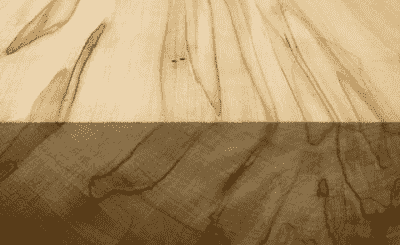

# 探测杀死树木，制造大量木材的甲虫

> 原文：<https://hackaday.com/2016/05/02/detecting-beetles-that-kill-trees-make-great-lumber/>

整个南加州都有小甲虫啃食树木，在树林中打洞。这些甲虫钻的洞直径只有 1 毫米，这使得它们在任何树皮粗糙的树上几乎看不见。受这些甲虫侵扰的树木最终会死亡，这成为该州最大的植物灾难之一。

 

豚草枫树，这些甲虫钻进枫树的结果。虽然豚草枫树更漂亮是有争议的，但它明显比硬枫树便宜，使甲虫滋生的树更不值钱。图片来源:[ [ironoakrva](http://imgur.com/gallery/uTjaG) ]

对于[Joan]的 2016 年黑客日奖的项目，她正在进行一个项目[来检测多食性钻孔虫](https://hackaday.io/project/11436-detecting-the-polyphagous-shothole-borer-pshb)，这种甲虫钻入树木并从里到外吃掉它们。这是一个令人惊讶的难题——不把树砍倒就无法看到树的内部——所以[Joan]转向其他探测甲虫的方法，包括用听诊器听甲虫咀嚼的声音。

虽然这些豚草甲虫会钻入树中并杀死它们，但探测这些微小的甲虫还有另一个经济优势。沉积在这些甲虫钻孔中的真菌制造了非常漂亮的木材，但是这种木材没有没有被甲虫侵扰的同种木材有价值。对于即将到来的 Hackaday 奖的[公民科学部分来说，这是一个伟大的项目，因为现在检测这些甲虫的最佳解决方案是将一群小学生送到森林中。](https://hackaday.io/prize/details#three)

The [HackadayPrize2016](http://hackaday.io/prize) is Sponsored by:       