# 用好的参考照片提升你的 CAD 游戏

> 原文：<https://hackaday.com/2016/05/06/up-your-cad-game-with-good-reference-photos/>

我为各种项目拍摄了许多参考照片。第一次，我记得我吃了很多苦，不得不重做一个模型几次，才得到一张有效的照片。就像[测零件很差](http://hackaday.com/2016/04/15/measuring-parts-badly-for-accurate-reverse-engineering/)一样，提炼自己的参考照片技巧，会让你在尝试用 CAD 重现物体时节省很多时间和精力。一旦你有了一个对象的模型，就很容易设计匹配的部分，复制原来的，甚至铣削原来的精确修改。

我正在给当地进口商店的廉价食品脱水机添加一些零件。我不确定我的项目会不会成功，但要说拍参考照片，这是个好项目。该对象是白色的、模糊的和笨拙的，这使得它很难在 CAD 程序中拍摄好的照片作为参考使用。我四处寻找关于这个主题的像样的教程，[只找到了一个](http://www.smallartworks.ca/CustomerGallery/PictureHints/Ortho.html)。也许那天我的 Google-fu 不是最好的。无论哪种方式，它主要是为了拍出好的正交照片，而不是如何优化照片以获得尺寸。

拍参考照有几点需要注意。第一个是失真和对抗失真的装备设置。第二是包括参考比例和表面，以帮助产生最终模型，从中可以精确地获得几何形状和尺寸。最后是对图片进行后处理，以防止失真，并为其在 cad 和建模软件中的使用做准备。

## 设置和失真:

重要的是，在拍摄参考照片时，不要试图成为传统意义上的优秀摄影师。我们不想要有趣的照片。我们想要一张光线尽可能均匀、不失真、比例尽可能大的照片。如果我们用这些方法拍一张某人的脸，那将是非常不讨人喜欢的。

帮助我们的第一件设备是一台镜头不会扭曲照片的照相机。不幸的是，我不是摄影师，所以我不能告诉你什么样的镜头组合会给你最好的效果。也许有人可以在评论中帮忙？然而，我发现普通的傻瓜相机或手机的镜头通常都很好。它们被设计成使得奶奶(或 Gerrit)可以得到预期的图像，而不必知道什么是鱼眼或桶形失真。

真正的诀窍是从主题后退。离被讨论的物体越远，它在图片中的尺寸越小，整体镜头变形对它的影响就越小。显然，远离物体会损失一些分辨率，所以这取决于你需要它做什么。对于大多数应用来说，为了更高的精度而损失一些像素是可以的。

The same squares. One taken up close. The other from further away and then zoomed in. The lines show how the grid curves away. Even though the second photo is much worse in quality, it’s more accurate. The filter to fix lens distortion has not been applied to either photo.

[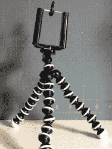](https://hackaday.com/wp-content/uploads/2016/04/2016-04-28-15-54.jpg)

Three dollars well spent. The stand unscrews from the clamp and lets it be used with a standard camera mounting thread.

接下来是偏斜和透视误差。你想拍出尽可能准确的照片。如果成功，唯一的误差将是镜头扭曲和物体的部分变小，因为它们消失在地平线上。三脚架不是必需的，但确实很有帮助。我的手机有一个三美元的适配器，可以让我把它当作一个便宜三脚架上的相机。调节起来并不是丝般顺滑，可能会有一些骂人的话，但是对大部分事情都管用。我们将用我们试图捕捉的最重要的特征来设置相机水平。设置它以获得物体的中心不一定那么重要，因为我们的兴趣点离镜头的中心越远，它将接收到越多的失真和透视误差。

照明也很重要。您可以使用强烈的光线来显示使用阴影的细节，但重要的是要注意阴影的长度和光线在纸上的方向，以便在稍后绘制尺寸时提供帮助。最好是明亮均匀的光线，不会洗掉零件上的阴影。想想早期的艺术项目。当你在立方体或球体上着色时，你需要尽可能平滑的渐变。如果你过度曝光死星，你只会在黑色的背景上有一个白色的圆圈，所有的博萨人都会白白死去。

## 参考比例:

我用一些东西为我的照片制作一个合适的比例。最有用的是网格。它可以是任意尺寸，因为它的主要目的是帮助我们设置照片，并在稍后的过程中消除失真。由于它位于物体后面，如果不使用不必要的三角学，很难判断网格的大小。我通常使用一个切割垫，上面画有网格。如果需要的话，很容易在网上找到要打印的网格图案。有大的容易看见的正方形比小的好。

这个过程并不十分精确，但只要小心和运气好，有时可以达到一毫米以内。如果我们用一些卡尺技巧来补充这些，我们甚至可以做得更好。我喜欢拿一个带刻度的组合或机械师的正方形，把它放在物体旁边。一把木尺也可以。

最好使用正方形将零件垂直放置在桌子上，这样它就与相机垂直了。我喜欢用激光水平仪从相机向物体投射一条线。这消除了等式中的所有猜测。

 [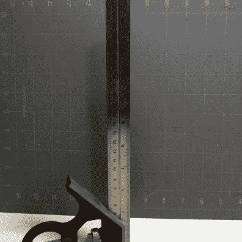](https://hackaday.com/2016/05/06/up-your-cad-game-with-good-reference-photos/scales/) The two reference scales I typically use. A cutting mat and a combination square. [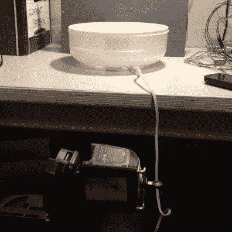](https://hackaday.com/2016/05/06/up-your-cad-game-with-good-reference-photos/lasers-4/) A laser level clamped in the tripod helps set the level of the camera exactly.

## 拍照技巧:

1.  不要试图在一张照片中完成所有的事情。如果你需要一个物体的轮廓。设置一张照片来拍摄轮廓。如果你需要那个物体上的界面，设置一张照片就可以了。您可以在 CAD 软件中设置更多的参考平面。拍摄两张照片通常比强迫一张照片做两份不同的工作更快，效果也更好。
2.  如果设备上有不借助参考照片也能收获的信息，单独记录。如果能以更准确的方式拍摄，不要试图从照片中提取尺寸和信息。
3.  彻底清洁物体。我浪费了一些时间来解码一个实际上只是零件上的灰尘或油污的特征。
4.  如果它是一个颜色非常奇怪或有光泽的物体，并且你有能力毁掉它，那就把它喷成灰色。
5.  如果它是一个又薄又平的物体，一些读者在卡尺贴中传授了这个有用的[技巧，一个平板扫描仪将会在二维空间中惊人地复制它。](http://hackaday.com/2016/04/15/measuring-parts-badly-for-accurate-reverse-engineering/)
6.  确保曝光照片，以获得物体的最大灰度和清晰度。我们不想要任何大的亮点或大的阴影。可能会让照片很无聊，但没关系。
7.  如果物体真的很大，遮住了网格，有一个技巧仍然可以在需要的平面上消除扭曲。假设你想要一个物体的中心平面的轮廓。给物体拍照。现在，在桌子上标出物体的中心，并标出网格的边缘。拿走对象，然后使用标记线将网格移动到对象的中心。无需移动相机设置即可拍照。你现在有了物体中心扭曲的图片。校正网格照片，然后用同样的方法校正原始照片，以获得准确的轮廓。

 [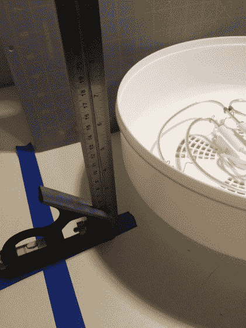](https://hackaday.com/2016/05/06/up-your-cad-game-with-good-reference-photos/markthemiddle/) Mark the edge of the pad and the center of the object. [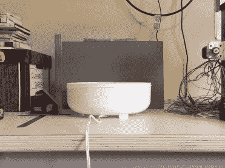](https://hackaday.com/2016/05/06/up-your-cad-game-with-good-reference-photos/original-place/) Take a photo of the object. [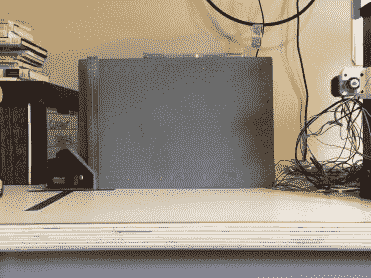](https://hackaday.com/2016/05/06/up-your-cad-game-with-good-reference-photos/moveforward/) Take a photo of the object. [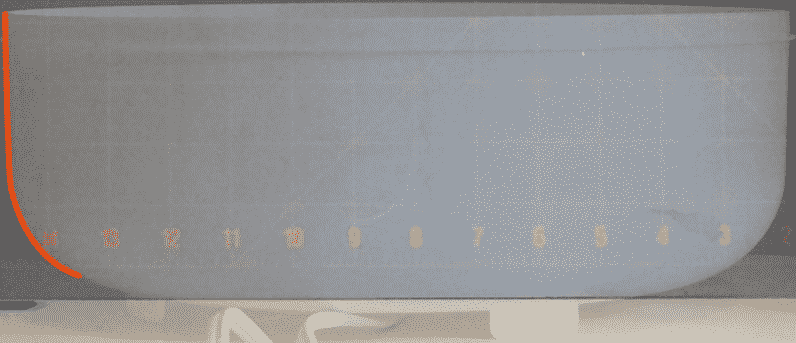](https://hackaday.com/2016/05/06/up-your-cad-game-with-good-reference-photos/extract/) Combine the images. Adjust for distortions and lighting. Crop. Then use to extract the geometry you like. This way you adjust for the distortion at the plane you’d like to capture the data and not the plane your references are on.

## 后处理

在后期处理中，我们会想。

1.  消除失真。
2.  修理照明设备。
3.  为 CAD 软件适当地裁剪照片。

我通常用 Photoshop 来编辑照片，但是 GIMP 也可以。GIMP 和 Photoshop 现在都包含了一个相机失真过滤器。在进入可能已经在图片中显示的透视错误之前，你想要首先使用这个。这就是我们放在物体后面的网格派上用场的地方。目标是拉直任何凹或凸的网格线。一旦我们做到了这一点，我们就会为下一步做好准备。

下一步是使用变换工具来扭曲照片，直到所有的线条相互垂直。很可能它们要么是平行四边形、梯形，要么是两者的奇怪组合。如果真的很极端，你最好重拍照片，花更多的时间进行设置。如果你真的做到了，你可以跳过这两个步骤，这将是最准确的照片。

照片中的灯光可能关了。使用水平工具来改变它，直到我们得到我们正在寻找的平滑梯度。洗掉照片，或者把它弄平，使白色变成白色，这可能很有诱惑力。现代产品摄影告诉我们，明亮干净的照片是我们努力追求的。这不是我们的目标。我们正试图从照片中提取几何信息。我们想要的是这样一张照片，其中阴影的梯度最清晰，边缘从背景中清晰地突出。它可能看起来有点暗或褪色，但如果你能清楚地看到一切，这是正确的。试着想一想课本上的旧黑白教育照片。

最后是裁剪照片。我们希望尽可能靠近对象进行裁剪。我放大，直到我的裁剪边缘刚好接触到我的对象的像素。我们这样做是因为我们将在 CAD 软件中设置一个我们希望软件调整照片大小的尺寸。如果我们有额外的像素包围我们的对象，这将会打乱我们的测量。

一旦你裁剪了照片，我也建议你扭曲照片以匹配原始对象的长宽比。例如，如果你拍摄了一个直径为 10 英寸、高为 15 英寸的圆柱体的照片，如果从正面拍摄，请确保照片的比例为 2:3。如果在设置和后处理阶段成功地消除了透视误差，我们应该在该点上对物体有一个非常接近的图像。

 [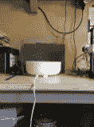](https://hackaday.com/2016/05/06/up-your-cad-game-with-good-reference-photos/2016-04-29-10-39-16/) Original Photo [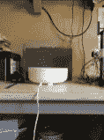](https://hackaday.com/2016/05/06/up-your-cad-game-with-good-reference-photos/lenscorrect/) Thanks to the set-up we don’t have too much to fix. The lens correction filter and a bit of rotation. [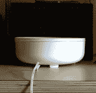](https://hackaday.com/2016/05/06/up-your-cad-game-with-good-reference-photos/adjusted-colors/) Adjusted the light to proivide the most information about its geometry. I could do with better lighting. [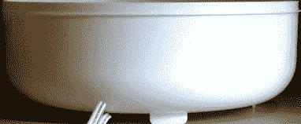](https://hackaday.com/2016/05/06/up-your-cad-game-with-good-reference-photos/crop/) The picture cropped and rotated. Note a small perspective error where my camera was higher than the center of the object. Also a small rotation. However, it is close enough for the purpose I need it for.

## 结论

希望在所有的工作之后，我们有一张照片可以用在我们选择的建模软件中。它们之间有所不同，但标准的工作流程是在草图中制作一个平面并绘制曲线。之后，很容易将它们挤压或旋转成有用的表面。对于非三维的工作，如获得电路板轮廓，您也可以将图像导入到 Inkscape 或 Illustrator 等矢量程序中，并跟踪轮廓。一旦你有了它，你就可以把它导出成你的 CAD 软件喜欢的格式。

[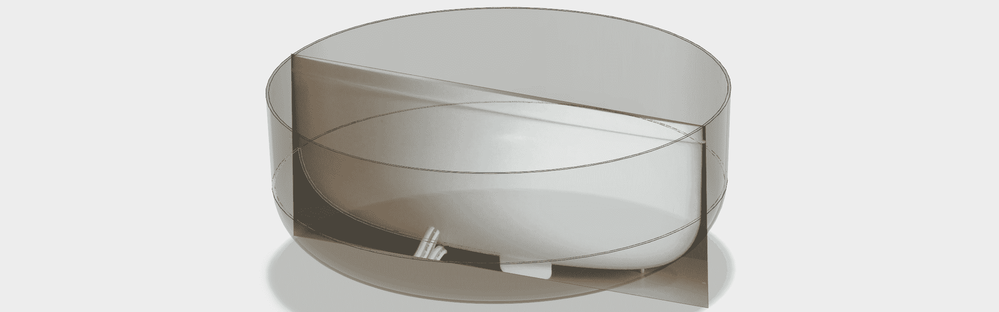](https://hackaday.com/wp-content/uploads/2016/04/blerg10.jpg)

Use the photo in your CAD or modeling software of choice to get the geometry needed!

我希望这是有用的。我相信你们中的许多人已经用自己的方式解决了这些问题。你用什么招数和方法来获得一张好的参考照片？