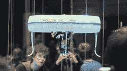

# 见见蓝鸟，飞行的无人机宠物管家

> 原文：<https://hackaday.com/2016/05/06/meet-blue-jay-the-flying-drone-pet-butler/>

荷兰埃因霍温理工大学(TU/e)的 20 名学生分享了一个关于未来的愿景:完全驯化的无人机宠物——一个会飞的朋友，它会在你需要的时候帮助你，而且通常非常非常可爱。他们的无人机“蓝鸟”(Blue Jay)装有传感器，有一个用于抓取和携带货物的强有力的爪子，在室内自主导航，并与人类在眼睛高度进行互动。

 为了展示他们的飞行伙伴，团队[安装了无人机咖啡馆](https://www.tue.nl/en/university/news-and-press/news/21-04-2016-tue-opens-the-worlds-first-drone-cafe/)——一家由互动无人机为游客提供饮料的咖啡馆。作为庆祝 TU/e 成立 60 周年的“Dream & Dare Festival”活动的一部分，这家咖啡馆今年 4 月只开放了几天。在 2016 年 5 月 23 日至 26 日的[DTW-荷兰技术周](http://facebook.com/348932421814112)期间，我们的荷兰读者仍然可以见到这个团队和他们的飞行仆人。

该团队认为无人机在人们的日常生活中有很大的潜力，可以成为一个友好的管家。无人机不仅可以探测到你家中的火灾或入侵者，还可以提前飞行，并在你不能时自动处理这些问题。无人机还可以为你和你的客人提供饮料或食物，迟早会成为你最好的朋友。我们确信无人驾驶飞机将尽可能充分地利用自己，这是我们认为任何有意识的实体都希望做到的。欣赏视频:

 [https://www.youtube.com/embed/XUaMl28-Jdk?version=3&rel=1&showsearch=0&showinfo=1&iv_load_policy=1&fs=1&hl=en-US&autohide=2&wmode=transparent](https://www.youtube.com/embed/XUaMl28-Jdk?version=3&rel=1&showsearch=0&showinfo=1&iv_load_policy=1&fs=1&hl=en-US&autohide=2&wmode=transparent)

[via [heise](http://www.heise.de/newsticker/meldung/Indoor-Drohne-Studenten-eroeffnen-kurzzeitig-ein-Drohnen-Cafe-3194337.html)