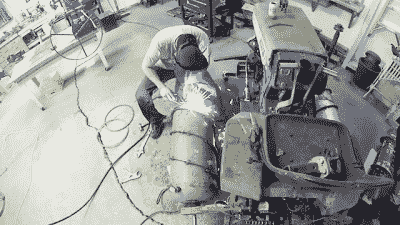

# 螺旋驱动拖拉机即将征服加拿大

> 原文：<https://hackaday.com/2016/05/05/screw-drive-tractor-is-about-to-conquer-canada/>

令人难以置信的螺旋驱动拖拉机又回来了。我们已经报道了[之前的试乘](http://hackaday.com/2016/04/04/screw-drive-tractor-hasnt-conquered-canada-yet/)，它以轴承轴台撕裂成两半而告终，但从那以后，又一次，大量的修复工作已经完成。【REDNIC79】加固了承重部位一个，换上了一副新的“轮胎”。结果仍然像以前的版本一样令人难以置信，但它现在以每小时 3 英里的速度向前推进(这次没有撕裂自己)。

【rednic 79】向我们展示了自第一版以来他所做改进的所有细节。在最后一次失败后，他认为，较大的螺旋吊舱直径将使车辆更好地漂浮，而较小的螺纹轮廓将防止螺钉挖入地面太深，从而减少推动车辆前进所需的力。

[REDNIC79]找到了四个相同的 100 磅，16 英寸直径的丙烷罐来建造新的吊舱。坦克对拖拉机来说有点太短，所以他[切开](https://www.youtube.com/watch?v=_FXlUHPxan4)两个坦克，用它们来延长另外两个，然后在每个坦克上焊接一个[双螺纹螺钉](https://www.youtube.com/watch?v=Io4k6TF5UlE)。他还[将坦克的前端](https://www.youtube.com/watch?v=6xuV3DS5HV8)做成锥形，使行驶更加平稳。在将新吊舱安装到 speedster 上后，增加了一对[定制钢链防护装置](https://www.youtube.com/watch?v=FDAeU95-Fpg)以防止岩石进入链条。然后，是时候进行另一次试驾了。欣赏视频:

 [https://www.youtube.com/embed/_bHUlJAaE2s?version=3&rel=1&showsearch=0&showinfo=1&iv_load_policy=1&fs=1&hl=en-US&autohide=2&wmode=transparent](https://www.youtube.com/embed/_bHUlJAaE2s?version=3&rel=1&showsearch=0&showinfo=1&iv_load_policy=1&fs=1&hl=en-US&autohide=2&wmode=transparent)

